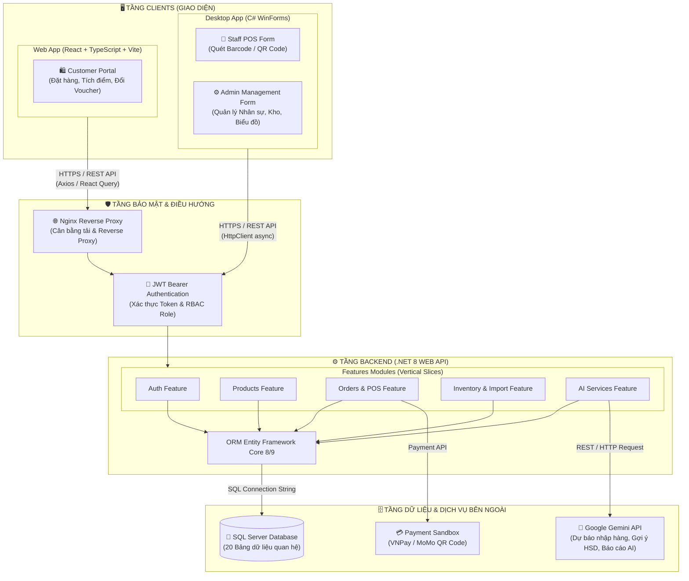
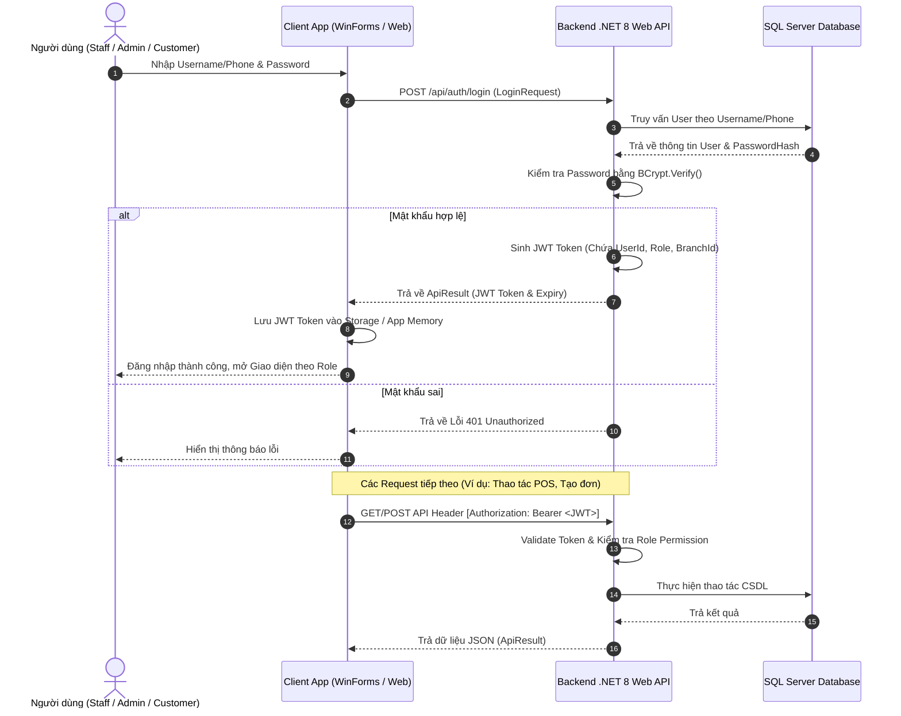

# THIẾT KẾ KIẾN TRÚC HỆ THỐNG SMART SUPERMARKET

---

## MỤC LỤC
1. [Giới thiệu](#1-giới-thiệu)
2. [Nội dung chính](#2-nội-dung-chính)
   - 2.1. [Tổng quan Kiến trúc 3 Tầng Độc lập (3-Tier Architecture)](#21-tổng-quan-kiến-trúc-3-tầng-độc-lập-3-tier-architecture)
   - 2.2. [Sơ đồ Luồng Dữ liệu & Tương tác Hệ thống (Mermaid Architecture)](#22-sơ-đồ-luồng-dữ-liệu--tương-tác-hệ-thống-mermaid-architecture)
   - 2.3. [Thiết kế Tầng Backend (.NET 8 Web API - Feature-Folder Clean Architecture)](#23-thiết-kế-tầng-backend-net-8-web-api---feature-folder-clean-architecture)
   - 2.4. [Thiết kế Tầng Desktop Application (C# WinForms)](#24-thiết-kế-tầng-desktop-application-c-winforms)
   - 2.5. [Thiết kế Tầng Web Client Application (React + TypeScript)](#25-thiết-kế-tầng-web-client-application-react--typescript)
   - 2.6. [Cơ chế Bảo mật & Xác thực (Security & Authentication Flow)](#26-cơ-chế-bảo-mật--xác-thực-security--authentication-flow)
   - 2.7. [Tích hợp Dịch vụ Bên ngoài & AI (External Services & AI Integration)](#27-tích-hợp-dịch-vụ-bên-ngoài--ai-external-services--ai-integration)
3. [Open Questions](#3-open-questions)
4. [Ghi chú](#4-ghi-chú)
5. [Kết luận](#5-kết-luận)

---

## 1. GIỚI THIỆU

Tài liệu **Architecture.md** mô tả chi tiết thiết kế kiến trúc kỹ thuật của hệ thống **Smart SuperMarket**. Tài liệu này định nghĩa cấu trúc tầng, mô hình tương tác dữ liệu giữa các thành phần (WinForms Desktop, React Web, .NET Web API, CSDL SQL Server và Google Gemini AI API), giải pháp bảo mật và chiến lược phân chia module mã nguồn.

Kiến trúc hệ thống được thiết kế hướng tới các tiêu chí: **Tính mở rộng (Scalability)**, **Tính bảo mật (Security)**, **Tính mô-đun hóa (Modularity)** và **Khả năng bảo trì lâu dài (Maintainability)**.

---

## 2. NỘI DUNG CHÍNH

### 2.1. Tổng quan Kiến trúc 3 Tầng Độc lập (3-Tier Architecture)

Hệ thống Smart SuperMarket tuân thủ mô hình kiến trúc Client-Server 3 tầng tập trung (Centralized 3-Tier Architecture):

1. **Tầng Giao diện Người dùng (Presentation Tier / Clients)**:
   - **WinForms Desktop Application (.NET 8/9)**: Ứng dụng dành cho Nhân viên (Staff POS bán hàng) và Quản trị viên (Admin quản lý hệ thống/kho/báo cáo).
   - **React + TypeScript Web Application**: Ứng dụng dành cho Khách hàng (Customer duyệt hàng, đặt đơn, tích điểm, đổi voucher).
   - *Nguyên tắc cốt lõi*: Cả WinForms Desktop và React Web **tuyệt đối không kết nối trực tiếp CSDL SQL Server**. Mọi thao tác đọc/ghi dữ liệu bắt buộc phải thông qua RESTful API.

2. **Tầng Nghiệp vụ Trung tâm (Application / Business Logic Tier - .NET 8 Web API)**:
   - Đóng vai trò là Bộ não trung tâm (Central API Gateway / Service).
   - Xử lý toàn bộ logic nghiệp vụ (Tính tiền, trừ tồn kho `Inventory`, áp dụng khuyến mãi `Promotion`, kiểm tra hạn sử dụng FEFO, tích điểm `LoyaltyPoints`).
   - Quản lý xác thực JWT Bearer Token và phân quyền theo Role (`Admin`, `Staff`, `Customer`).

3. **Tầng Dữ liệu & Dịch vụ Bên ngoài (Data & External Services Tier)**:
   - **Cơ sở dữ liệu tập trung (SQL Server)**: Lưu trữ 20 bảng dữ liệu quan hệ, thao tác qua Entity Framework Core (Code First).
   - **Dịch vụ AI (Google Gemini API)**: Thực hiện các bài toán hỗ trợ ra quyết định kinh doanh qua giao thức HTTP REST.

---

### 2.2. Sơ đồ Luồng Dữ liệu & Tương tác Hệ thống (Mermaid Architecture)

---

### 2.3. Thiết kế Tầng Backend (.NET 8 Web API - Feature-Folder Clean Architecture)

Backend được tổ chức theo kiến trúc **Feature-Folder / Vertical Slice Clean Architecture** nhằm đảm bảo tính đóng gói cao:

- **`Common/`**: Chứa các tiện ích hệ thống dùng chung (`ApiResult<T>` wrapper, `IDateTimeProvider`, `BarcodeGenerator`).
- **`Domain/`**: Chứa cốt lõi nghiệp vụ thuần túy:
  - `Entities/`: Các class đại diện cho các bảng CSDL (`User.cs`, `Product.cs`, `Order.cs`, `OrderDetail.cs`, `Inventory.cs`...).
  - `Enums/`: Các hằng số Enum hệ thống (`UserRole.cs`, `UserStatus.cs`, `OrderStatus.cs`, `PaymentMethod.cs`...).
- **`Features/`**: Đóng gói mã nguồn theo từng nhóm chức năng nghiệp vụ độc lập. Khi phát triển một feature (ví dụ `Products`), tất cả `Controllers/`, `DTOs/`, `Services/` của feature đó đều nằm gọn trong thư mục `Features/Products/`.
- **`Infrastructure/`**: Chứa các triển khai hạ tầng:
  - `Persistence/`: `AppDbContext.cs` (EF Core) và Fluent API Configurations.
  - `Security/`: `JwtService.cs` (sinh/xác thực Token) và `PasswordHasher.cs` (mã hóa BCrypt).
  - `External/AI/`: `GeminiClient.cs` (giao tiếp với Google Gemini API).
  - `Options/`: `JwtOptions.cs`, `GeminiOptions.cs` (map file `appsettings.json`).

---

### 2.4. Thiết kế Tầng Desktop Application (C# WinForms)

Ứng dụng WinForms Desktop được thiết kế theo mô hình **Layered Component**:

- **UI Layer (Forms & User Controls)**:
  - `LoginForm`: Đăng nhập hệ thống cho Staff và Admin.
  - `PosForm`: Màn hình bán hàng POS tích hợp sự kiện từ Máy quét mã vạch USB / Camera.
  - `AdminForms`: Các Form quản lý sản phẩm, kho hàng, tài khoản nhân viên.
  - `DashboardForm`: Bảng điều khiển tích hợp biểu đồ tương tác `LiveCharts2`.
- **Service & Client Layer**:
  - `ApiClient`: Wrapper sử dụng `HttpClient` gọi bất đồng bộ (`async/await`) tới Backend API.
  - `BarcodeScannerHelper`: Xử lý tín hiệu quét mã vạch và tự động trigger sự kiện tìm kiếm sản phẩm.
  - `ReportPrinter`: Xuất và xem trước hóa đơn bán hàng định dạng PDF bằng thư viện `QuestPDF`.
- **Localization**: Sử dụng file Resource `.resx` hỗ trợ chuyển đổi ngôn ngữ Việt / Anh realtime.

---

### 2.5. Thiết kế Tầng Web Client Application (React + TypeScript)

Ứng dụng Web dành cho Khách hàng sử dụng **Feature-based Architecture**:

- **`src/app/`**: Cấu hình Providers (TanStack Query, Theme) và Routing.
- **`src/features/`**: Chia theo nhóm chức năng (`products`, `cart`, `orders`, `vouchers`).
- **`src/shared/`**:
  - `api/`: `axiosInstance.ts` cấu hình tự động đính kèm JWT Bearer Token.
  - `types/`: Các TypeScript Interfaces đồng bộ với DTOs của Backend.
  - `utils/`: Định dạng tiền tệ VNĐ, ngày tháng.

---

### 2.6. Cơ chế Bảo mật & Xác thực (Security & Authentication Flow)

---

### 2.7. Tích hợp Dịch vụ Bên ngoài & AI (External Services & AI Integration)

1. **Google Gemini AI Integration**:
   - Giao tiếp qua HTTP REST Client trong `Infrastructure/External/AI/GeminiClient.cs`.
   - Sử dụng **System Prompt** được định hình sẵn chuyên biệt cho ngành bán lẻ siêu thị.
   - Nhận kết quả phản hồi dạng JSON/Text để phục vụ bài toán dự báo nhập hàng và tự động sinh báo cáo kinh doanh.
2. **Payment Sandbox Integration**:
   - Backend cung cấp API tạo mã QR thanh toán (VNPay / MoMo Sandbox).
   - WinForms POS hiển thị mã QR lên màn hình phụ/chính để khách hàng quét trả tiền.

---

## 3. OPEN QUESTIONS

| STT | Vấn đề chưa quyết định | Tác động | Hướng xử lý đề xuất |
| :---: | :--- | :--- | :--- |
| 1 | Khi mất kết nối Internet / API tại quầy thu ngân WinForms POS, hệ thống có hỗ trợ chế độ Offline Mode (lưu tạm hóa đơn cục bộ SQLite) hay không? | Ảnh hưởng đến kiến trúc lưu trữ tạm thời trên WinForms Desktop. | Ở phiên bản v1, giả định hệ thống hoạt động với kết nối mạng ổn định (Online Mode). Chế độ Offline Sync sẽ xem xét ở v2. |
| 2 | Việc quản lý file hình ảnh sản phẩm sẽ lưu trực tiếp thư mục `wwwroot` của Backend hay sử dụng Dịch vụ Cloud Storage (như Cloudinary/AWS S3)? | Ảnh hưởng cấu hình lưu trữ media trong Backend. | Đề xuất: Ở phiên bản v1, lưu ảnh trực tiếp vào thư mục `wwwroot/images/products/` của Backend API để đơn giản hóa triển khai. |

---

## 4. GHI CHÚ
- Toàn bộ các giao tiếp giữa Client và Backend API phải sử dụng giao thức an toàn `HTTPS`.
- Tất cả các thao tác thay đổi dữ liệu kho và tạo hóa đơn bắt buộc phải bọc trong **Database Transaction** để đảm bảo tính toàn vẹn dữ liệu (ACID).

---

## 5. KẾT LUẬN

Tài liệu `Architecture.md` đã xác lập mô hình kiến trúc 3 tầng tập trung, thiết kế chi tiết cho Backend, WinForms Desktop và React Web Client, sơ đồ luồng xác thực JWT/BCrypt và phương án tích hợp Google Gemini AI. Đây là khung kiến trúc chuẩn mực để toàn bộ thành viên tuân thủ khi viết mã nguồn.
