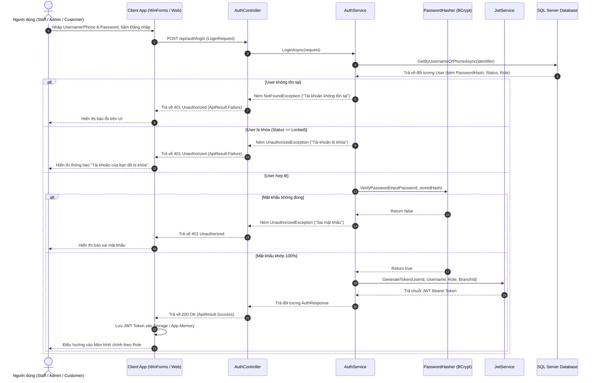
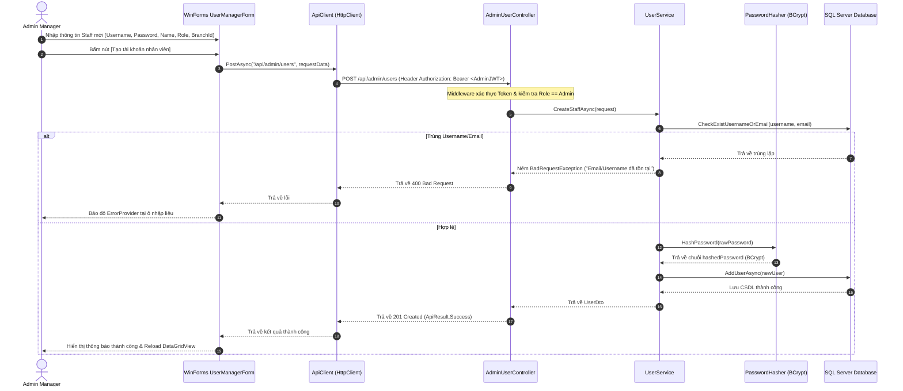
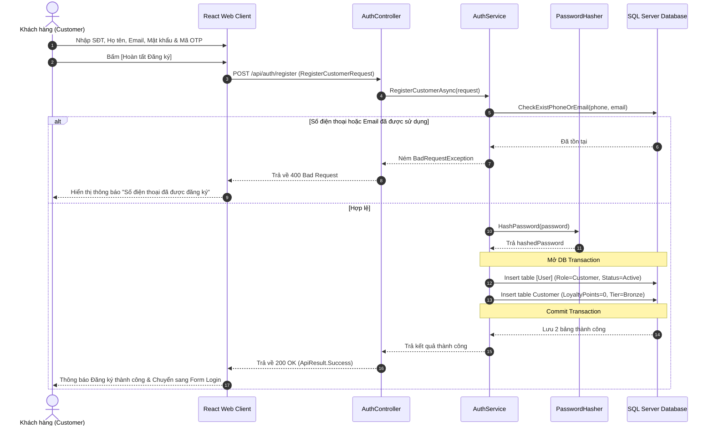
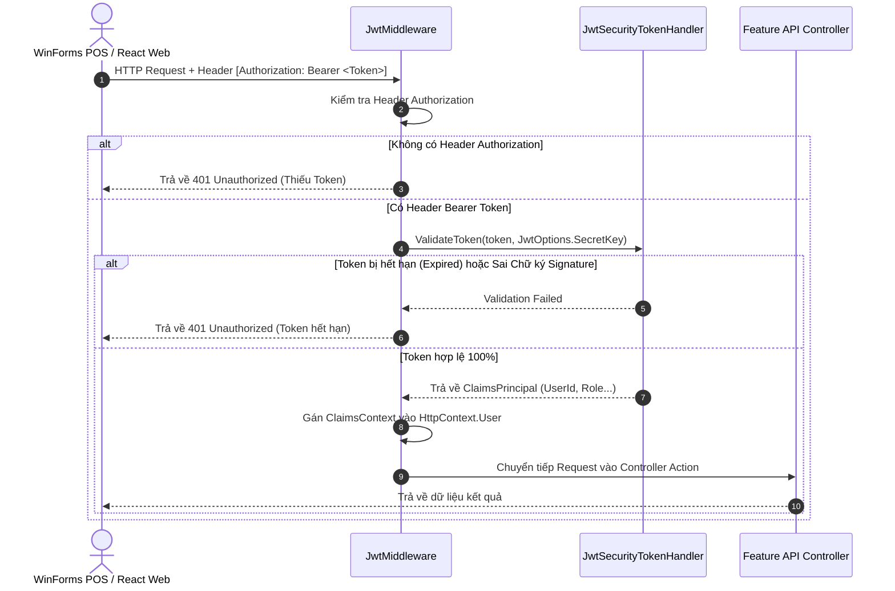

# SƠ ĐỒ TUẦN TỰ XÁC THỰC & PHÂN QUYỀN (SEQUENCE DIAGRAM SPECIFICATION)

---

## MỤC LỤC
1. [Giới thiệu](#1-giới-thiệu)
2. [Nội dung chính](#2-nội-dung-chính)
   - 2.1. [Sơ đồ Tuần tự Luồng Đăng nhập Hệ thống (Login Sequence Diagram)](#21-sơ-đồ-tuần-tự-luồng-đăng-nhập-hệ-thống-login-sequence-diagram)
   - 2.2. [Sơ đồ Tuần tự Admin Tạo mới Tài khoản Nhân viên (Staff Creation Sequence Diagram)](#22-sơ-đồ-tuần-tự-admin-tạo-mới-tài-khoản-nhân-viên-staff-creation-sequence-diagram)
   - 2.3. [Sơ đồ Tuần tự Khách hàng Đăng ký Tài khoản Web (Customer Registration Sequence Diagram)](#23-sơ-đồ-tuần-tự-khách-hàng-đăng-ký-tài-khoản-web-customer-registration-sequence-diagram)
   - 2.4. [Sơ đồ Tuần tự Validate JWT Token tại Backend Middleware](#24-sơ-đồ-tuần-tự-validate-jwt-token-tại-backend-middleware)
3. [Open Questions](#3-open-questions)
4. [Ghi chú](#4-ghi-chú)
5. [Kết luận](#5-kết-luận)

---

## 1. GIỚI THIỆU

Tài liệu **SequenceDiagram.md** mô tả bằng sơ đồ tuần tự (Sequence Diagram) các tương tác qua lại theo thời gian giữa Người dùng, Client App (WinForms Desktop / React Web), Backend Controllers, Services, Security Helpers và CSDL SQL Server đối với phân hệ 01_Authentication.

---

## 2. NỘI DUNG CHÍNH

### 2.1. Sơ đồ Tuần tự Luồng Đăng nhập Hệ thống (Login Sequence Diagram)

---

### 2.2. Sơ đồ Tuần tự Admin Tạo mới Tài khoản Nhân viên (Staff Creation Sequence Diagram)

---

### 2.3. Sơ đồ Tuần tự Khách hàng Đăng ký Tài khoản Web (Customer Registration Sequence Diagram)

---

### 2.4. Sơ đồ Tuần tự Validate JWT Token tại Backend Middleware

---

## 3. OPEN QUESTIONS

| STT | Vấn đề chưa quyết định | Tác động | Hướng xử lý đề xuất |
| :---: | :--- | :--- | :--- |
| 1 | Có nên bổ sung Blacklist Token trong Redis/RAM Cache để lập tức hủy hiệu lực của JWT Token khi Admin bấm "Khóa tài khoản" nhân viên hay không? | Ảnh hưởng tốc độ phản ứng ngắt phiên làm việc. | Ở bản v1, khi Token bị ngắt ở lần gọi API tiếp theo nếu UserStatus bị đổi sang Locked thì API tự từ chối. |

---

## 4. GHI CHÚ
- Các sơ đồ tuần tự trên mô tả đúng luồng xử lý thực tế sẽ được lập trình trong C# Backend API và Client.

---

## 5. KẾT LUẬN

Tài liệu `SequenceDiagram.md` đã trực quan hóa chi tiết 4 sơ đồ tương tác tuần tự cốt lõi của phân hệ Authentication. Đây là tài liệu hướng dẫn kỹ thuật quan trọng giúp lập trình viên hình dung chính xác thứ tự gọi hàm và xử lý luồng dữ liệu.
