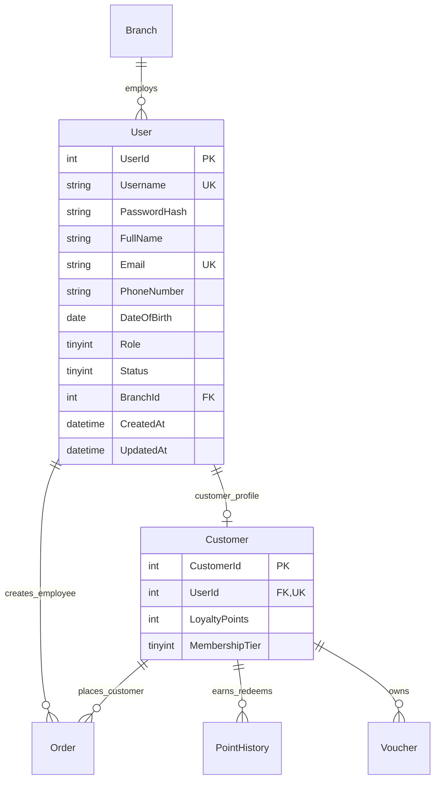

# MÔ TẢ CẤU TRÚC THỰC THỂ USER & CUSTOMER (USER ENTITY SPECIFICATION)

---

## MỤC LỤC
1. [Giới thiệu](#1-giới-thiệu)
2. [Nội dung chính](#2-nội-dung-chính)
   - 2.1. [Lý do thiết kế chuẩn hóa 3NF (Tách User & Customer)](#21-lý-do-thiết-kế-chuẩn-hóa-3nf-tách-user--customer)
   - 2.2. [Chi tiết Bảng 1: User (Tài Khoản Hệ Thống)](#22-chi-tiết-bảng-1-user-tài-khoản-hệ-thống)
   - 2.3. [Chi tiết Bảng 2: Customer (Hồ Sơ Khách Hàng Thành Viên)](#23-chi-tiết-bảng-2-customer-hồ-sơ-khách-hàng-thành-viên)
   - 2.4. [Sơ đồ Quan hệ Thực thể (ERD Diagram - User & Customer)](#24-sơ-đồ-quan-hệ-thực-thể-erd-diagram---user--customer)
   - 2.5. [Định nghĩa Entity Classes trong C# (.NET 8 EF Core)](#25-định-nghĩa-entity-classes-trong-c-net-8-ef-core)
3. [Open Questions](#3-open-questions)
4. [Ghi chú](#4-ghi-chú)
5. [Kết luận](#5-kết-luận)

---

## 1. GIỚI THIỆU

Tài liệu **UserEntity.md** chi tiết hóa thiết kế cơ sở dữ liệu cho 2 thực thể cốt lõi `[User]` và `Customer` theo đúng bản vẽ `Database_Design_ERD.pdf` (Version 2.0). 

Tài liệu định nghĩa các trường dữ liệu, kiểu dữ liệu, khóa chính, khóa ngoại, các ràng buộc UNIQUE/CHECK, và cách ánh xạ sang Entity Classes trong C# Entity Framework Core.

---

## 2. NỘI DUNG CHÍNH

### 2.1. Lý do thiết kế chuẩn hóa 3NF (Tách User & Customer)
Trong các thiết kế ban đầu, thông tin tích điểm (`LoyaltyPoints`) và hạng thành viên (`MembershipTier`) nằm chung trong bảng `User`. Tuy nhiên, theo phản hồi của chuyên gia và để đảm bảo chuẩn hóa 3NF:
- **Tài khoản Admin và Staff**: Không bao giờ sử dụng tích điểm hay đổi quà. Nếu để chung, 2 trường này sẽ bị `NULL` vô nghĩa trên hàng trăm tài khoản nhân viên.
- **Giải pháp v2.0**: Tách riêng bảng `Customer` liên kết với bảng `[User]` qua quan hệ **1-1 (`UserId` UNIQUE FK)**.
  - Bảng `[User]`: Chứa thông tin đăng nhập, xác thực và phân quyền dùng chung cho mọi vai trò.
  - Bảng `Customer`: Chỉ dành riêng cho người dùng có `Role = 4 (Customer)` để lưu điểm tích lũy và xếp hạng thành viên.

---

### 2.2. Chi tiết Bảng 1: User (Tài Khoản Hệ Thống)

Tên bảng SQL: `[User]`

| Tên Cột | Kiểu Dữ Liệu | Khóa | Ràng Buộc | Ghi Chú / Mô Tả |
| :--- | :--- | :---: | :--- | :--- |
| **`UserId`** | `INT IDENTITY(1,1)` | **PK** | `NOT NULL` | Mã người dùng tự tăng duy nhất |
| **`Username`** | `NVARCHAR(50)` | | `UNIQUE, NOT NULL` | Tên đăng nhập hệ thống |
| **`PasswordHash`** | `NVARCHAR(255)` | | `NOT NULL` | Mật khẩu đã mã hóa bằng BCrypt + Salt |
| **`FullName`** | `NVARCHAR(100)` | | `NOT NULL` | Họ và tên đầy đủ của người dùng |
| **`Email`** | `NVARCHAR(100)` | | `UNIQUE, NOT NULL` | Địa chỉ Email liên hệ |
| **`PhoneNumber`** | `NVARCHAR(15)` | | `NULL` | Số điện thoại cá nhân (Dùng xác thực OTP cho Customer) |
| **`DateOfBirth`** | `DATE` | | `NULL` | Ngày tháng năm sinh |
| **`Role`** | `TINYINT` | | `NOT NULL, CHECK (1..4)` | `1=Admin`, `2=Manager`, `3=Staff`, `4=Customer` |
| **`Status`** | `TINYINT` | | `DEFAULT 1, CHECK (1..2)` | `1=Active` (Hoạt động), `2=Locked` (Bị khóa) |
| **`BranchId`** | `INT` | **FK** | `NULL` | Trỏ tới `Branch(BranchId)` - Chi nhánh nhân viên làm việc |
| **`CreatedAt`** | `DATETIME` | | `DEFAULT GETDATE()` | Thời điểm khởi tạo tài khoản |
| **`UpdatedAt`** | `DATETIME` | | `NULL` | Thời điểm cập nhật thông tin gần nhất |

---

### 2.3. Chi tiết Bảng 2: Customer (Hồ Sơ Khách Hàng Thành Viên)

Tên bảng SQL: `Customer`

| Tên Cột | Kiểu Dữ Liệu | Khóa | Ràng Buộc | Ghi Chú / Mô Tả |
| :--- | :--- | :---: | :--- | :--- |
| **`CustomerId`** | `INT IDENTITY(1,1)` | **PK** | `NOT NULL` | Mã hồ sơ khách hàng duy nhất |
| **`UserId`** | `INT` | **FK** | `UNIQUE, NOT NULL` | Trỏ tới `[User](UserId)` (Quan hệ 1-1, ON DELETE CASCADE) |
| **`LoyaltyPoints`** | `INT` | | `DEFAULT 0, CHECK (>=0)` | Điểm tích lũy thưởng từ các giao dịch mua hàng |
| **`MembershipTier`** | `TINYINT` | | `DEFAULT 1, CHECK (1..4)` | `1=Bronze`, `2=Silver`, `3=Gold`, `4=Diamond` |

---

### 2.4. Sơ đồ Quan hệ Thực thể (ERD Diagram - User & Customer)



---

### 2.5. Định nghĩa Entity Classes trong C# (.NET 8 EF Core)

#### File `Domain/Entities/User.cs`:
```text
Cấu trúc thuộc tính User Entity:
- UserId (int, PK)
- Username (string)
- PasswordHash (string)
- FullName (string)
- Email (string)
- PhoneNumber (string?)
- DateOfBirth (DateTime?)
- Role (UserRole Enum)
- Status (UserStatus Enum)
- BranchId (int?)
- CreatedAt (DateTime)
- UpdatedAt (DateTime?)
- Navigation Property: CustomerProfile (Customer?)
```

#### File `Domain/Entities/Customer.cs`:
```text
Cấu trúc thuộc tính Customer Entity:
- CustomerId (int, PK)
- UserId (int, FK UNIQUE)
- LoyaltyPoints (int)
- MembershipTier (int)
- Navigation Property: User (User)
```

---

## 3. OPEN QUESTIONS

| STT | Vấn đề chưa quyết định | Tác động | Hướng xử lý đề xuất |
| :---: | :--- | :--- | :--- |
| 1 | Trường `BranchId` ở bảng `User` đối với tài khoản `Role = Admin` hoặc `Customer` sẽ nhận giá trị `NULL`. Liệu Admin có cần thuộc về chi nhánh cụ thể nào không? | Quyết định logic truy vấn chi nhánh. | Giữ `BranchId` dạng `NULLable` (`int?`). Admin/Customer không thuộc chi nhánh cụ thể nào (`BranchId = NULL`). |

---

## 4. GHI CHÚ
- Khi mã hóa mật khẩu bằng BCrypt, chuỗi hash trả về luôn có độ dài 60 ký tự. Cột `PasswordHash NVARCHAR(255)` đảm bảo chứa đủ dung lượng và linh hoạt nâng cấp thuật toán mã hóa tương lai.
- Ràng buộc `ON DELETE CASCADE` được cấu hình trên khóa ngoại `Customer.UserId` để khi xóa tài khoản User (môi trường Test), hồ sơ Customer tương ứng tự động bị xóa theo.

---

## 5. KẾT LUẬN

Tài liệu `UserEntity.md` đã làm rõ chi tiết cấu trúc 2 bảng CSDL `[User]` và `Customer` tuân thủ chuẩn 3NF từ bản vẽ `Database_Design_ERD.pdf`. Đây là nền tảng để triển khai các Entity Classes trong C# EF Core và thiết lập quan hệ CSDL cho phân hệ Authentication.
