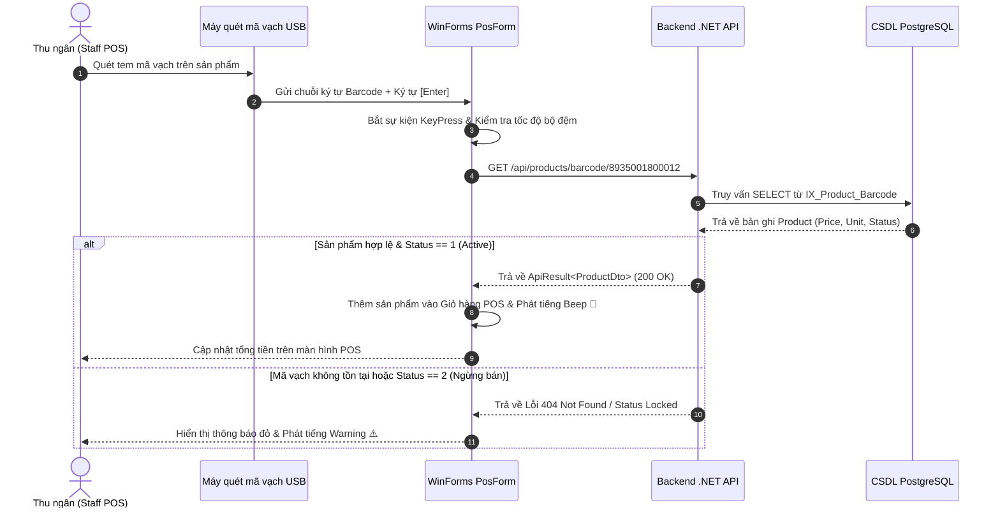

# THIẾT KẾ & QUY CHUẨN MÃ VẠCH (BARCODE SPECIFICATION)

---

## MỤC LỤC
1. [Giới thiệu](#1-giới-thiệu)
2. [Nội dung chính](#2-nội-dung-chính)
   - 2.1. [Các Chuẩn Mã vạch Được Hỗ trợ (Supported Barcode Standards)](#21-các-chuẩn-mã-vạch-được-hỗ-trợ-supported-barcode-standards)
   - 2.2. [Quy tắc Sinh Mã vạch Nội bộ (Internal Barcode Generation Rule)](#22-quy-tắc-sinh-mã-vạch-nội-bộ-internal-barcode-generation-rule)
   - 2.3. [Tích hợp Thiết bị Máy quét Mã vạch (Hardware Scanner Integration)](#23-tích-hợp-thiết-bị-máy-quét-mã-vạch-hardware-scanner-integration)
   - 2.4. [Xử lý Sự kiện Quét Mã vạch trên WinForms POS (`PosForm`)](#24-xử-lý-sự-kiện-quét-mã-vạch-trên-winforms-pos-posform)
   - 2.5. [Sơ đồ Luồng Xử lý Quét Mã vạch Tức thì (Real-time POS Scan Flow)](#25-sơ-đồ-luồng-xử-lý-quét-mã-vạch-tức-thì-real-time-pos-scan-flow)
3. [Ghi chú](#3-ghi-chú)
4. [Kết luận](#4-kết-luận)

---

## 1. GIỚI THIỆU

Tài liệu **Barcode.md** mô tả quy chuẩn kỹ thuật và giải pháp tích hợp xử lý Mã vạch (Barcode / QR Code) cho hệ thống **Smart SuperMarket**. Mã vạch là chìa khóa tối quan trọng giúp tối ưu hóa tốc độ thanh toán tại quầy thu ngân WinForms POS (`PosForm`), loại bỏ thao tác nhập tay thủ công và giảm thiểu tối đa sai sót khi bán hàng vào giờ cao điểm.

Tài liệu quy định các chuẩn mã vạch được chấp nhận, thuật toán sinh mã vạch nội bộ cho các mặt hàng tự đóng gói/cân kg, và giải pháp lập trình lắng nghe tín hiệu từ máy quét mã vạch USB/Webcam trên ứng dụng WinForms.

---

## 2. NỘI DUNG CHÍNH

### 2.1. Các Chuẩn Mã vạch Được Hỗ trợ (Supported Barcode Standards)

Hệ thống Smart SuperMarket hỗ trợ nhận diện và lưu trữ **3 nhóm chuẩn mã vạch**:

1. **EAN-13 (European Article Numbering - 13 chữ số)**:
   - Chuẩn mã vạch thương mại quốc tế phổ biến nhất trên hàng hóa đóng gói sẵn (VD: *8935001800012* - Mã vạch Việt Nam có tiền tố `893`).
2. **CODE-128 (Mã vạch độ dài tùy biến 8 - 50 ký tự)**:
   - Chuẩn mã vạch chứa cả chữ cái và chữ số, thích hợp cho mã vạch quản lý nội bộ chuỗi siêu thị.
3. **QR Code (2D Barcode)**:
   - Mã vạch 2 chiều tích hợp thông tin mã sản phẩm hoặc liên kết thanh toán MoMo / VNPay QR.

---

### 2.2. Quy tắc Sinh Mã vạch Nội bộ (Internal Barcode Generation Rule)

Đối với các mặt hàng chưa có mã vạch từ nhà sản xuất (như *Rau củ quả tươi, Thịt cá tươi sống đóng khay, Hàng cân ký*):

1. **Tiền tố chuẩn Nội bộ (Prefix)**:
   - Tất cả mã vạch nội bộ do siêu thị tự sinh có tiền tố bắt đầu bằng **`200`** (Dành riêng cho hàng nội bộ theo quy định GS1).
2. **Cấu trúc Mã vạch 13 chữ số (EAN-13 Nội bộ)**:
   - `200` (3 chữ số đầu): Tiền tố siêu thị nội bộ.
   - `XXXXX` (5 chữ số tiếp): Mã sản phẩm duy nhất (`ProductId` padded 5 chữ số).
   - `WWWWW` (4 chữ số tiếp): Trọng lượng sản phẩm theo gram (VD: `0500` = 500g) hoặc giá tiền.
   - `C` (1 chữ số cuối): Checksum tự động tính theo thuật toán Modulo 10 EAN-13.
3. **Thư viện Hỗ trợ Sinh Mã vạch**:
   - Sử dụng thư viện `ZXing.Net` hoặc `BarcodeLib` trên C# Backend / WinForms để render ảnh Barcode EAN-13/Code-128 in tem nhãn.

---

### 2.3. Tích hợp Thiết bị Máy quét Mã vạch (Hardware Scanner Integration)

Máy quét mã vạch tại quầy thu ngân (USB Barcode Scanner) hoạt động theo cơ chế **Emulated Keyboard Device (HID Input)**:
- Khi quét mã vạch, máy quét gửi chuỗi ký tự mã vạch với tốc độ cực nhanh (khoảng 20 - 50ms) vào hệ thống tương tự như bàn phím gõ siêu tốc.
- Kết thúc chuỗi quét, máy quét tự động gửi ký tự **`Enter` (`\n` hoặc `\r`)**.

---

### 2.4. Xử lý Sự kiện Quét Mã vạch trên WinForms POS (`PosForm`)

Để trải nghiệm bán hàng POS đạt tốc độ tức thì (< 100ms) mà thu ngân không cần phải click chuột vào ô tìm kiếm:

1. **Bắt sự kiện KeyPreview toàn Form**:
   - Thiết lập `this.KeyPreview = true;` trên `PosForm`.
2. **Bộ đệm Ký tự (Scan Buffer)**:
   - Khai báo một `StringBuilder _scanBuffer = new StringBuilder();` và biến ghi nhận thời điểm bấm phím `DateTime _lastKeypressTime`.
3. **Thuật toán Phân biệt Gõ tay vs Máy quét**:
   - Nếu khoảng cách giữa 2 ký tự liên tiếp `< 50ms` $\rightarrow$ Xác định là máy quét tự động gõ.
   - Khi gặp ký tự `Enter`: Trích xuất chuỗi mã vạch từ `_scanBuffer`, tự động xóa bộ đệm và gọi API `GET /api/products/barcode/{barcode}`.

---

### 2.5. Sơ đồ Luồng Xử lý Quét Mã vạch Tức thì (Real-time POS Scan Flow)

---

## 3. GHI CHÚ
- Đầu in tem nhãn mã vạch tại siêu thị phải được cài đặt độ phân giải tối thiểu 203 DPI để máy quét mã vạch đọc chính xác.
- Mã vạch sản phẩm tuyệt đối không chứa dấu tiếng Việt có dấu hoặc ký tự gạch chéo `/` để tránh bị lỗi trên URL API Path.

---

## 4. KẾT LUẬN

Tài liệu `Barcode.md` đã quy định rõ ràng các chuẩn mã vạch, quy tắc sinh mã vạch nội bộ EAN-13 và giải pháp xử lý sự kiện máy quét trên WinForms POS. Đây là nền tảng kỹ thuật đảm bảo chức năng bán hàng POS của Smart SuperMarket đạt hiệu năng tối đa.
