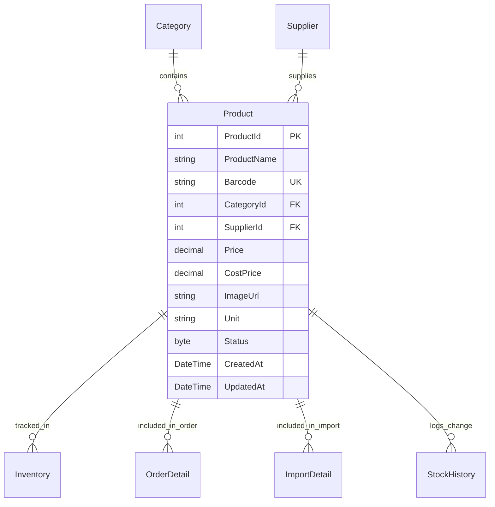

# THIẾT KẾ CHI TIẾT THỰC THỂ SẢN PHẨM (PRODUCT ENTITY SPECIFICATION)

---

## MỤC LỤC
1. [Giới thiệu](#1-giới-thiệu)
2. [Nội dung chính](#2-nội-dung-chính)
   - 2.1. [Mục đích và Ý nghĩa Nghiệp vụ của Bảng Product](#21-mục-đích-và-ý-nghĩa-nghiệp-vụ-của-bảng-product)
   - 2.2. [Cấu trúc Chi tiết các Trường Dữ liệu (Schema Fields)](#22-cấu-trúc-chi-tiết-các-trường-dữ-liệu-schema-fields)
   - 2.3. [Ràng buộc CSDL (Constraints, Validations, Default Values)](#23-ràng-buộc-csdl-constraints-validations-default-values)
   - 2.4. [Thiết kế Chỉ mục (Index Design)](#24-thiết-kế-chỉ-mục-index-design)
   - 2.5. [Mối quan hệ Entiy & Navigation Properties (EF Core)](#25-mối-quan-hệ-entiy--navigation-properties-ef-core)
   - 2.6. [Quy định Chỉnh sửa Trường Dữ liệu (Mutability Rules)](#26-quy-định-chỉnh-sửa-trường-dữ-liệu-mutability-rules)
   - 2.7. [Dữ liệu Mẫu (Sample Data Records)](#27-dữ-liệu-mẫu-sample-data-records)
   - 2.8. [Chuẩn Thiết kế ERP Best Practices](#28-chuẩn-thiết-kế-erp-best-practices)
3. [Ghi chú](#3-ghi-chú)
4. [Kết luận](#4-kết-luận)

---

## 1. GIỚI THIỆU

Tài liệu **ProductEntity.md** mô tả chi tiết thiết kế kỹ thuật cho bảng dữ liệu `Product` (Sản phẩm) thuộc hệ thống **Smart SuperMarket**. Thiết kế này hoàn toàn tuân thủ theo bản vẽ sơ đồ thực thể **Database_Design_ERD.pdf (Version 2.0)**, đảm bảo chuẩn hóa dữ liệu 3NF, tính toàn vẹn tham chiếu và hiệu năng truy vấn cao nhất.

Tài liệu định nghĩa rõ ràng kiểu dữ liệu, khóa chính/khóa ngoại, các ràng buộc UNIQUE, chỉ mục INDEX, quy tắc validation và các thuộc tính điều hướng (Navigation Properties) khi triển khai trên Entity Framework Core (EF Core 8/9).

---

## 2. NỘI DUNG CHÍNH

### 2.1. Mục đích và Ý nghĩa Nghiệp vụ của Bảng Product

- **Mục đích**: Lưu trữ toàn bộ thông tin định danh và thuộc tính kinh doanh của các mặt hàng được bày bán trong siêu thị.
- **Ý nghĩa nghiệp vụ**:
  - Là thực thể trung tâm kết nối giữa hoạt động nhập kho (`ImportReceipt`), bán hàng POS (`Order`), quản lý kho chuỗi (`Inventory`) và khuyến mãi (`Promotion`).
  - Cung cấp dữ liệu mã vạch duy nhất (`Barcode`) cho máy quét mã vạch USB/Webcam tại quầy thu ngân WinForms POS.
  - Lưu giữ giá bán niêm yết (`Price`) và giá vốn trung bình (`CostPrice`) để hệ thống tự động tính toán lợi nhuận gộp.
  - Định danh Nhà cung cấp chính (`SupplierId`) cho sản phẩm theo cập nhật mới nhất từ ERD v2.0.

---

### 2.2. Cấu trúc Chi tiết các Trường Dữ liệu (Schema Fields)

Bảng `Product` gồm **12 trường dữ liệu** chuẩn hóa theo `Database_Design_ERD.pdf`:

| Tên trường (Column Name) | Kiểu dữ liệu (Data Type) | Khóa (Key) | Ràng buộc (Constraint) | Mô tả & Ý nghĩa Nghiệp vụ |
| :--- | :--- | :---: | :--- | :--- |
| **`ProductId`** | `INT` | **PK** | `IDENTITY(1,1), NOT NULL` | Mã định danh tự tăng duy nhất của sản phẩm. |
| **`ProductName`** | `NVARCHAR(150)` | | `NOT NULL` | Tên đầy đủ của sản phẩm (VD: *Nước que Coca-Cola 330ml*). |
| **`Barcode`** | `NVARCHAR(50)` | | `UNIQUE, NOT NULL` | Mã vạch chuẩn EAN-13/CODE-128 hoặc QR Code duy nhất. |
| **`CategoryId`** | `INT` | **FK** | `NOT NULL` | Trỏ tới `Category(CategoryId)` — Danh mục sản phẩm. |
| **`SupplierId`** | `INT` | **FK** | `NULL` | Trỏ tới `Supplier(SupplierId)` — Nhà cung cấp chính (ERD v2.0). |
| **`Price`** | `DECIMAL(18,2)` | | `NOT NULL, CHECK (Price >= 0)` | Giá bán niêm yết hiện tại (VNĐ). |
| **`CostPrice`** | `DECIMAL(18,2)` | | `NULL, CHECK (CostPrice >= 0)` | Giá vốn trung bình nhập kho (VNĐ). |
| **`ImageUrl`** | `NVARCHAR(255)` | | `NULL` | Đường dẫn tương đối lưu ảnh (VD: `/images/products/p101.jpg`). |
| **`Unit`** | `NVARCHAR(20)` | | `NOT NULL` | Đơn vị tính (VD: *chai, lon, hộp, gói, kg, lốc, thùng*). |
| **`Status`** | `TINYINT` | | `DEFAULT 1, CHECK (Status IN (1, 2))` | Trạng thái kinh doanh: `1` = Đang bán, `2` = Ngừng kinh doanh. |
| **`CreatedAt`** | `DATETIME` | | `DEFAULT GETDATE(), NOT NULL` | Thời điểm khởi tạo bản ghi sản phẩm. |
| **`UpdatedAt`** | `DATETIME` | | `NULL` | Thời điểm cập nhật thông tin sản phẩm gần nhất. |

---

### 2.3. Ràng buộc CSDL (Constraints, Validations, Default Values)

1. **Ràng buộc Khóa chính (Primary Key)**:
   - `PK_Product`: `ProductId` tự động tăng (`IDENTITY(1,1)`).
2. **Ràng buộc Duy nhất (Unique Constraint)**:
   - `UQ_Product_Barcode`: Chuỗi `Barcode` phải là duy nhất trên toàn bộ hệ thống CSDL. Không được phép có 2 sản phẩm trùng mã vạch.
3. **Ràng buộc Khóa ngoại (Foreign Keys)**:
   - `FK_Product_Category`: `CategoryId` tham chiếu `Category(CategoryId)` (`ON DELETE RESTRICT`). Không thể xóa danh mục nếu đang có sản phẩm.
   - `FK_Product_Supplier`: `SupplierId` tham chiếu `Supplier(SupplierId)` (`ON DELETE SET NULL`). Nếu nhà cung cấp bị xóa, trường này chuyển về `NULL`.
4. **Ràng buộc Kiểm tra Miền giá trị (Check Constraints)**:
   - `CK_Product_Price`: `Price >= 0`. Giá bán không được là số âm.
   - `CK_Product_CostPrice`: `CostPrice IS NULL OR CostPrice >= 0`. Giá vốn không được là số âm.
   - `CK_Product_Status`: `Status IN (1, 2)`.
5. **Giá trị Mặc định (Default Values)**:
   - `Status` mặc định là `1` (Đang bán).
   - `CreatedAt` mặc định lấy thời gian hiện tại (`GETDATE()` trong SQL Server / `CURRENT_TIMESTAMP` trong PostgreSQL).

---

### 2.4. Thiết kế Chỉ mục (Index Design)

Để tối ưu hóa tốc độ tìm kiếm khi quét mã vạch POS và lọc danh sách sản phẩm:

| Tên Index | Các cột được Index | Loại Index | Mục đích Tối ưu hóa |
| :--- | :--- | :--- | :--- |
| `IX_Product_Barcode` | `Barcode` | **UNIQUE NONCLUSTERED** | Tối ưu tức thì tốc độ tìm sản phẩm khi quét mã vạch trên POS (< 10ms). |
| `IX_Product_CategoryId` | `CategoryId` | **NONCLUSTERED** | Tối ưu truy vấn danh sách sản phẩm theo từng Danh mục. |
| `IX_Product_SupplierId` | `SupplierId` | **NONCLUSTERED** | Tối ưu tìm kiếm sản phẩm do một Nhà cung cấp cụ thể cung ứng. |
| `IX_Product_Status_Name` | `Status`, `ProductName` | **NONCLUSTERED** | Tối ưu lọc sản phẩm "Đang bán" kết hợp tìm kiếm theo từ khóa tên. |

---

### 2.5. Mối quan hệ Entity & Navigation Properties (EF Core)

Trong mô hình Entity Framework Core (`SmartSupermarket.Backend.Domain.Entities.Product`):



#### Thuộc tính điều hướng trong C# Entity Class:
- **`Category`**: `public Category Category { get; set; } = null!;` (N-1)
- **`Supplier`**: `public Supplier? Supplier { get; set; }` (N-1, Nullable)
- **`Inventories`**: `public ICollection<Inventory> Inventories { get; set; }` (1-N)
- **`OrderDetails`**: `public ICollection<OrderDetail> OrderDetails { get; set; }` (1-N)
- **`ImportDetails`**: `public ICollection<ImportDetail> ImportDetails { get; set; }` (1-N)
- **`StockHistories`**: `public ICollection<StockHistory> StockHistories { get; set; }` (1-N)

---

### 2.6. Quy định Chỉnh sửa Trường Dữ liệu (Mutability Rules)

| Nhóm trường | Danh sách trường | Quy định Chỉnh sửa & Lý do Nghiệp vụ |
| :--- | :--- | :--- |
| **Bất biến (Immutable)** | `ProductId`, `CreatedAt` | **Không bao giờ được sửa** sau khi bản ghi được tạo lập. |
| **Kiểm soát chặt chẽ** | `Barcode` | **Hạn chế sửa**. Chỉ cho phép sửa khi nhập sai mã vạch lúc tạo mới và mã vạch mới chưa tồn tại trong CSDL. |
| **Cho phép sửa (Mutable)** | `ProductName`, `CategoryId`, `SupplierId`, `Price`, `CostPrice`, `ImageUrl`, `Unit`, `Status` | **Được phép sửa** bởi Admin/Manager. Khi sửa `Price`, hệ thống ghi nhận thời điểm `UpdatedAt = DateTime.UtcNow`. |

---

### 2.7. Dữ liệu Mẫu (Sample Data Records)

```json
[
  {
    "ProductId": 1,
    "ProductName": "Nước ngọt Coca-Cola Lon 330ml",
    "Barcode": "8935001800012",
    "CategoryId": 1,
    "SupplierId": 1,
    "Price": 10000.00,
    "CostPrice": 7500.00,
    "ImageUrl": "/images/products/coca_330ml.jpg",
    "Unit": "lon",
    "Status": 1,
    "CreatedAt": "2026-09-01T08:00:00Z",
    "UpdatedAt": null
  },
  {
    "ProductId": 2,
    "ProductName": "Sữa tươi tiệt trùng Vinamilk Có đường 1L",
    "Barcode": "8934673123456",
    "CategoryId": 2,
    "SupplierId": 2,
    "Price": 36000.00,
    "CostPrice": 29000.00,
    "ImageUrl": "/images/products/vinamilk_1l.jpg",
    "Unit": "hộp",
    "Status": 1,
    "CreatedAt": "2026-09-01T08:00:00Z",
    "UpdatedAt": null
  }
]
```

---

### 2.8. Chuẩn Thiết kế ERP Best Practices

1. **Khóa chínhSurrogate Key (`ProductId`)**: Sử dụng số nguyên tự tăng làm khóa chính thay vì dùng mã vạch `Barcode` làm khóa chính. Điều này giúp việc liên kết bảng nhẹ hơn (4-byte INT vs 50-byte VARCHAR) và cho phép đổi mã vạch khi cần mà không bị vỡ FK.
2. **Nguyên tắc Xóa mềm (Soft Delete)**: Tuyệt đối **không dùng lệnh SQL `DELETE`** trên bảng `Product`. Khi ngưng kinh doanh một mặt hàng, chỉ cập nhật `Status = 2 (Ngừng kinh doanh)`. Điều này bảo toàn dữ liệu lịch sử hóa đơn `Order` và báo cáo tài chính.
3. **Chính xác số thực cho Tiền tệ**: Sử dụng kiểu `DECIMAL(18,2)` cho `Price` và `CostPrice` để tránh lỗi làm tròn của kiểu `FLOAT`/`DOUBLE`.

---

## 3. GHI CHÚ
- Khi khởi tạo migration EF Core, Fluent API `UserConfiguration` phải cấu hình chính xác `HasPrecision(18, 2)` cho trường `Price` và `CostPrice`.
- Thuộc tính `SupplierId` có giá trị `NULL` áp dụng cho các sản phẩm nhỏ lẻ chưa cố định nhà cung cấp chính hoặc sản phẩm tự chế biến tại siêu thị.

---

## 4. KẾT LUẬN

Tài liệu `ProductEntity.md` đã quy định hoàn chỉnh và chuẩn hóa cấu trúc dữ liệu cho thực thể `Product` theo đúng bản vẽ `Database_Design_ERD.pdf`. Đây là tài liệu căn cứ bắt buộc cho tầng Data Access Layer và EF Core Model Configuration.