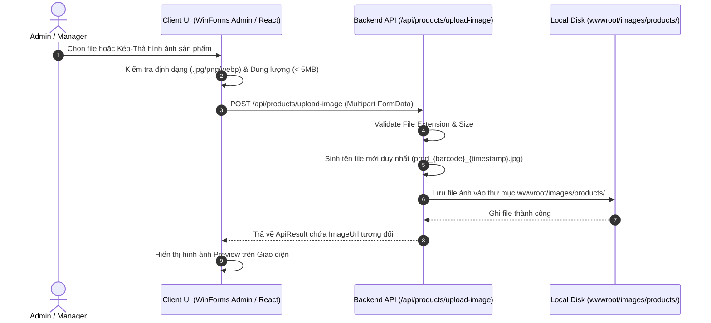

# THIẾT KẾ & QUY ĐỊNH HÌNH ẢNH SẢN PHẨM (PRODUCT IMAGE SPECIFICATION)

---

## MỤC LỤC
1. [Giới thiệu](#1-giới-thiệu)
2. [Nội dung chính](#2-nội-dung-chính)
   - 2.1. [Tổng quan Lưu trữ & Kiến trúc Hình ảnh (Image Architecture)](#21-tổng-quan-lưu-trữ--kiến-trúc-hình-ảnh-image-architecture)
   - 2.2. [Quy chuẩn Định dạng & Kích thước File Ảnh](#22-quy-chuẩn-định-dạng--kích-thước-file-ảnh)
   - 2.3. [Quy tắc Đặt tên File & Đường dẫn `ImageUrl`](#23-quy-tắc-đặt-tên-file--đường-dẫn-imageurl)
   - 2.4. [Xử lý Ảnh Mặc định (Fallback / Placeholder Image)](#24-xử-lý-ảnh-mặc-định-fallback--placeholder-image)
   - 2.5. [Quy trình Tải lên Hình ảnh (Image Upload Flow)](#25-quy-trình-tải-lên-hình-ảnh-image-upload-flow)
   - 2.6. [Tính năng Kéo-Thả (Drag & Drop) trên WinForms & React Web](#26-tính-năng-kéo-thả-drag--drop-trên-winforms--react-web)
3. [Ghi chú](#3-ghi-chú)
4. [Kết luận](#4-kết-luận)

---

## 1. GIỚI THIỆU

Tài liệu **ProductImage.md** định nghĩa các quy chuẩn kỹ thuật, kiến trúc lưu trữ và quy trình xử lý hình ảnh sản phẩm cho hệ thống **Smart SuperMarket**. Hình ảnh sản phẩm trực quan giúp Khách hàng mua sắm trên React Web Client dễ dàng nhận diện hàng hóa, đồng thời hỗ trợ Quản trị viên và Nhân viên xem trước hình ảnh trên WinForms Admin Dashboard.

Tài liệu quy định chi tiết vị trí lưu trữ trên Server Backend, kích thước tối ưu, quy tắc đặt tên file, xử lý hình ảnh mặc định và tính năng Kéo-Thả (Drag-and-Drop) đáp ứng tiêu chí F3 trong Rubric đồ án.

---

## 2. NỘI DUNG CHÍNH

### 2.1. Tổng quan Lưu trữ & Kiến trúc Hình ảnh (Image Architecture)

Hệ thống áp dụng phương án lưu trữ hình ảnh tập trung tại tầng Backend Web API (Phiên bản v1):
- **Vị trí vật lý trên Server**: `Backend/wwwroot/images/products/`
- **Địa chỉ URL truy cập**: `http://localhost:5137/images/products/<filename>` (Được phục vụ bởi middleware `app.UseStaticFiles()` trong ASP.NET Core).
- **Trường lưu trữ CSDL**: Trường `ImageUrl` (NVARCHAR(255)) trong bảng `Product` chỉ lưu đường dẫn tương đối (Relative Path), ví dụ: `/images/products/prod_8935001800012_20260909.jpg`.

---

### 2.2. Quy chuẩn Định dạng & Kích thước File Ảnh

1. **Định dạng file cho phép**:
   - `JPG` / `JPEG`, `PNG`, `WEBP`.
   - Không chấp nhận các định dạng `.gif`, `.bmp`, `.exe`, `.pdf`.
2. **Dung lượng file tối đa**:
   - Tối đa **5 MB / file ảnh**.
   - Backend validate dung lượng bằng `IFormFile.Length`. Nếu vượt quá 5MB $\rightarrow$ Trả về lỗi `400 Bad Request` ("Dung lượng ảnh không được vượt quá 5MB").
3. **Kích thước & Tỷ lệ hiển thị**:
   - Tỷ lệ khung hình khuyến nghị: **Tỷ lệ 1:1 (Vuông)**.
   - Độ phân giải khuyến nghị: `500 x 500 px` hoặc `800 x 800 px`.

---

### 2.3. Quy tắc Đặt tên File & Đường dẫn `ImageUrl`

Để đảm bảo không trùng tên file và tránh lưu đè khi upload:

1. **Công thức đặt tên file trên Server**:
   `prod_{Barcode}_{Timestamp}.{ext}`
   - `Barcode`: Mã vạch sản phẩm (VD: `8935001800012`).
   - `Timestamp`: Thời gian tải lên định dạng `yyyyMMddHHmmss` (VD: `20260909164500`).
   - `ext`: Đuôi mở rộng gốc (`.jpg`, `.png`).
   - *Ví dụ tên file hoàn chỉnh*: `prod_8935001800012_20260909164500.jpg`

---

### 2.4. Xử lý Ảnh Mặc định (Fallback / Placeholder Image)

1. Khi trường `ImageUrl` trong CSDL mang giá trị `NULL` hoặc chuỗi rỗng `""`:
   - Backend API và Client (React/WinForms) tự động thay thế bằng đường dẫn ảnh mặc định:
     `http://localhost:5137/images/products/no-image.png`
2. Đảm bảo giao diện hiển thị không bị vỡ khung hình (Broken Image) khi sản phẩm chưa kịp cập nhật hình ảnh đại diện.

---

### 2.5. Quy trình Tải lên Hình ảnh (Image Upload Flow)

---

### 2.6. Tính năng Kéo-Thả (Drag & Drop) trên WinForms & React Web

Đáp ứng tiêu chí **F3 trong Bảng Rubric Đồ án Lập trình Windows**:

1. **Trên ứng dụng WinForms Desktop (Admin Product Form)**:
   - Cấu hình `PictureBox` hoặc `Panel` xem trước ảnh: `AllowDrop = true`.
   - Bắt sự kiện `DragEnter`: Kiểm tra nếu dữ liệu kéo vào là File (`DataFormats.FileDrop`) $\rightarrow$ Hiện con trỏ `DragDropEffects.Copy`.
   - Bắt sự kiện `DragDrop`: Lấy đường dẫn file ảnh vừa thả vào, hiển thị preview lên `PictureBox` và tự động gửi API upload lên Server.
2. **Trên ứng dụng React Web Client**:
   - Sử dụng HTML5 Drag and Drop API hoặc thư viện `react-dropzone` hỗ trợ kéo thả hình ảnh mượt mà.

---

## 3. GHI CHÚ
- Thư mục `Backend/wwwroot/images/products/` phải có quyền ghi (Write Permission) trên môi trường Server.
- Khi cập nhật ảnh mới cho sản phẩm, hệ thống có thể thực hiện dọn dẹp (xóa) file ảnh cũ không còn sử dụng để tiết kiệm dung lượng đĩa cứng.

---

## 4. KẾT LUẬN

Tài liệu `ProductImage.md` đã quy định rõ ràng kiến trúc lưu trữ, định dạng file, quy tắc đặt tên và tính năng Kéo-Thả ảnh sản phẩm. Các quy chuẩn này đảm bảo tính thẩm mỹ giao diện và tối ưu hóa hiệu năng tải trang cho cả ứng dụng WinForms và Web.
