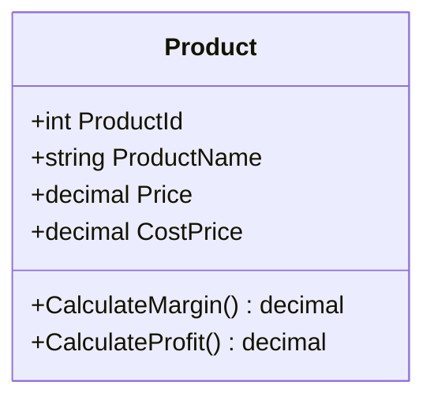

# THIẾT KẾ & QUY ĐỊNH GIÁ SẢN PHẨM (PRODUCT PRICE SPECIFICATION)

---

## MỤC LỤC
1. [Giới thiệu](#1-giới-thiệu)
2. [Nội dung chính](#2-nội-dung-chính)
   - 2.1. [Cấu trúc Định giá Sản phẩm (Pricing Model Architecture)](#21-cấu-trúc-định-giá-sản-phẩm-pricing-model-architecture)
   - 2.2. [Giải thích Chi tiết Giá bán Niêm yết (`Price`)](#22-giải-thích-chi-tiết-giá-bán-niêm-yết-price)
   - 2.3. [Giải thích Chi tiết Giá vốn Trung bình (`CostPrice`)](#23-giải-thích-chi-tiết-giá-vốn-trung-bình-costprice)
   - 2.4. [Công thức Tính Tỷ lệ Lợi nhuận Gộp (Profit Margin Calculation)](#24-công-thức-tính-tỷ-lệ-lợi-nhuận-gộp-profit-margin-calculation)
   - 2.5. [Quy trình Cập nhật Giá & Theo dõi Lịch sử (Price Update & Audit Trail)](#25-quy-trình-cập-nhật-giá--theo-dõi-lịch-sử-price-update--audit-trail)
   - 2.6. [Quy tắc Định dạng Tiền tệ & Hiển thị trên Giao diện](#26-quy-tắc-định-dạng-tiền-tệ--hiển-thị-trên-giao-diện)
3. [Ghi chú](#3-ghi-chú)
4. [Kết luận](#4-kết-luận)

---

## 1. GIỚI THIỆU

Tài liệu **ProductPrice.md** mô tả mô hình định giá, phương pháp quản lý giá bán, giá vốn và quy tắc kiểm soát tài chính cho sản phẩm trong hệ thống **Smart SuperMarket**. Quản lý giá chính xác là cơ sở cho các hoạt động tính tiền tại quầy POS, áp dụng khuyến mãi, tính toán lợi nhuận kinh doanh và phục vụ báo cáo phân tích AI Gemini.

Tài liệu quy định sự khác biệt giữa Giá bán niêm yết (`Price`) và Giá vốn (`CostPrice`), công thức tính tỷ lệ biên lợi nhuận, quy trình cập nhật giá an toàn và định dạng hiển thị tiền tệ VNĐ thống nhất toàn hệ thống.

---

## 2. NỘI DUNG CHÍNH

### 2.1. Cấu trúc Định giá Sản phẩm (Pricing Model Architecture)

Hệ thống quản lý 2 chỉ số giá cốt lõi cho mỗi bản ghi `Product` theo `Database_Design_ERD.pdf`:

1. **`Price` (Giá bán niêm yết hiện tại)**: Giá bán chính thức áp dụng khi tính tiền cho Khách hàng tại quầy POS WinForms hoặc đặt hàng online trên React Web.
2. **`CostPrice` (Giá vốn trung bình nhập kho)**: Giá trung bình tính trên mỗi đơn vị sản phẩm dựa trên các lần nhập hàng từ Nhà cung cấp.

---

### 2.2. Giải thích Chi tiết Giá bán Niêm yết (`Price`)

- **Kiểu dữ liệu**: `DECIMAL(18,2)`, không được `NULL`, phải lớn hơn hoặc bằng 0 (`Price >= 0`).
- **Đơn vị**: Việt Nam Đồng (VNĐ).
- **Phạm vi tác động**:
  - Tự động nhảy giá khi quét mã vạch trên `PosForm` WinForms.
  - Hiển thị công khai trên danh mục sản phẩm React Web Client.
  - Làm căn cứ nhân với số lượng (`Quantity`) để tính `SubTotal` trong `OrderDetail`.

---

### 2.3. Giải thích Chi tiết Giá vốn Trung bình (`CostPrice`)

- **Kiểu dữ liệu**: `DECIMAL(18,2)`, cho phép `NULL` (khi sản phẩm mới khởi tạo chưa có giao dịch nhập kho).
- **Cập nhật tự động**:
  - Khi lập Phiếu nhập hàng (`ImportReceipt`), hệ thống tự động tính toán lại Giá vốn trung bình theo phương pháp Bình quân gia quyền (Weighted Average Cost):
    $$\text{CostPrice}_{\text{mới}} = \frac{(\text{Tồn hiện tại} \times \text{CostPrice}_{\text{cũ}}) + (\text{Số lượng nhập} \times \text{Giá nhập})}{(\text{Tồn hiện tại} + \text{Số lượng nhập})}$$
- **Ý nghĩa**: Làm căn cứ để Admin xem báo cáo lãi/lỗ và phục vụ AI Gemini phân tích hiệu quả kinh doanh.

---

### 2.4. Công thức Tính Tỷ lệ Lợi nhuận Gộp (Profit Margin Calculation)

Dựa trên `Price` và `CostPrice`, hệ thống tự động tính toán 2 chỉ số tài chính:

1. **Lợi nhuận gộp trên từng đơn vị (Gross Profit per Unit)**:
   $$\text{Profit} = \text{Price} - \text{CostPrice}$$
2. **Tỷ lệ biên lợi nhuận gộp (Gross Profit Margin %)**:
   $$\text{Margin \%} = \frac{\text{Price} - \text{CostPrice}}{\text{Price}} \times 100\%$$

- *Ví dụ*:
  - `Price` = 10.000 VNĐ, `CostPrice` = 7.500 VNĐ.
  - $\text{Profit} = 10.000 - 7.500 = 2.500 \text{ VNĐ}$.
  - $\text{Margin \%} = \frac{2.500}{10.000} \times 100\% = 25\%$.

---

### 2.5. Quy trình Cập nhật Giá & Theo dõi Lịch sử (Price Update & Audit Trail)

1. **Phân quyền chỉnh sửa giá**: Chỉ người dùng có vai trò `Admin` hoặc `Manager` mới có quyền thay đổi giá bán `Price` (`PUT /api/products/{id}`).
2. **Cập nhật thời gian**: Mỗi khi `Price` thay đổi, trường `UpdatedAt` tự động gán bằng `DateTime.UtcNow`.
3. **Giá thời điểm bán (Snapshot Price)**:
   - Khi tạo đơn hàng (`Order`), giá tại thời điểm bán được ghi đè cố định vào cột `OrderDetail.UnitPrice`.
   - Dù sau này `Product.Price` có thay đổi thì lịch sử hóa đơn cũ vẫn giữ nguyên giá tại thời điểm bán, đảm bảo tính toàn vẹn tài chính.

---

### 2.6. Quy tắc Định dạng Tiền tệ & Hiển thị trên Giao diện

Toàn bộ giá tiền hiển thị trên giao diện WinForms Desktop, React Web Client và File in Hóa đơn PDF (`QuestPDF`) phải tuân thủ chuẩn định dạng tiền tệ Việt Nam:

1. **Định dạng chuẩn**: Sử dụng phân cách hàng nghìn bằng dấu chấm `.` và ký hiệu `đ` hoặc `VNĐ` ở cuối.
   - *Ví dụ*: `10.000 đ`, `36.000 VNĐ`, `1.250.000 VNĐ`.
2. **Trong mã nguồn C#**:
   - `price.ToString("N0", new CultureInfo("vi-VN")) + " VNĐ"` $\rightarrow$ Hiển thị `10.000 VNĐ`.
3. **Trong mã nguồn TypeScript/React**:
   - `new Intl.NumberFormat('vi-VN', { style: 'currency', currency: 'VND' }).format(price)`

---

## 3. GHI CHÚ
- Khi nhập giá bán trên WinForms Admin Form, sử dụng control `NumericUpDown` hoặc TextBox có Masked Formatting để ngăn ngừa người dùng nhập nhầm ký tự chữ.
- Tuyệt đối không lưu giá tiền dưới dạng chuỗi `string` trong CSDL để tránh lỗi khi tính toán tổng doanh thu.

---

## 4. KẾT LUẬN

Tài liệu `ProductPrice.md` đã quy định hoàn chỉnh mô hình định giá sản phẩm, phương pháp tính giá vốn trung bình và chuẩn hiển thị tiền tệ. Đây là tiêu chuẩn để triển khai logic kế toán và báo cáo doanh thu trên hệ thống Smart SuperMarket.
