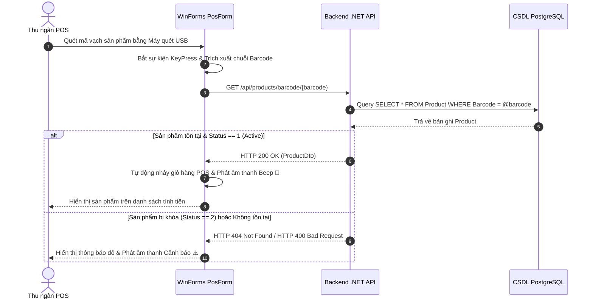
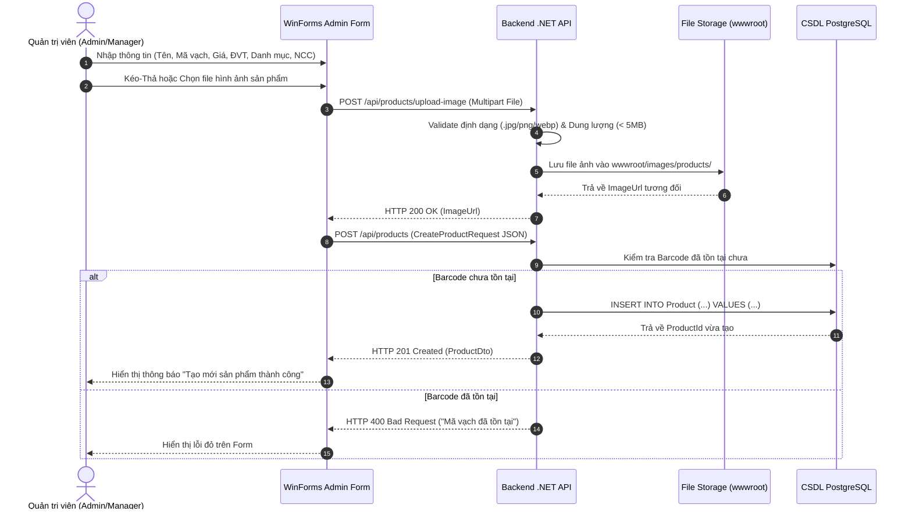
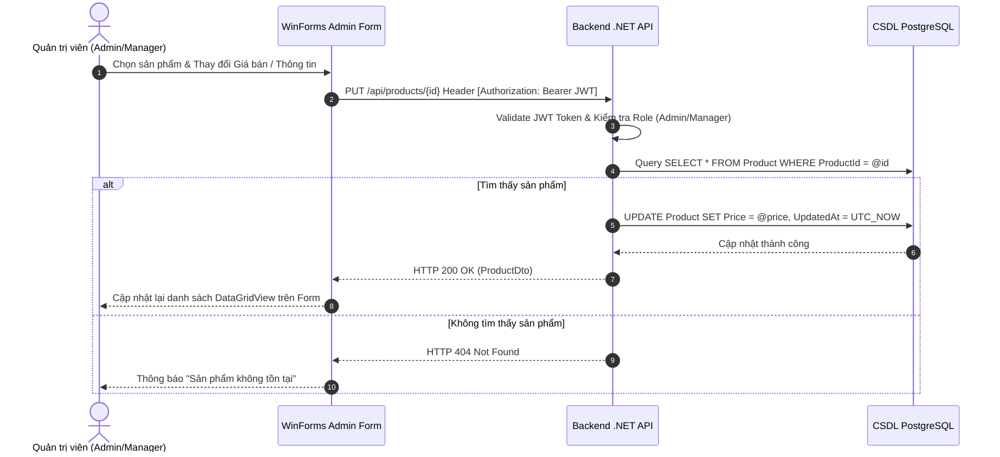
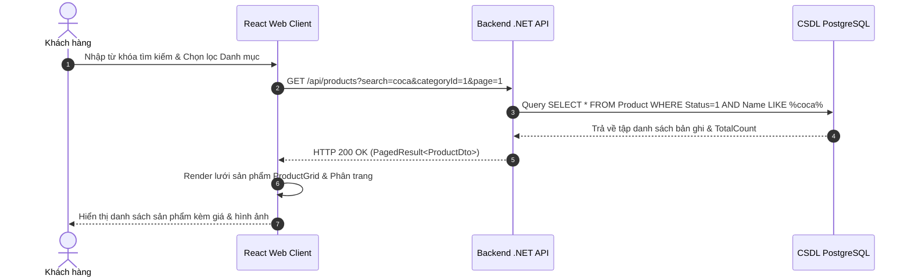
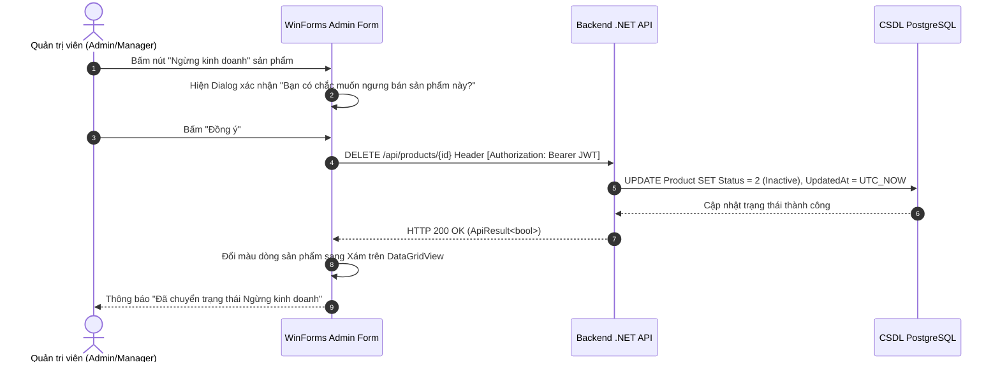

# SƠ ĐỒ TUẦN HOÀN QUẢN LÝ SẢN PHẨM (PRODUCT SEQUENCE DIAGRAM SPECIFICATION)

---

## MỤC LỤC
1. [Giới thiệu](#1-giới-thiệu)
2. [Nội dung chính](#2-nội-dung-chính)
   - 2.1. [Sơ đồ 1: Quyết định Bán hàng POS Quét Mã vạch (POS Barcode Scanning Flow)](#21-sơ-đồ-1-quyết-định-bán-hàng-pos-quét-mã-vạch-pos-barcode-scanning-flow)
   - 2.2. [Sơ đồ 2: Admin Tạo mới Sản phẩm & Upload Ảnh (Product Creation & Image Upload Flow)](#22-sơ-đồ-2-admin-tạo-mới-sản-phẩm--upload-ảnh-product-creation--image-upload-flow)
   - 2.3. [Sơ đồ 3: Admin Cập nhật Giá & Thông tin Sản phẩm (Product Update Flow)](#23-sơ-đồ-3-admin-cập-nhật-giá--thông-tin-sản-phẩm-product-update-flow)
   - 2.4. [Sơ đồ 4: Khách hàng Duyệt & Tìm kiếm Sản phẩm trên Web (Web Customer Search Flow)](#24-sơ-đồ-4-khách-hàng-duyệt--tìm-kiếm-sản-phẩm-trên-web-web-customer-search-flow)
   - 2.5. [Sơ đồ 5: Admin Khóa mềm / Ngừng Kinh doanh Sản phẩm (Soft Delete Flow)](#25-sơ-đồ-5-admin-khóa-mềm--ngừng-kinh-doanh-sản-phẩm-soft-delete-flow)
3. [Ghi chú](#3-ghi-chú)
4. [Kết luận](#4-kết-luận)

---

## 1. GIỚI THIỆU

Tài liệu **SequenceDiagram.md** mô tả các Sơ đồ Tuần hoàn (Sequence Diagrams) cho các quy trình nghiệp vụ cốt lõi thuộc phân hệ **02_Product (Quản lý Sản phẩm)**. Các sơ đồ này minh họa trực quan trình tự tương tác giữa các tác nhân (Thu ngân POS, Quản trị viên, Khách hàng), ứng dụng WinForms Desktop / React Web Client, tầng Backend REST API (.NET 8/9) và CSDL PostgreSQL.

Tất cả các sơ đồ đều được vẽ bằng cú pháp Mermaid chuẩn, sẵn sàng để render trực tiếp trên GitHub và VS Code.

---

## 2. NỘI DUNG CHÍNH

### 2.1. Sơ đồ 1: Quyết định Bán hàng POS Quét Mã vạch (POS Barcode Scanning Flow)

---

### 2.2. Sơ đồ 2: Admin Tạo mới Sản phẩm & Upload Ảnh (Product Creation & Image Upload Flow)

---

### 2.3. Sơ đồ 3: Admin Cập nhật Giá & Thông tin Sản phẩm (Product Update Flow)

---

### 2.4. Sơ đồ 4: Khách hàng Duyệt & Tìm kiếm Sản phẩm trên Web (Web Customer Search Flow)

---

### 2.5. Sơ đồ 5: Admin Khóa mềm / Ngừng Kinh doanh Sản phẩm (Soft Delete Flow)

---

## 3. GHI CHÚ
- Tất cả các luồng thay đổi dữ liệu (`POST`, `PUT`, `DELETE`) bắt buộc phải kiểm tra quyền `[Authorize(Roles = "Admin,Manager")]` tại Controller.
- Luồng POS quét mã vạch là luồng nhạy cảm nhất về thời gian phản hồi, yêu cầu thời gian xử lý toàn trình từ máy quét đến khi hiển thị UI dưới 100ms.

---

## 4. KẾT LUẬN

Tài liệu `SequenceDiagram.md` đã mô tả chi tiết 5 sơ đồ tuần hoàn thể hiện chính xác các luồng tương tác dữ liệu cho phân hệ Sản phẩm. Các sơ đồ này là căn cứ thiết kế luồng xử lý (Control Flow) cho lập trình viên Backend và Frontend/WinForms.
