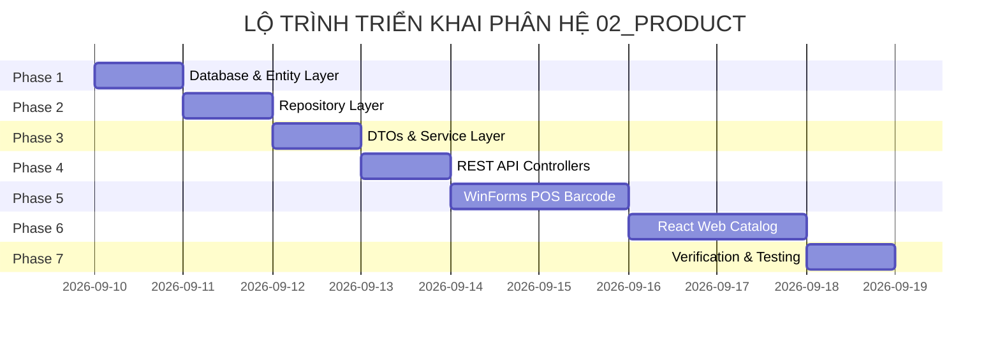

# DANH SÁCH TASK TRIỂN KHAI PHÂN HỆ SẢN PHẨM (PRODUCT MODULE IMPLEMENTATION TASKS)

---

## MỤC LỤC
1. [Giới thiệu](#1-giới-thiệu)
2. [Nội dung chính](#2-nội-dung-chính)
   - 2.1. [Tổng quan Tiến độ 7 Phase Triển khai Phân hệ Product](#21-tổng-quan-tiến-độ-7-phase-triển-khai-phân-hệ-product)
   - 2.2. [Phase 1: Database & Entity Layer (Cơ sở Dữ liệu & Entity C#)](#22-phase-1-database--entity-layer-cơ-sở-dữ-liệu--entity-c)
   - 2.3. [Phase 2: Repository Layer (Tầng Truy vấn Dữ liệu EF Core)](#23-phase-2-repository-layer-tầng-truy-vấn-dữ-liệu-ef-core)
   - 2.4. [Phase 3: DTOs & Service Layer (Tầng Logic Nghiệp vụ & DTOs)](#24-phase-3-dtos--service-layer-tầng-logic-nghiệp-vụ--dtos)
   - 2.5. [Phase 4: REST API Controllers (Tầng API Endpoints)](#25-phase-4-rest-api-controllers-tầng-api-endpoints)
   - 2.6. [Phase 5: WinForms POS Barcode Integration (Tầng Desktop Client POS)](#26-phase-5-winforms-pos-barcode-integration-tầng-desktop-client-pos)
   - 2.7. [Phase 6: Web Client Product Catalog (Tầng React Web Client)](#27-phase-6-web-client-product-catalog-tầng-react-web-client)
   - 2.8. [Phase 7: Verification & Testing (Kiểm thử & Nghiệm thu)](#28-phase-7-verification--testing-kiểm-thử--nghiệm-thu)
3. [Ghi chú](#3-ghi-chú)
4. [Kết luận](#4-kết-luận)

---

## 1. GIỚI THIỆU

Tài liệu **Tasks.md** chi tiết hóa danh mục công việc (Task Breakdown), lộ trình triển khai theo 7 Phase và tiêu chí nghiệm thu cho phân hệ **02_Product (Quản lý Sản phẩm)** trong dự án **Smart SuperMarket**. Lộ trình được thiết kế tuân thủ mô hình Feature-Folder Clean Architecture, cho phép phát triển cuộn cuốn từ CSDL đến Backend API, WinForms Desktop POS và React Web Client.

---

## 2. NỘI DUNG CHÍNH

### 2.1. Tổng quan Tiến độ 7 Phase Triển khai Phân hệ Product

---

### 2.2. Phase 1: Database & Entity Layer (Cơ sở Dữ liệu & Entity C#)

- [ ] **Task 1.1**: Tạo C# Entity `Product.cs` trong `Backend/Domain/Entities/` chứa đầy đủ 12 thuộc tính chuẩn theo `Database_Design_ERD.pdf`.
- [ ] **Task 1.2**: Tạo Fluent API Configuration `ProductConfiguration.cs` trong `Backend/Infrastructure/Persistence/Configurations/`:
  - Cấu hình Primary Key `ProductId` tự tăng.
  - Cấu hình Unique Index cho `Barcode`.
  - Cấu hình `HasPrecision(18, 2)` cho `Price` và `CostPrice`.
  - Cấu hình mối quan hệ Foreign Key tới `Category` (Restrict) và `Supplier` (SetNull).
- [ ] **Task 1.3**: Đăng ký `DbSet<Product> Products` trong `AppDbContext.cs`.
- [ ] **Task 1.4**: Chạy CLI `dotnet ef migrations add AddProductEntity` và `dotnet ef database update` áp dụng vào PostgreSQL CSDL.
- **Tiêu chí nghiệm thu**: Migration tạo bảng `Product` trong PostgreSQL thành công với 12 cột và đúng các chỉ mục FK/UNIQUE.

---

### 2.3. Phase 2: Repository Layer (Tầng Truy vấn Dữ liệu EF Core)

- [ ] **Task 2.1**: Định nghĩa interface `IProductRepository.cs` trong `Backend/Features/Products/Repositories/`:
  - `GetByIdAsync(int id)`
  - `GetByBarcodeAsync(string barcode)`
  - `GetPagedAsync(string search, int? categoryId, int? supplierId, byte? status, decimal? minPrice, decimal? maxPrice, int page, int pageSize)`
  - `AddAsync(Product product)`
  - `Update(Product product)`
  - `SaveChangesAsync()`
- [ ] **Task 2.2**: Triển khai class `ProductRepository.cs` sử dụng EF Core LINQ truy vấn bất đồng bộ (`async/await`).
- [ ] **Task 2.3**: Đăng ký Dependency Injection `services.AddScoped<IProductRepository, ProductRepository>()` trong `DependencyInjection.cs`.
- **Tiêu chí nghiệm thu**: Thực hiện unit build thành công 0 lỗi.

---

### 2.4. Phase 3: DTOs & Service Layer (Tầng Logic Nghiệp vụ & DTOs)

- [ ] **Task 3.1**: Tạo file `ProductDTOs.cs` trong `Backend/Features/Products/DTOs/`:
  - `ProductDto` (Response DTO).
  - `CreateProductRequest` (Request DTO có Data Annotations validation).
  - `UpdateProductRequest` (Request DTO).
  - `ProductBarcodeDto` (DTO tra cứu siêu nhẹ cho POS).
- [ ] **Task 3.2**: Định nghĩa interface `IProductService.cs` và class `ProductService.cs` trong `Backend/Features/Products/Services/`:
  - Thêm logic kiểm tra trùng `Barcode` (BR-PROD-01).
  - Thêm logic validate `Price >= 0` và giá vốn (BR-PROD-02).
  - Thêm logic Xóa mềm chuyển `Status = 2` (BR-PROD-03).
- [ ] **Task 3.3**: Đăng ký Dependency Injection `services.AddScoped<IProductService, ProductService>()`.
- **Tiêu chí nghiệm thu**: Logic kiểm tra trùng mã vạch và xóa mềm hoạt động chính xác.

---

### 2.5. Phase 4: REST API Controllers (Tầng API Endpoints)

- [ ] **Task 4.1**: Tạo `ProductsController.cs` trong `Backend/Features/Products/Controllers/`:
  - `GET /api/products`: Public / Authenticated.
  - `GET /api/products/{id}`: Public.
  - `GET /api/products/barcode/{barcode}`: Public / Authenticated POS.
  - `POST /api/products`: `[Authorize(Roles = "Admin,Manager")]`.
  - `PUT /api/products/{id}`: `[Authorize(Roles = "Admin,Manager")]`.
  - `DELETE /api/products/{id}`: `[Authorize(Roles = "Admin,Manager")]`.
  - `POST /api/products/upload-image`: `[Authorize(Roles = "Admin,Manager")]`.
- [ ] **Task 4.2**: Cấu hình Swagger UI hiển thị đầy đủ tài liệu API phân hệ Product.
- **Tiêu chí nghiệm thu**: Biên dịch `dotnet build` đạt 0 Error(s), 0 Warning(s).

---

### 2.6. Phase 5: WinForms POS Barcode Integration (Tầng Desktop Client POS)

- [ ] **Task 5.1**: Tạo `BarcodeScannerHelper.cs` bắt sự kiện gõ bàn phím tốc độ cao từ máy quét USB trên WinForms.
- [ ] **Task 5.2**: Tích hợp luồng quét Barcode nhảy giỏ hàng tự động trong `PosForm.cs`.
- [ ] **Task 5.3**: Xây dựng màn hình Quản lý Sản phẩm cho Admin (`AdminProductForm.cs`) hỗ trợ Kéo-Thả (Drag & Drop) ảnh sản phẩm.
- **Tiêu chí nghiệm thu**: Quét mã vạch trên POS tự động tìm sản phẩm và nhảy giỏ hàng < 100ms.

---

### 2.7. Phase 6: Web Client Product Catalog (Tầng React Web Client)

- [ ] **Task 6.1**: Tạo TypeScript interfaces cho `Product` trong `Frontend/src/shared/types/product.ts`.
- [ ] **Task 6.2**: Xây dựng trang Danh mục Sản phẩm `ProductListPage.tsx` tích hợp thanh tìm kiếm và lọc danh mục.
- [ ] **Task 6.3**: Xây dựng component `ProductCard.tsx` hiển thị giá niêm yết, đơn vị tính và hình ảnh sản phẩm.
- **Tiêu chí nghiệm thu**: Khách hàng duyệt và tìm kiếm sản phẩm mượt mà trên Web.

---

### 2.8. Phase 7: Verification & Testing (Kiểm thử & Nghiệm thu)

- [ ] **Task 7.1**: Seed dữ liệu sản phẩm mẫu trong `DbInitializer.cs`.
- [ ] **Task 7.2**: Kiểm thử toàn bộ API qua Postman Collection và Swagger UI.
- [ ] **Task 7.3**: Kiểm tra lại tính nhất quán với `Database_Design_ERD.pdf` và `CodingConvention.md`.
- **Tiêu chí nghiệm thu**: Toàn bộ hệ thống chạy ổn định 100%.

---

## 3. GHI CHÚ
- Khi triển khai Task, mỗi lập trình viên tạo Git Branch riêng theo chuẩn `feature/product-api` hoặc `feature/pos-barcode`.
- Mọi Commit phải gắn kèm mã Task tương ứng (VD: `feat(product): implement barcode lookup API #Task4.1`).

---

## 4. KẾT LUẬN

Tài liệu `Tasks.md` đã chia nhỏ và lộ trình hóa toàn bộ công việc triển khai phân hệ Sản phẩm qua 7 Phase rõ ràng. Đây là kế hoạch làm việc chính xác giúp đội ngũ phát triển hoàn thành đúng tiến độ và chất lượng.
