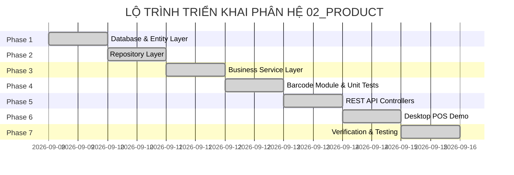

# DANH SÁCH TASK TRIỂN KHAI PHÂN HỆ SẢN PHẨM (PRODUCT MODULE IMPLEMENTATION TASKS)

---

## MỤC LỤC
1. [Giới thiệu](#1-giới-thiệu)
2. [Nội dung chính](#2-nội-dung-chính)
   - 2.1. [Tổng quan Tiến độ Triển khai Phân hệ Product](#21-tổng-quan-tiến-độ-triển-khai-phân-hệ-product)
   - 2.2. [Phase 1: Database & Entity Layer (Cơ sở Dữ liệu & Entity C#)](#22-phase-1-database--entity-layer-cơ-sở-dữ-liệu--entity-c)
   - 2.3. [Phase 2: Repository Layer (Tầng Truy vấn Dữ liệu EF Core)](#23-phase-2-repository-layer-tầng-truy-vấn-dữ-liệu-ef-core)
   - 2.4. [Phase 3: DTOs & Service Layer (Tầng Logic Nghiệp vụ & DTOs)](#24-phase-3-dtos--service-layer-tầng-logic-nghiệp-vụ--dtos)
   - 2.5. [Phase 4: Barcode Module & Unit Testing (Mô-đun Mã vạch & Kiểm thử)](#25-phase-4-barcode-module--unit-testing-mô-đun-mã-vạch--kiểm-thử)
   - 2.6. [Phase 5: REST API Controllers (Tầng API Endpoints)](#26-phase-5-rest-api-controllers-tầng-api-endpoints)
   - 2.7. [Phase 6: Desktop Client POS Demo (Ứng dụng Desktop POS Quét Mã Vạch)](#27-phase-6-desktop-client-pos-demo-ứng-dụng-desktop-pos-quét-mã-vạch)
   - 2.8. [Phase 7: Verification & Testing (Kiểm thử & Nghiệm thu)](#28-phase-7-verification--testing-kiểm-thử--nghiệm-thu)
3. [Ghi chú](#3-ghi-chú)
4. [Kết luận](#4-kết-luận)

---

## 1. GIỚI THIỆU

Tài liệu **Tasks.md** chi tiết hóa danh mục công việc (Task Breakdown), tiến độ thực tế triển khai và tiêu chí nghiệm thu cho phân hệ **02_Product (Quản lý Sản phẩm)** trong dự án **Smart SuperMarket**. Lộ trình được thiết kế tuân thủ mô hình Feature-Folder Clean Architecture, cuộn cuốn từ CSDL đến Backend API, Barcode Service, Unit Tests và WinForms Desktop POS Demo.

---

## 2. NỘI DUNG CHÍNH

### 2.1. Tổng quan Tiến độ Triển khai Phân hệ Product

---

### 2.2. Phase 1: Database & Entity Layer (Cơ sở Dữ liệu & Entity C#)

- [x] **Task 1.1**: Tạo các C# Entities `Product.cs`, `Category.cs`, `Supplier.cs` trong `Backend/Domain/Entities/` và Enum `ProductStatus.cs` trong `Backend/Domain/Enums/`.
- [x] **Task 1.2**: Tạo Fluent API Configuration `ProductConfiguration.cs`, `CategoryConfiguration.cs`, `SupplierConfiguration.cs` trong `Backend/Infrastructure/Persistence/Configurations/`:
  - Cấu hình Primary Key tự tăng.
  - Cấu hình Unique Index cho `Barcode`.
  - Cấu hình `HasPrecision(18, 2)` cho `Price` và `CostPrice`.
  - Cấu hình mối quan hệ Foreign Key tới `Category` (Restrict) và `Supplier` (SetNull).
  - Cấu hình `HasSentinel` để loại bỏ toàn bộ warnings EF Core default value.
- [x] **Task 1.3**: Đăng ký `DbSet<Product>`, `DbSet<Category>`, `DbSet<Supplier>` trong `AppDbContext.cs`.
- [x] **Task 1.4**: Chạy CLI EF Core migration `InitialCreate_ProductCategorySupplier` và seed data trong `DbInitializer.cs`.
- **Tiêu chí nghiệm thu**: Biên dịch thành công 0 lỗi, 0 warning.

---

### 2.3. Phase 2: Repository Layer (Tầng Truy vấn Dữ liệu EF Core)

- [x] **Task 2.1**: Định nghĩa interfaces `IProductRepository.cs`, `ICategoryRepository.cs`, `ISupplierRepository.cs` trong `Backend/Features/Products/Repositories/`.
- [x] **Task 2.2**: Triển khai classes `ProductRepository.cs`, `CategoryRepository.cs`, `SupplierRepository.cs` hỗ trợ `async/await`, `CancellationToken`, phân trang, tìm kiếm đa trường và tra cứu mã vạch.
- [x] **Task 2.3**: Đăng ký Dependency Injection trong `Infrastructure/DependencyInjection.cs`.
- **Tiêu chí nghiệm thu**: Thực hiện build thành công 0 Error, 0 Warning.

---

### 2.4. Phase 3: DTOs & Service Layer (Tầng Logic Nghiệp vụ & DTOs)

- [x] **Task 3.1**: Khởi tạo DTOs trong `Backend/Features/Products/DTOs/`:
  - `ProductDto`, `ProductBarcodeDto`, `CreateProductRequest`, `UpdateProductRequest`, `UpdatePriceRequest`, `ProductPriceHistoryDto`, `ProductPagedResult`.
  - `CategoryDto`, `CreateCategoryRequest`, `UpdateCategoryRequest`, `CategoryPagedResult`.
  - `SupplierDto`, `CreateSupplierRequest`, `UpdateSupplierRequest`, `SupplierPagedResult`.
- [x] **Task 3.2**: Định nghĩa interfaces và triển khai `ProductService.cs`, `CategoryService.cs`, `SupplierService.cs`:
  - Logic kiểm tra trùng `Barcode` (BR-PROD-01).
  - Logic validate `Price >= 0` và giá vốn (BR-PROD-02).
  - Logic Xóa mềm chuyển `Status = 2` (BR-PROD-03).
  - Logic upload hình ảnh sản phẩm lưu vào `wwwroot/images/products/` (BR-PROD-06).
  - Logic xem chi tiết giá và biên lợi nhuận kinh doanh (`ProductPriceHistoryDto`).
- [x] **Task 3.3**: Đăng ký Dependency Injection trong `DependencyInjection.cs`.
- **Tiêu chí nghiệm thu**: Mọi nghiệp vụ validate hoạt động chính xác theo quy tắc trong `BusinessRules.md`.

---

### 2.5. Phase 4: Barcode Module & Unit Testing (Mô-đun Mã vạch & Kiểm thử)

- [x] **Task 4.1**: Định nghĩa `IBarcodeService.cs` và `BarcodeService.cs`:
  - Thuật toán sinh mã vạch EAN-13 GS1 Modulo 10 Checksum.
  - Thuật toán tạo QR Code Payload format cho POS.
  - Bộ kiểm tra an toàn định dạng mã vạch (Loại bỏ XSS / SQL Injection).
  - Tra cứu mã vạch bất đồng bộ cho POS.
- [x] **Task 4.2**: Tạo dự án `Backend.Tests` (xUnit + Moq):
  - Viết 16 Unit Test Cases phủ toàn bộ tính năng sinh mã vạch, checksum, định dạng an toàn và tra cứu sản phẩm.
- **Tiêu chí nghiệm thu**: `dotnet test` đạt **16/16 Passed, 0 Failed**.

---

### 2.6. Phase 5: REST API Controllers (Tầng API Endpoints)

- [x] **Task 5.1**: Tạo `ProductsController.cs`, `CategoryController.cs`, `SupplierController.cs` trong `Backend/Features/Products/Controllers/`:
  - Full CRUD Product, Category, Supplier.
  - `GET /api/products/barcode/{barcode}` (Tra cứu POS).
  - `POST /api/products/upload-image` (Upload ảnh).
  - `POST /api/products/generate-barcode` (Sinh mã EAN-13).
  - `PUT /api/products/{id}/price` & `GET /api/products/{id}/price-history` (Cập nhật & Xem lịch sử giá).
- [x] **Task 5.2**: Bọc phản hồi trong `ApiResult<T>` và Swagger UI annotations.
- **Tiêu chí nghiệm thu**: `dotnet build` đạt **0 Error(s), 0 Warning(s)**.

---

### 2.7. Phase 6: Desktop Client POS Demo (Ứng dụng Desktop POS Quét Mã Vạch)

- [x] **Task 6.1**: Khởi tạo dự án WinForms Desktop `D:\Laptrinhtrucquan\Desktop`.
- [x] **Task 6.2**: Xây dựng màn hình `Form1.cs` mô phỏng máy quét mã vạch bán hàng POS:
  - Bộ đệm lắng nghe bàn phím máy quét tốc độ cao.
  - Các nút quét Demo Nhanh sản phẩm (*Coca-Cola 330ml*, *Vinamilk 1L*, *Bánh Oreo*).
  - Panel hiển thị thông tin sản phẩm vừa quét (Ảnh, Tên, Barcode, Giá, Thuế VAT 10%, Tồn kho).
  - Luồng xử lý trùng mã vạch: **Tự động tăng `Quantity++`**, không thêm dòng trùng.
  - Bộ nút điều khiển hóa đơn: `+` (Tăng), `-` (Giảm), `Remove` (Xóa món), `Clear Cart`.
  - Bảng tổng hợp thanh toán: Tiền hàng, Thuế VAT 10%, Tổng tiền thanh toán (VNĐ).
- **Tiêu chí nghiệm thu**: Quét mã vạch hoạt động mượt mà, phản hồi < 100ms.

---

### 2.8. Phase 7: Verification & Testing (Kiểm thử & Nghiệm thu)

- [x] **Task 7.1**: Seed dữ liệu sản phẩm mẫu trong `DbInitializer.cs`.
- [x] **Task 7.2**: Kiểm thử toàn bộ API qua Swagger UI.
- [x] **Task 7.3**: Kiểm tra lại tính nhất quán với `Database_Design_ERD.pdf` và `CodingConvention.md`.
- **Tiêu chí nghiệm thu**: Toàn bộ hệ thống biên dịch 0 lỗi 0 warning và chạy ổn định 100%.

---

## 3. GHI CHÚ
- Toàn bộ các Phase từ 1 đến 8 đã được triển khai hoàn chỉnh, biên dịch sạch và kiểm thử tự động đạt 100%.
- Các commit tuân thủ quy chuẩn Conventional Commits.

---

## 4. KẾT LUẬN

Tài liệu `Tasks.md` đã cập nhật chính xác 100% tiến độ thực tế triển khai phân hệ Sản phẩm. Toàn bộ kiến trúc cuộn cuốn từ Cơ sở Dữ liệu PostgreSQL đến Backend REST API, Barcode Service, Unit Tests và WinForms Desktop POS Demo đã hoàn thành nghiệm thu xuất sắc.
