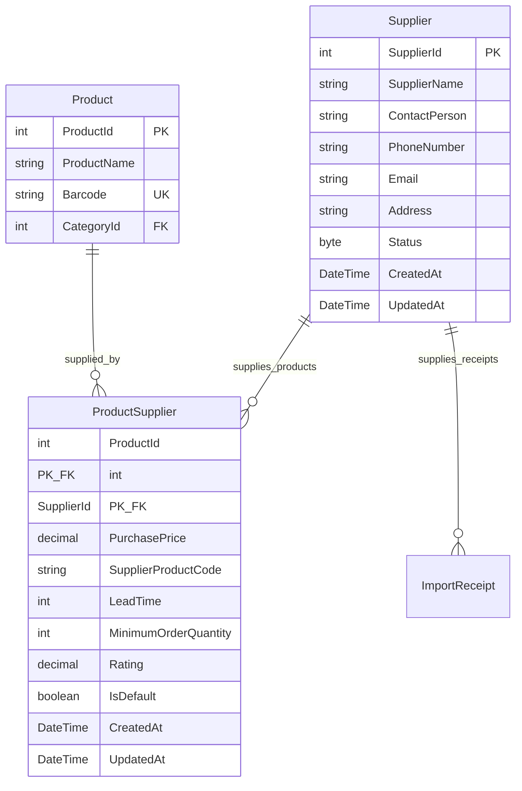

# TÀI LIỆU TỔNG QUAN PHÂN HỆ QUẢN LÝ NHÀ CUNG CẤP (SUPPLIER MODULE OVERVIEW)

---

## MỤC LỤC
1. [Giới thiệu Phân hệ](#1-giới-thiệu-phân-hệ)
2. [Cấu trúc Tài liệu Phân hệ Supplier](#2-cấu-trúc-tài-liệu-phân-hệ-supplier)
3. [Kiến trúc Thực thể & Sơ đồ Quan hệ (ERD N-N)](#3-kiến-trúc-thực-thể--sơ-đồ-quan-hệ-erd-n-n)
4. [Tóm tắt Các Quy tắc Nghiệp vụ Chính (Business Rules Summary)](#4-tóm-tắt-các-quy-tắc-nghiệp-vụ-chính-business-rules-summary)
5. [Phân quyền Thao tác theo Vai trò (Authorization Matrix)](#5-phân-quyền-thao-tác-theo-vai-trò-authorization-matrix)
6. [Lộ trình Triển khai Phân hệ (Roadmap Phases)](#6-lộ-trình-triển-khai-phân-hệ-roadmap-phases)

---

## 1. GIỚI THIỆU PHÂN HỆ

Phân hệ **Quản lý Nhà cung cấp (04_Supplier)** thuộc hệ thống **Smart SuperMarket** giữ vai trò quản lý toàn bộ đối tác cung ứng hàng hóa cho siêu thị. Phân hệ cung cấp các chức năng quản lý thông tin nhà cung cấp, liên kết nhiều-nhiều (Many-to-Many) giữa **Sản phẩm (`Product`)** và **Nhà cung cấp (`Supplier`)** thông qua bảng thực thể liên kết **`ProductSupplier`**.

### Các đặc điểm kỹ thuật & nghiệp vụ trọng tâm:
- **Quan hệ Many-to-Many (`Product` <-> `Supplier`)**: Một sản phẩm có thể được cung ứng bởi nhiều nhà cung cấp khác nhau, và một nhà cung cấp có thể phân phối nhiều sản phẩm.
- **Dữ liệu Thương mại chi tiết trên `ProductSupplier`**: Lưu giữ giá nhập (`PurchasePrice`), mã sản phẩm của NCC (`SupplierProductCode`), thời gian giao hàng (`LeadTime`), số lượng đặt hàng tối thiểu (`MinimumOrderQuantity`), đánh giá uy tín (`Rating`) và đánh dấu nhà cung cấp mặc định (`IsDefault`).
- **Phân quyền bảo mật chặt chẽ (Role-Based Access Control - RBAC)**:
  - **Admin / Manager / Staff**: Được phép thực hiện đầy đủ các thao tác CRUD Nhà cung cấp và quản lý liên kết sản phẩm.
  - **AI (Gemini Assistant)**: Chỉ được phép truy cập **Đọc dữ liệu (Read-Only)** để phục vụ phân tích báo cáo nhập hàng, dự báo tồn kho và đề xuất đối tác cung ứng.
  - **Customer / Public**: Không có quyền truy cập thông tin nhà cung cấp.

---

## 2. CẤU TRÚC TÀI LIỆU PHÂN HỆ SUPPLIER

Phân hệ `docs/04_Supplier/` bao gồm 6 tài liệu chuẩn hóa đóng vai trò là **Single Source of Truth (SSOT)**:

| Tên file tài liệu | Nội dung & Mục đích kỹ thuật |
| :--- | :--- |
| **`README.md`** | Tài liệu tổng quan, định hướng kiến trúc, phân quyền và sitemap phân hệ Supplier. |
| **`SupplierEntity.md`** | Thiết kế chi tiết CSDL cho bảng `Supplier` và bảng liên kết `ProductSupplier` (Fields, PK/FK, Index, EF Core Mapping). |
| **`BusinessRules.md`** | Tập hợp các Quy tắc Nghiệp vụ (BR-SUPP-01 đến BR-SUPP-08) bắt buộc tuân thủ ở tầng Domain & Service. |
| **`API.md`** | Đặc tả kỹ thuật RESTful API Endpoints (`/api/v1/suppliers`), Request/Response DTOs, HTTP Status Codes. |
| **`SequenceDiagram.md`** | Sơ đồ tuần tự Mermaid mô tả luồng xử lý CRUD, liên kết N-N sản phẩm và truy vấn Read-Only cho AI. |
| **`Tasks.md`** | Danh sách công việc triển khai mã nguồn chi tiết theo 5 Phase (Database, Repository, Service, API, Test). |

---

## 3. KIẾN TRÚC THỰC THỂ & SƠ ĐỒ QUAN HỆ (ERD N-N)

---

## 4. TÓM TẮT CÁC QUY TẮC NGHIỆP VỤ CHÍNH (BUSINESS RULES SUMMARY)

| Mã quy tắc | Tên quy tắc nghiệp vụ | Mô tả ngắn gọn | Mức độ nghiêm ngặt |
| :---: | :--- | :--- | :---: |
| **BR-SUPP-01** | Tính Duy nhất của Nhà cung cấp | Tên nhà cung cấp (`SupplierName`), Mã số thuế/Email/Số điện thoại không được trùng lặp. | **Bắt buộc (Critical)** |
| **BR-SUPP-02** | Chuẩn hóa Thông tin Liên hệ | Số điện thoại đúng định dạng VN (10 chữ số), Email đúng định dạng RFC 5322. | **Bắt buộc (High)** |
| **BR-SUPP-03** | Ràng buộc Liên kết N-N `ProductSupplier` | Một sản phẩm chỉ có tối đa 1 Nhà cung cấp mặc định (`IsDefault = true`). | **Bắt buộc (Critical)** |
| **BR-SUPP-04** | Kiểm soát Giá nhập & Điều khoản Cung ứng | `PurchasePrice >= 0`, `LeadTime >= 0`, `MinimumOrderQuantity >= 1`, `Rating` từ 1.0 đến 5.0. | **Bắt buộc (High)** |
| **BR-SUPP-05** | Quản lý Trạng thái & Xóa mềm | Không xóa vật lý NCC nếu đã phát sinh phiếu nhập hàng `ImportReceipt` hoặc liên kết sản phẩm. Dùng `Status = 2 (Inactive)`. | **Bắt buộc (Critical)** |
| **BR-SUPP-06** | Phân quyền Thao tác theo Vai trò | Admin/Staff được CRUD; AI chỉ được Đọc (Read-Only); Customer bị cấm. | **Bắt buộc (Critical)** |

---

## 5. PHÂN QUYỀN THAO TÁC THEO VAI TRÒ (AUTHORIZATION MATRIX)

| Chức năng / API Endpoint | Admin (1) | Manager (2) | Staff (3) | AI Agent | Customer (4) / Public |
| :--- | :---: | :---: | :---: | :---: | :---: |
| **Xem danh sách & Chi tiết Nhà cung cấp** | ✅ | ✅ | ✅ | ✅ *(Read-Only)* | ❌ |
| **Xem danh sách Sản phẩm theo Nhà cung cấp** | ✅ | ✅ | ✅ | ✅ *(Read-Only)* | ❌ |
| **Tạo mới / Cập nhật thông tin Nhà cung cấp** | ✅ | ✅ | ✅ | ❌ | ❌ |
| **Xóa mềm / Khôi phục Nhà cung cấp** | ✅ | ✅ | ✅ | ❌ | ❌ |
| **Tạo / Cập nhật Liên kết `ProductSupplier`** | ✅ | ✅ | ✅ | ❌ | ❌ |
| **Hủy liên kết Sản phẩm - Nhà cung cấp** | ✅ | ✅ | ✅ | ❌ | ❌ |

---

## 6. LỘ TRÌNH TRIỂN KHAI PHÂN HỆ (ROADMAP PHASES)

1. **Phase 1 - Database Layer**: Triển khai Entity `Supplier`, `ProductSupplier`, EF Core Fluent API Mapping, Navigation Properties và Migration.
2. **Phase 2 - Repository Layer**: Triển khai `ISupplierRepository` & `SupplierRepository` hỗ trợ CRUD, tra cứu N-N, lọc phân trang và lấy danh sách sản phẩm theo NCC.
3. **Phase 3 - Service Layer**: Triển khai `ISupplierService` & `SupplierService` thực thi toàn bộ Business Rules (BR-SUPP-01 đến BR-SUPP-06).
4. **Phase 4 - API Layer**: Triển khai `SupplierController` đầy đủ Swagger DTOs, HTTP Status Codes, Validation và Attribute Authorize.
5. **Phase 5 - Testing & Verification**: Viết bộ Unit Test trong `Backend.Tests` kiểm thử toàn bộ nghiệp vụ N-N và phân quyền truy cập.
