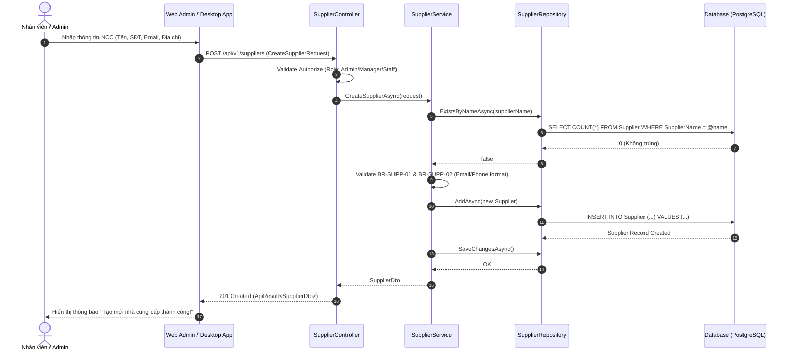
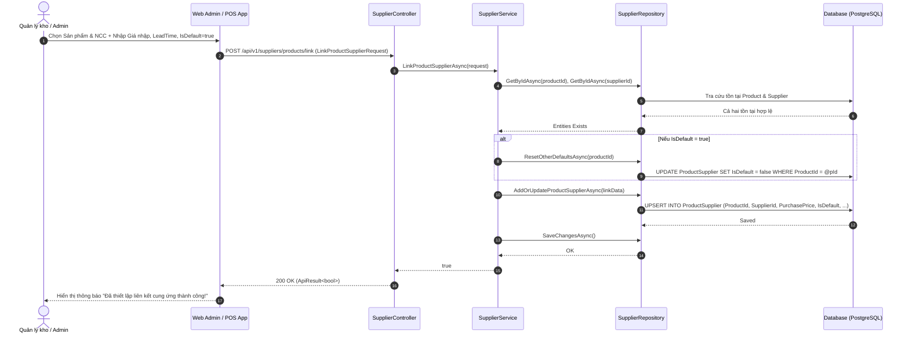
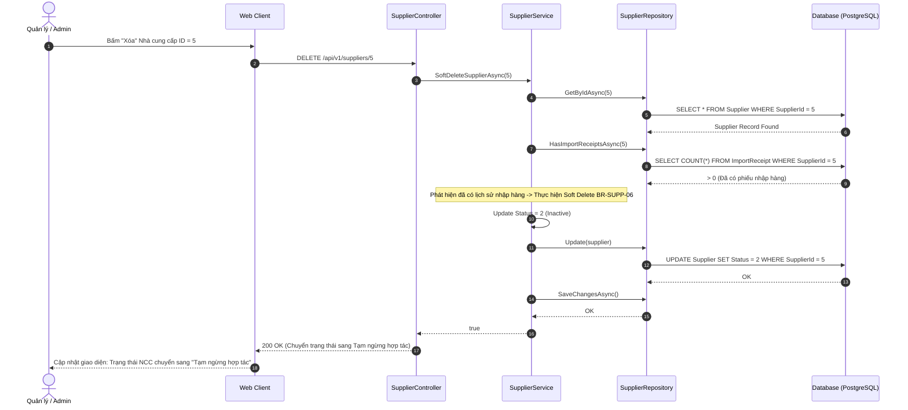
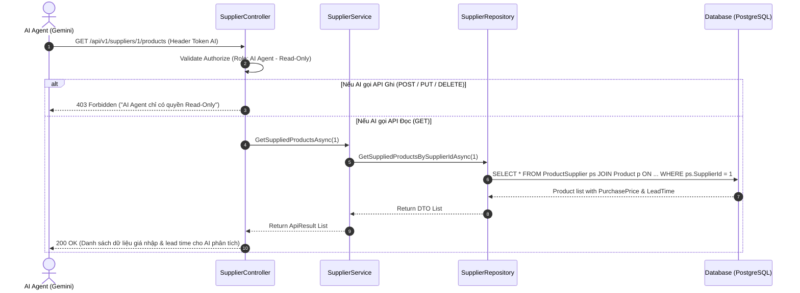

# SƠ ĐỒ TUẦN TỰ PHÂN HỆ QUẢN LÝ NHÀ CUNG CẤP (SUPPLIER SEQUENCE DIAGRAM SPECIFICATION)

---

## MỤC LỤC
1. [Giới thiệu](#1-giới-thiệu)
2. [Sơ đồ Tuần tự Chi tiết](#2-sơ-đồ-tuần-tự-chi-tiết)
   - 2.1. [Luồng 1: Tạo mới Nhà cung cấp (Admin / Staff)](#21-luồng-1-tạo-mới-nhà-cung-cấp-admin--staff)
   - 2.2. [Luồng 2: Cấu hình Liên kết ProductSupplier N-N & Thiết lập NCC Mặc định](#22-luồng-2-cấu-hình-liên-kết-productsupplier-n-n--thiết-lập-ncc-mặc-định)
   - 2.3. [Luồng 3: Xóa mềm Nhà cung cấp (Soft Delete)](#23-luồng-3-xóa-mềm-nhà-cung-cấp-soft-delete)
   - 2.4. [Luồng 4: AI Agent Tra cứu Read-Only Phân tích Cung ứng](#24-luồng-4-ai-agent-tra-cứu-read-only-phân-tích-cung-ứng)
3. [Ghi chú](#3-ghi-chú)
4. [Kết luận](#4-kết-luận)

---

## 1. GIỚI THIỆU

Tài liệu **SequenceDiagram.md** mô hình hóa trực quan luồng tương tác giữa Người dùng (User / AI Agent), Giao diện Client, Controller, Service Layer, Repository và CSDL PostgreSQL trong phân hệ Nhà cung cấp.

---

## 2. SƠ ĐỒ TUẦN TỰ CHI TIẾT

### 2.1. Luồng 1: Tạo mới Nhà cung cấp (Admin / Staff)

---

### 2.2. Luồng 2: Cấu hình Liên kết ProductSupplier N-N & Thiết lập NCC Mặc định

---

### 2.3. Luồng 3: Xóa mềm Nhà cung cấp (Soft Delete)

---

### 2.4. Luồng 4: AI Agent Tra cứu Read-Only Phân tích Cung ứng

---

## 3. GHI CHÚ
- Mọi thao tác ghi dữ liệu từ client đều trải qua kiểm tra token xác thực và phân quyền RBAC trước khi đi vào Service.
- Luồng AI Agent tuyệt đối tuân thủ chỉ xem dữ liệu Read-Only.

---

## 4. KẾT LUẬN

Tài liệu `SequenceDiagram.md` đã mô tả đầy đủ 4 luồng thao tác tuần tự cốt lõi của phân hệ Nhà cung cấp, là nền tảng trực quan cho quá trình phát triển mã nguồn backend và frontend.
