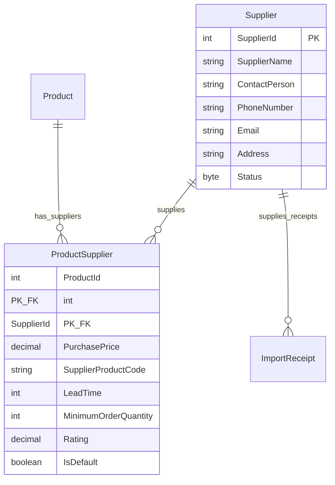

# THIẾT KẾ CHI TIẾT THỰC THỂ NHÀ CUNG CẤP & LIÊN KẾT SẢN PHẨM (SUPPLIER & PRODUCT-SUPPLIER ENTITY SPECIFICATION)

---

## MỤC LỤC
1. [Giới thiệu](#1-giới-thiệu)
2. [Nội dung chính](#2-nội-dung-chính)
   - 2.1. [Mục đích và Ý nghĩa Nghiệp vụ](#21-mục-đích-và-ý-nghĩa-nghiệp-vụ)
   - 2.2. [Cấu trúc Chi tiết Bảng Supplier](#22-cấu-trúc-chi-tiết-bảng-supplier)
   - 2.3. [Cấu trúc Chi tiết Bảng Thực thể Liên kết ProductSupplier (Many-to-Many)](#23-cấu-trúc-chi-tiết-bảng-thực-thể-liên-kết-productsupplier-many-to-many)
   - 2.4. [Ràng buộc CSDL (Constraints, Validations, Default Values)](#24-ràng-buộc-csdl-constraints-validations-default-values)
   - 2.5. [Thiết kế Chỉ mục (Index Design)](#25-thiết-kế-chỉ-mục-index-design)
   - 2.6. [Mối quan hệ Entity & Navigation Properties (EF Core)](#26-mối-quan-hệ-entity--navigation-properties-ef-core)
   - 2.7. [Dữ liệu Mẫu (Sample Data Records)](#27-dữ-liệu-mẫu-sample-data-records)
   - 2.8. [Chuẩn Thiết kế ERP Best Practices](#28-chuẩn-thiết-kế-erp-best-practices)
3. [Ghi chú](#3-ghi-chú)
4. [Kết luận](#4-kết-luận)

---

## 1. GIỚI THIỆU

Tài liệu **SupplierEntity.md** mô tả chi tiết thiết kế kỹ thuật cho bảng dữ liệu `Supplier` (Nhà cung cấp) và bảng thực thể liên kết Nhiều-Nhiều **`ProductSupplier`** thuộc hệ thống **Smart SuperMarket**. Thiết kế này tuân thủ chuẩn hóa CSDL 3NF, bảo toàn dữ liệu thương mại và đáp ứng kiến trúc kết nối linh hoạt giữa sản phẩm và các đối tác cung ứng.

---

## 2. NỘI DUNG CHÍNH

### 2.1. Mục đích và Ý nghĩa Nghiệp vụ

- **Bảng `Supplier`**: Lưu giữ thông tin pháp lý, liên hệ và trạng thái hợp tác với các nhà cung cấp phân phối hàng hóa.
- **Bảng `ProductSupplier`**: Giải quyết mối quan hệ Many-to-Many giữa `Product` và `Supplier`. Mỗi bản ghi đại diện cho một thỏa thuận cung ứng cụ thể của một Nhà cung cấp cho một Sản phẩm, bao gồm giá nhập (`PurchasePrice`), thời gian giao hàng (`LeadTime`), số lượng đặt tối thiểu (`MinimumOrderQuantity`), điểm đánh giá chất lượng (`Rating`) và đánh dấu nhà cung cấp ưu tiên (`IsDefault`).

---

### 2.2. Cấu trúc Chi tiết Bảng Supplier

Bảng `Supplier` gồm **9 trường dữ liệu**:

| Tên trường (Column Name) | Kiểu dữ liệu (Data Type) | Khóa (Key) | Ràng buộc (Constraint) | Mô tả & Ý nghĩa Nghiệp vụ |
| :--- | :--- | :---: | :--- | :--- |
| **`SupplierId`** | `INT` | **PK** | `IDENTITY(1,1), NOT NULL` | Mã định danh tự tăng duy nhất của Nhà cung cấp. |
| **`SupplierName`** | `NVARCHAR(150)` | | `NOT NULL` | Tên pháp lý/Tên giao dịch của Nhà cung cấp. |
| **`ContactPerson`** | `NVARCHAR(100)` | | `NULL` | Họ tên đại diện/Người liên hệ trực tiếp. |
| **`PhoneNumber`** | `NVARCHAR(15)` | | `NULL` | Số điện thoại liên hệ chính thức. |
| **`Email`** | `NVARCHAR(100)` | | `NULL` | Địa chỉ email tiếp nhận đơn hàng/hóa đơn. |
| **`Address`** | `NVARCHAR(255)` | | `NULL` | Địa chỉ văn phòng/kho bãi của Nhà cung cấp. |
| **`Status`** | `TINYINT` | | `DEFAULT 1, CHECK (Status IN (1, 2))` | Trạng thái hợp tác: `1` = Active (Đang hợp tác), `2` = Inactive (Tạm ngừng). |
| **`CreatedAt`** | `DATETIME` | | `DEFAULT GETDATE(), NOT NULL` | Thời điểm khởi tạo bản ghi Nhà cung cấp. |
| **`UpdatedAt`** | `DATETIME` | | `NULL` | Thời điểm cập nhật thông tin gần nhất. |

---

### 2.3. Cấu trúc Chi tiết Bảng Thực thể Liên kết ProductSupplier (Many-to-Many)

Bảng `ProductSupplier` gồm **10 trường dữ liệu**:

| Tên trường (Column Name) | Kiểu dữ liệu (Data Type) | Khóa (Key) | Ràng buộc (Constraint) | Mô tả & Ý nghĩa Nghiệp vụ |
| :--- | :--- | :---: | :--- | :--- |
| **`ProductId`** | `INT` | **PK, FK** | `NOT NULL` | Mã sản phẩm (Trỏ tới `Product.ProductId`). |
| **`SupplierId`** | `INT` | **PK, FK** | `NOT NULL` | Mã nhà cung cấp (Trỏ tới `Supplier.SupplierId`). |
| **`PurchasePrice`** | `DECIMAL(18,2)` | | `NOT NULL, CHECK (PurchasePrice >= 0)` | Giá nhập hợp đồng thương mại với NCC (VNĐ). |
| **`SupplierProductCode`**| `NVARCHAR(50)` | | `NULL` | Mã SKU/Mã quản lý riêng sản phẩm của NCC. |
| **`LeadTime`** | `INT` | | `DEFAULT 1, CHECK (LeadTime >= 0)` | Thời gian giao hàng dự kiến (số ngày). |
| **`MinimumOrderQuantity`**| `INT` | | `DEFAULT 1, CHECK (MinimumOrderQuantity >= 1)` | Số lượng đặt hàng tối thiểu cho mỗi đơn (MOQ). |
| **`Rating`** | `DECIMAL(3,2)` | | `DEFAULT 5.0, CHECK (Rating >= 1.0 AND Rating <= 5.0)` | Điểm đánh giá chất lượng dịch vụ của NCC (1.00 - 5.00 điểm). |
| **`IsDefault`** | `BOOLEAN` | | `DEFAULT FALSE, NOT NULL` | Đánh dấu Nhà cung cấp chính/mặc định (`true`/`false`). |
| **`CreatedAt`** | `DATETIME` | | `DEFAULT GETDATE(), NOT NULL` | Ngày tạo thỏa thuận cung ứng. |
| **`UpdatedAt`** | `DATETIME` | | `NULL` | Ngày cập nhật điều khoản cung ứng gần nhất. |

---

### 2.4. Ràng buộc CSDL (Constraints, Validations, Default Values)

1. **Ràng buộc Khóa chính (Primary Key)**:
   - `PK_Supplier`: `SupplierId` tự tăng (`IDENTITY(1,1)`).
   - `PK_ProductSupplier`: Khóa chính phức hợp `(ProductId, SupplierId)`.
2. **Ràng buộc Duy nhất (Unique Constraints)**:
   - `UQ_Supplier_SupplierName`: Tên nhà cung cấp duy nhất trên hệ thống.
3. **Ràng buộc Khóa ngoại (Foreign Keys)**:
   - `FK_ProductSupplier_Product`: `ProductId` tham chiếu `Product(ProductId)` (`ON DELETE CASCADE`).
   - `FK_ProductSupplier_Supplier`: `SupplierId` tham chiếu `Supplier(SupplierId)` (`ON DELETE CASCADE`).
4. **Ràng buộc Kiểm tra Miền giá trị (Check Constraints)**:
   - `CK_Supplier_Status`: `Status IN (1, 2)`.
   - `CK_ProductSupplier_PurchasePrice`: `PurchasePrice >= 0`.
   - `CK_ProductSupplier_LeadTime`: `LeadTime >= 0`.
   - `CK_ProductSupplier_MinimumOrderQuantity`: `MinimumOrderQuantity >= 1`.
   - `CK_ProductSupplier_Rating`: `Rating >= 1.00 AND Rating <= 5.00`.

---

### 2.5. Thiết kế Chỉ mục (Index Design)

| Tên Index | Các cột được Index | Loại Index | Mục đích Tối ưu hóa |
| :--- | :--- | :--- | :--- |
| `IX_Supplier_SupplierName` | `SupplierName` | **UNIQUE NONCLUSTERED** | Tối ưu tra cứu Nhà cung cấp theo tên giao dịch. |
| `IX_ProductSupplier_SupplierId` | `SupplierId` | **NONCLUSTERED** | Tối ưu truy vấn danh sách tất cả sản phẩm do 1 NCC cung cấp. |
| `IX_ProductSupplier_ProductId_IsDefault` | `ProductId`, `IsDefault` | **NONCLUSTERED** | Tối ưu tìm kiếm nhanh Nhà cung cấp mặc định cho 1 Sản phẩm. |

---

### 2.6. Mối quan hệ Entity & Navigation Properties (EF Core)



#### EF Core Configuration Mapping Snippet (C#):
```csharp
public class ProductSupplierConfiguration : IEntityTypeConfiguration<ProductSupplier>
{
    public void Configure(EntityTypeBuilder<ProductSupplier> builder)
    {
        builder.ToTable("ProductSupplier");
        builder.HasKey(ps => new { ps.ProductId, ps.SupplierId });

        builder.Property(ps => ps.PurchasePrice).HasPrecision(18, 2).IsRequired();
        builder.Property(ps => ps.Rating).HasPrecision(3, 2).HasDefaultValue(5.00m);
        builder.Property(ps => ps.LeadTime).HasDefaultValue(1);
        builder.Property(ps => ps.MinimumOrderQuantity).HasDefaultValue(1);
        builder.Property(ps => ps.IsDefault).HasDefaultValue(false);

        builder.HasOne(ps => ps.Product)
            .WithMany(p => p.ProductSuppliers)
            .HasForeignKey(ps => ps.ProductId);

        builder.HasOne(ps => ps.Supplier)
            .WithMany(s => s.ProductSuppliers)
            .HasForeignKey(ps => ps.SupplierId);
    }
}
```

---

### 2.7. Dữ liệu Mẫu (Sample Data Records)

#### 1. Bảng `Supplier`:
```json
[
  {
    "SupplierId": 1,
    "SupplierName": "Công ty TNHH NGK Coca-Cola Việt Nam",
    "ContactPerson": "Nguyễn Văn A",
    "PhoneNumber": "02838291111",
    "Email": "contact@cocacola.com.vn",
    "Address": "Xa lộ Hà Nội, P. Linh Trung, TP. Thủ Đức, TP.HCM",
    "Status": 1,
    "CreatedAt": "2026-09-01T08:00:00Z"
  },
  {
    "SupplierId": 2,
    "SupplierName": "Công ty Cổ phần Sữa Việt Nam (Vinamilk)",
    "ContactPerson": "Trần Thị B",
    "PhoneNumber": "02854155555",
    "Email": "vinamilk@vinamilk.com.vn",
    "Address": "Số 10 Tân Trào, P. Tân Phú, Quận 7, TP.HCM",
    "Status": 1,
    "CreatedAt": "2026-09-01T08:00:00Z"
  }
]
```

#### 2. Bảng `ProductSupplier`:
```json
[
  {
    "ProductId": 1,
    "SupplierId": 1,
    "PurchasePrice": 7500.00,
    "SupplierProductCode": "KO-CAN-330",
    "LeadTime": 2,
    "MinimumOrderQuantity": 50,
    "Rating": 4.80,
    "IsDefault": true,
    "CreatedAt": "2026-09-01T08:00:00Z"
  }
]
```

---

### 2.8. Chuẩn Thiết kế ERP Best Practices

1. **Khóa chính Phức hợp (Composite Key)**: Dùng `(ProductId, SupplierId)` đảm bảo tính toàn vẹn, tránh 1 sản phẩm bị gán trùng lặp 2 lần cho cùng một nhà cung cấp.
2. **Cấu hình Nhà cung cấp Mặc định (`IsDefault`)**: Giúp các phân hệ Đặt hàng tự động và AI Gợi ý nhập kho nhanh chóng xác định đúng đối tác chính mà không cần chọn thủ công.
3. **Độ chính xác tiền tệ (`DECIMAL(18,2)`)**: Đảm bảo chính xác cho `PurchasePrice` khi tính toán tổng giá trị phiếu nhập kho.

---

## 3. GHI CHÚ
- Khi xóa một `ProductSupplier`, bản ghi lịch sử `ImportReceipt` trước đó vẫn được bảo toàn nguyên vẹn dữ liệu.
- Phân quyền AI Agent chỉ có thể đọc dữ liệu các bảng này, không được sửa đổi `IsDefault` hay `PurchasePrice`.

---

## 4. KẾT LUẬN

Tài liệu `SupplierEntity.md` đã chuẩn hóa hoàn chỉnh mô hình thực thể `Supplier` và `ProductSupplier` Many-to-Many, tạo tiền đề vững chắc cho việc phát triển Repository, Service và API.
