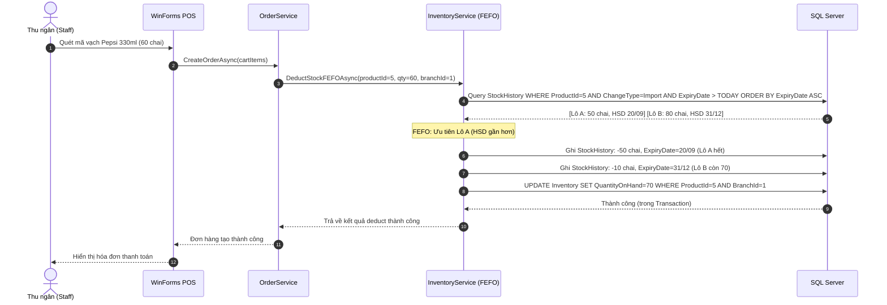

# THUẬT TOÁN FEFO — FIRST EXPIRED, FIRST OUT (FEFO SPECIFICATION)

---

## MỤC LỤC
1. [Giới thiệu](#1-giới-thiệu)
2. [Nội dung chính](#2-nội-dung-chính)
   - 2.1. [Định nghĩa FEFO](#21-định-nghĩa-fefo)
   - 2.2. [Tại sao siêu thị phải dùng FEFO thay vì FIFO hay LIFO](#22-tại-sao-siêu-thị-phải-dùng-fefo-thay-vì-fifo-hay-lifo)
   - 2.3. [So sánh FEFO — FIFO — LIFO](#23-so-sánh-fefo--fifo--lifo)
   - 2.4. [Cách hệ thống Smart SuperMarket implement FEFO](#24-cách-hệ-thống-smart-supermarket-implement-fefo)
   - 2.5. [Ví dụ minh họa chi tiết](#25-ví-dụ-minh-họa-chi-tiết)
   - 2.6. [Sơ đồ tuần tự FEFO khi bán hàng](#26-sơ-đồ-tuần-tự-fefo-khi-bán-hàng)
3. [Open Questions](#3-open-questions)
4. [Ghi chú](#4-ghi-chú)
5. [Kết luận](#5-kết-luận)

---

## 1. GIỚI THIỆU

Tài liệu **FEFO.md** mô tả thuật toán quản lý xuất kho theo nguyên tắc **FEFO (First Expired, First Out)** — Hàng nào hết hạn sử dụng trước thì xuất kho trước. Đây là nguyên tắc bắt buộc trong ngành bán lẻ thực phẩm và hàng tiêu dùng nhanh (FMCG), giúp giảm thiểu tối đa tổn thất do hàng hóa hết hạn sử dụng trong kho.

---

## 2. NỘI DUNG CHÍNH

### 2.1. Định nghĩa FEFO

**FEFO (First Expired, First Out)** — Xuất trước lô hàng có hạn sử dụng (HSD) gần nhất:

> Khi xuất kho (bán hàng, điều chuyển, hoặc sử dụng nội bộ), hệ thống luôn ưu tiên chọn lô hàng có `ExpiryDate` **sớm nhất** trong số các lô còn tồn kho, bất kể lô đó được nhập vào kho lúc nào.

**Điều kiện áp dụng:**
- Sản phẩm có trường `ExpiryDate` (hạn sử dụng) — thường là thực phẩm, đồ uống, mỹ phẩm, dược phẩm.
- Sản phẩm không có `ExpiryDate` (đồ gia dụng, pin, đồ điện) → áp dụng FIFO thay thế.

---

### 2.2. Tại sao siêu thị phải dùng FEFO thay vì FIFO hay LIFO

Trong siêu thị bán lẻ thực phẩm như Smart SuperMarket, hàng hóa được nhập theo nhiều đợt khác nhau với các lô có HSD khác nhau. Nếu không quản lý đúng:

**Kịch bản xấu (không dùng FEFO):**
1. Pepsi Lô A nhập ngày 01/08/2026, HSD: 20/09/2026 (còn 9 ngày đến HSD)
2. Pepsi Lô B nhập ngày 25/08/2026, HSD: 31/12/2026 (còn 111 ngày đến HSD)
3. Nếu hệ thống xuất Lô B trước → Lô A sẽ hết hạn trong kho → Phải hủy → Thiệt hại tài chính.

**Kết quả khi dùng FEFO:**
- Hệ thống tự động phát hiện Lô A có HSD sớm hơn → Xuất Lô A trước → Lô A được bán ra trước khi hết hạn → Tránh được tổn thất.

---

### 2.3. So sánh FEFO — FIFO — LIFO

| Tiêu chí | FEFO | FIFO | LIFO |
| :--- | :--- | :--- | :--- |
| **Tiêu chí xuất kho** | Hạn sử dụng gần nhất trước | Nhập trước xuất trước | Nhập sau xuất trước |
| **Phù hợp ngành** | Thực phẩm, FMCG, Dược phẩm | Hàng hóa thông thường | Kế toán hàng hóa (hiếm dùng thực tế) |
| **Rủi ro hàng hết hạn** | ✅ Rất thấp | 🟡 Trung bình | ❌ Rất cao |
| **Độ phức tạp implement** | Cần lưu ExpiryDate từng lô | Đơn giản | Đơn giản |
| **Tiêu chuẩn pháp lý** | Bắt buộc với thực phẩm | Tùy ngành | Không khuyến nghị |
| **Smart SuperMarket dùng** | ✅ Áp dụng chính | Fallback khi không có HSD | ❌ Không dùng |

---

### 2.4. Cách hệ thống Smart SuperMarket implement FEFO

**Bước 1 — Lưu trữ HSD khi nhập hàng:**

Mỗi dòng `ImportDetail` lưu `ExpiryDate` của lô hàng nhập. Một phiếu nhập có thể có nhiều dòng cùng sản phẩm nhưng HSD khác nhau.

```
ImportDetail (ImportReceiptId=15):
  - ProductId=5 (Pepsi), Quantity=50, ExpiryDate=2026-09-20
  - ProductId=5 (Pepsi), Quantity=80, ExpiryDate=2026-12-31
```

**Bước 2 — Khi bán hàng, query lô hàng theo FEFO:**

```csharp
// InventoryService.cs — Lấy lô hàng theo FEFO
var stockBatches = await _context.StockHistory
    .Where(sh => sh.ProductId == productId
              && sh.BranchId == branchId
              && sh.ChangeType == StockChangeType.Import
              && sh.ExpiryDate > DateOnly.FromDateTime(DateTime.Today))
    .OrderBy(sh => sh.ExpiryDate)   // FEFO: HSD gần nhất lên đầu
    .ThenBy(sh => sh.CreatedAt)     // Tie-break: nhập trước xuất trước
    .ToListAsync();
```

**Bước 3 — Ghi StockHistory với ExpiryDate của lô xuất:**

```csharp
await _context.StockHistory.AddAsync(new StockHistory
{
    ProductId = productId,
    BranchId = branchId,
    ChangeType = StockChangeType.Sale,
    QuantityChange = -quantitySold,
    QuantityBefore = quantityBefore,
    QuantityAfter = quantityBefore - quantitySold,
    ExpiryDate = selectedBatch.ExpiryDate,  // HSD của lô được xuất (FEFO)
    ReferenceId = orderId,
    CreatedByUserId = userId,
    CreatedAt = DateTime.UtcNow
});
```

---

### 2.5. Ví dụ minh họa chi tiết

**Tình huống:** Chi nhánh 1 có sản phẩm Pepsi 330ml với 2 lô hàng:

| Lô | ImportReceiptId | Số lượng còn | ExpiryDate | Ngày còn lại |
| :---: | :---: | :---: | :---: | :---: |
| A | 12 | 50 chai | 20/09/2026 | 9 ngày |
| B | 15 | 80 chai | 31/12/2026 | 111 ngày |

**Khách hàng mua 60 chai Pepsi:**

Theo FEFO:
1. Xuất **toàn bộ Lô A** trước: 50 chai (còn thiếu 10 chai)
2. Xuất tiếp **10 chai từ Lô B**: 10 chai

**Kết quả sau giao dịch:**

| Lô | Trước | Xuất | Còn lại |
| :---: | :---: | :---: | :---: |
| A | 50 chai | -50 chai | 0 chai (hết) |
| B | 80 chai | -10 chai | 70 chai |
| **Tổng** | **130 chai** | **-60 chai** | **70 chai** |

→ Lô A được tiêu thụ hết trước khi hết hạn → Tránh tổn thất.

**Nếu dùng LIFO (sai):**
- Xuất 60 chai từ Lô B trước → Lô A vẫn còn 50 chai với HSD 20/09 → 9 ngày nữa phải hủy → Thiệt hại.

---

### 2.6. Sơ đồ tuần tự FEFO khi bán hàng



---

## 3. OPEN QUESTIONS

| STT | Vấn đề chưa quyết định | Tác động | Hướng xử lý đề xuất |
| :---: | :--- | :--- | :--- |
| 1 | Khi một lô hàng chỉ còn một phần (VD: Lô A còn 3 chai, khách mua 10 chai) — Giá bán áp dụng theo lô nào? Lô A (HSD gần = giảm 50%) hay Lô B (HSD xa = giá thường)? | Ảnh hưởng trải nghiệm POS và doanh thu. | Đề xuất: Áp dụng giá theo lô FEFO đầu tiên (Lô A) cho toàn bộ 10 chai. Đơn giản hơn cho thu ngân và đảm bảo khuyến mãi hàng sắp hết hạn được ưu tiên. |

---

## 4. GHI CHÚ
- FEFO chỉ có thể implement chính xác khi dữ liệu `ExpiryDate` được nhập đầy đủ tại bước nhập hàng (`ImportDetail.ExpiryDate`). Nhân viên nhập kho phải được đào tạo nhập đúng HSD từng lô.
- Trong giao diện WinForms POS, thu ngân không thấy lô hàng nào đang được xuất — FEFO hoạt động hoàn toàn tự động ở Backend.
- Nên thêm Index trên `(ProductId, BranchId, ExpiryDate)` trong bảng `StockHistory` để query FEFO nhanh hơn.

---

## 5. KẾT LUẬN

Tài liệu `FEFO.md` đã định nghĩa rõ ràng thuật toán First Expired, First Out và cách implement trong hệ thống Smart SuperMarket. FEFO là nghiệp vụ cốt lõi phân biệt hệ thống quản lý siêu thị chuyên nghiệp với các ứng dụng đơn giản, giúp giảm thiểu tổn thất hàng hóa hết hạn và đảm bảo an toàn thực phẩm cho người tiêu dùng.
