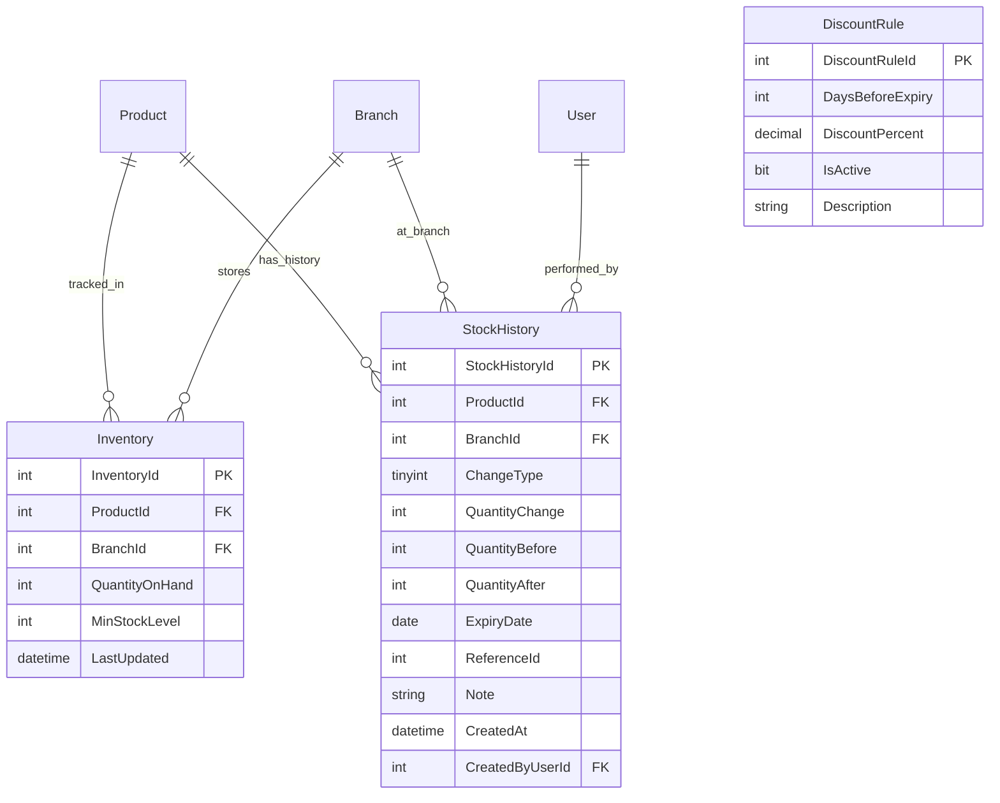

# MÔ TẢ CẤU TRÚC THỰC THỂ TỒN KHO (INVENTORY ENTITY SPECIFICATION)

---

## MỤC LỤC
1. [Giới thiệu](#1-giới-thiệu)
2. [Nội dung chính](#2-nội-dung-chính)
   - 2.1. [Chi tiết Bảng 1: Inventory (Tồn Kho)](#21-chi-tiết-bảng-1-inventory-tồn-kho)
   - 2.2. [Chi tiết Bảng 2: StockHistory (Lịch Sử Biến Động Tồn Kho)](#22-chi-tiết-bảng-2-stockhistory-lịch-sử-biến-động-tồn-kho)
   - 2.3. [Chi tiết Bảng 3: DiscountRule (Quy Tắc Giảm Giá Theo HSD)](#23-chi-tiết-bảng-3-discountrule-quy-tắc-giảm-giá-theo-hsd)
   - 2.4. [Sơ đồ Quan hệ Thực thể (ERD Diagram)](#24-sơ-đồ-quan-hệ-thực-thể-erd-diagram)
   - 2.5. [Định nghĩa Entity Classes trong C# (.NET 8 EF Core)](#25-định-nghĩa-entity-classes-trong-c-net-8-ef-core)
   - 2.6. [Định nghĩa Enum Types](#26-định-nghĩa-enum-types)
3. [Open Questions](#3-open-questions)
4. [Ghi chú](#4-ghi-chú)
5. [Kết luận](#5-kết-luận)

---

## 1. GIỚI THIỆU

Tài liệu **InventoryEntity.md** chi tiết hóa thiết kế cơ sở dữ liệu cho 3 thực thể cốt lõi của phân hệ quản lý tồn kho: `Inventory`, `StockHistory` và `DiscountRule` theo đúng bản vẽ `Database_Design_ERD.pdf` (Version 2.0).

Tài liệu định nghĩa các trường dữ liệu, kiểu dữ liệu SQL Server, khóa chính, khóa ngoại, ràng buộc, và cách ánh xạ sang Entity Classes trong C# Entity Framework Core.

---

## 2. NỘI DUNG CHÍNH

### 2.1. Chi tiết Bảng 1: Inventory (Tồn Kho)

Tên bảng SQL: `Inventory`

| Tên Cột | Kiểu Dữ Liệu | Khóa | Ràng Buộc | Ghi Chú / Mô Tả |
| :--- | :--- | :---: | :--- | :--- |
| **`InventoryId`** | `INT IDENTITY(1,1)` | **PK** | `NOT NULL` | Mã tồn kho tự tăng duy nhất |
| **`ProductId`** | `INT` | **FK** | `NOT NULL` | Trỏ tới `Product(ProductId)` |
| **`BranchId`** | `INT` | **FK** | `NOT NULL` | Trỏ tới `Branch(BranchId)` — chi nhánh sở hữu tồn kho |
| **`QuantityOnHand`** | `INT` | | `DEFAULT 0, CHECK (>= 0)` | Số lượng tồn kho hiện tại tại chi nhánh |
| **`MinStockLevel`** | `INT` | | `DEFAULT 10, CHECK (> 0)` | Ngưỡng cảnh báo tồn kho thấp (mặc định 10 đơn vị) |
| **`LastUpdated`** | `DATETIME` | | `DEFAULT GETDATE()` | Thời điểm cập nhật tồn kho gần nhất |
| UNIQUE | | | `UNIQUE (ProductId, BranchId)` | Mỗi sản phẩm chỉ có 1 bản ghi tồn kho tại 1 chi nhánh |

---

### 2.2. Chi tiết Bảng 2: StockHistory (Lịch Sử Biến Động Tồn Kho)

Tên bảng SQL: `StockHistory`

| Tên Cột | Kiểu Dữ Liệu | Khóa | Ràng Buộc | Ghi Chú / Mô Tả |
| :--- | :--- | :---: | :--- | :--- |
| **`StockHistoryId`** | `INT IDENTITY(1,1)` | **PK** | `NOT NULL` | Mã lịch sử tồn kho |
| **`ProductId`** | `INT` | **FK** | `NOT NULL` | Trỏ tới `Product(ProductId)` |
| **`BranchId`** | `INT` | **FK** | `NOT NULL` | Trỏ tới `Branch(BranchId)` |
| **`ChangeType`** | `TINYINT` | | `NOT NULL, CHECK (1..4)` | `1=Import`, `2=Sale`, `3=Adjustment`, `4=Expired` |
| **`QuantityChange`** | `INT` | | `NOT NULL` | Số lượng thay đổi — dương (+) là tăng, âm (-) là giảm |
| **`QuantityBefore`** | `INT` | | `NOT NULL, CHECK (>= 0)` | Tồn kho trước khi biến động |
| **`QuantityAfter`** | `INT` | | `NOT NULL, CHECK (>= 0)` | Tồn kho sau khi biến động |
| **`ExpiryDate`** | `DATE` | | `NULL` | Hạn sử dụng của lô hàng liên quan (áp dụng cho Import) |
| **`ReferenceId`** | `INT` | | `NULL` | ID tham chiếu: `ImportReceiptId` hoặc `OrderId` |
| **`Note`** | `NVARCHAR(255)` | | `NULL` | Ghi chú thêm về lý do biến động |
| **`CreatedAt`** | `DATETIME` | | `DEFAULT GETDATE()` | Thời điểm ghi nhận biến động |
| **`CreatedByUserId`** | `INT` | **FK** | `NOT NULL` | Trỏ tới `[User](UserId)` — nhân viên thực hiện |

---

### 2.3. Chi tiết Bảng 3: DiscountRule (Quy Tắc Giảm Giá Theo HSD)

Tên bảng SQL: `DiscountRule`

| Tên Cột | Kiểu Dữ Liệu | Khóa | Ràng Buộc | Ghi Chú / Mô Tả |
| :--- | :--- | :---: | :--- | :--- |
| **`DiscountRuleId`** | `INT IDENTITY(1,1)` | **PK** | `NOT NULL` | Mã quy tắc giảm giá |
| **`DaysBeforeExpiry`** | `INT` | | `NOT NULL, CHECK (> 0)` | Số ngày trước HSD để kích hoạt quy tắc này |
| **`DiscountPercent`** | `DECIMAL(5,2)` | | `NOT NULL, CHECK (0 < x <= 100)` | Phần trăm giảm giá áp dụng |
| **`IsActive`** | `BIT` | | `DEFAULT 1` | `1` = Đang áp dụng, `0` = Tạm ngưng |
| **`Description`** | `NVARCHAR(200)` | | `NULL` | Mô tả ngắn về quy tắc |

**Dữ liệu mặc định (Seed Data):**

| DiscountRuleId | DaysBeforeExpiry | DiscountPercent | Description |
| :---: | :---: | :---: | :--- |
| 1 | 7 | 50.00 | Sản phẩm còn ≤ 7 ngày HSD — Giảm 50% |
| 2 | 15 | 20.00 | Sản phẩm còn ≤ 15 ngày HSD — Giảm 20% |

---

### 2.4. Sơ đồ Quan hệ Thực thể (ERD Diagram)



---

### 2.5. Định nghĩa Entity Classes trong C# (.NET 8 EF Core)

#### File `Domain/Entities/Inventory.cs`:
```csharp
namespace SmartSupermarket.Backend.Domain.Entities;

public class Inventory
{
    public int InventoryId { get; set; }
    public int ProductId { get; set; }
    public int BranchId { get; set; }
    public int QuantityOnHand { get; set; } = 0;
    public int MinStockLevel { get; set; } = 10;
    public DateTime LastUpdated { get; set; } = DateTime.UtcNow;

    // Navigation properties
    public Product Product { get; set; } = null!;
}
```

#### File `Domain/Entities/StockHistory.cs`:
```csharp
using SmartSupermarket.Backend.Domain.Enums;

namespace SmartSupermarket.Backend.Domain.Entities;

public class StockHistory
{
    public int StockHistoryId { get; set; }
    public int ProductId { get; set; }
    public int BranchId { get; set; }
    public StockChangeType ChangeType { get; set; }
    public int QuantityChange { get; set; }
    public int QuantityBefore { get; set; }
    public int QuantityAfter { get; set; }
    public DateOnly? ExpiryDate { get; set; }
    public int? ReferenceId { get; set; }
    public string? Note { get; set; }
    public DateTime CreatedAt { get; set; } = DateTime.UtcNow;
    public int CreatedByUserId { get; set; }

    // Navigation properties
    public Product Product { get; set; } = null!;
    public User CreatedByUser { get; set; } = null!;
}
```

#### File `Domain/Entities/DiscountRule.cs`:
```csharp
namespace SmartSupermarket.Backend.Domain.Entities;

public class DiscountRule
{
    public int DiscountRuleId { get; set; }
    public int DaysBeforeExpiry { get; set; }
    public decimal DiscountPercent { get; set; }
    public bool IsActive { get; set; } = true;
    public string? Description { get; set; }
}
```

---

### 2.6. Định nghĩa Enum Types

#### File `Domain/Enums/StockChangeType.cs`:
```csharp
namespace SmartSupermarket.Backend.Domain.Enums;

public enum StockChangeType
{
    Import = 1,      // Nhập hàng từ phiếu nhập
    Sale = 2,        // Bán hàng tại POS
    Adjustment = 3,  // Điều chỉnh thủ công (kiểm kê)
    Expired = 4      // Hủy hàng hết hạn sử dụng
}
```

---

## 3. OPEN QUESTIONS

| STT | Vấn đề chưa quyết định | Tác động | Hướng xử lý đề xuất |
| :---: | :--- | :--- | :--- |
| 1 | `DiscountRule` áp dụng cho toàn bộ sản phẩm hay từng danh mục riêng biệt? | Ảnh hưởng schema và logic tính giảm giá tại POS. | Đề xuất v1: Áp dụng toàn hệ thống. v2 mở rộng: Thêm cột `CategoryId` (nullable) vào `DiscountRule` để lọc theo danh mục. |
| 2 | Cột `ExpiryDate` trong `StockHistory` lưu HSD của lô nào khi 1 sản phẩm có nhiều lô HSD khác nhau? | Ảnh hưởng tính chính xác FEFO. | Đề xuất: `ExpiryDate` trong `StockHistory` luôn là HSD của lô được xuất theo FEFO tại thời điểm giao dịch. |

---

## 4. GHI CHÚ
- Cột `QuantityOnHand` có ràng buộc `CHECK (>= 0)` ở cấp DB. Tầng Service phải kiểm tra trước khi ghi để tránh lỗi constraint violation.
- `StockHistory` là bảng **append-only** — không bao giờ UPDATE hoặc DELETE bản ghi lịch sử.
- Khi cấu hình EF Core, bảng `Inventory` cần cấu hình `HasIndex(x => new { x.ProductId, x.BranchId }).IsUnique()` để đảm bảo ràng buộc UNIQUE.

---

## 5. KẾT LUẬN

Tài liệu `InventoryEntity.md` đã làm rõ chi tiết cấu trúc 3 bảng CSDL `Inventory`, `StockHistory` và `DiscountRule` tuân thủ thiết kế trong `Database_Design_ERD.pdf`. Đây là nền tảng để triển khai Entity Classes và Migration trong EF Core, đảm bảo tính nhất quán dữ liệu tồn kho trong toàn hệ thống Smart SuperMarket.
