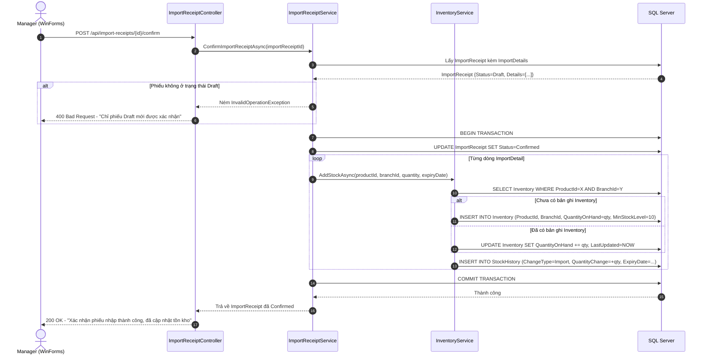
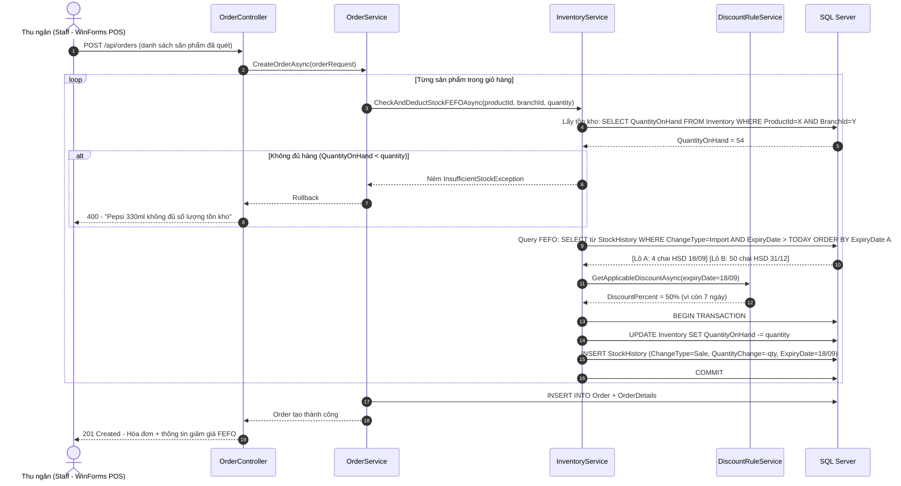
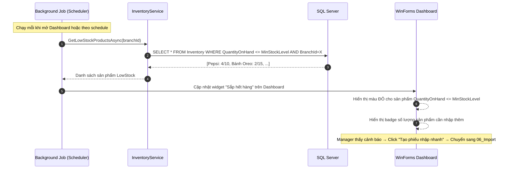
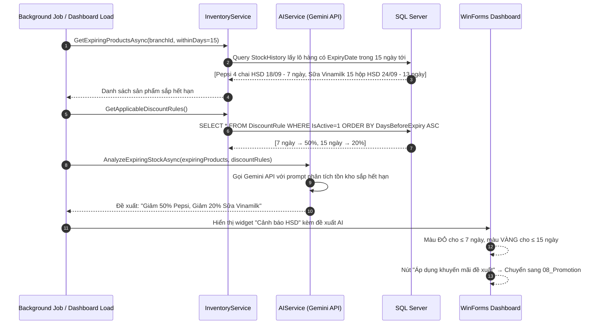

# SƠ ĐỒ TUẦN TỰ QUẢN LÝ TỒN KHO (INVENTORY SEQUENCE DIAGRAM SPECIFICATION)

---

## MỤC LỤC
1. [Giới thiệu](#1-giới-thiệu)
2. [Nội dung chính](#2-nội-dung-chính)
   - 2.1. [Luồng: Xác nhận Phiếu nhập → Cập nhật Tồn kho](#21-luồng-xác-nhận-phiếu-nhập--cập-nhật-tồn-kho)
   - 2.2. [Luồng: Bán hàng POS → Trừ tồn kho theo FEFO](#22-luồng-bán-hàng-pos--trừ-tồn-kho-theo-fefo)
   - 2.3. [Luồng: Cảnh báo tự động khi tồn kho thấp](#23-luồng-cảnh-báo-tự-động-khi-tồn-kho-thấp)
   - 2.4. [Luồng: AI phát hiện sắp hết hạn → Đề xuất DiscountRule](#24-luồng-ai-phát-hiện-sắp-hết-hạn--đề-xuất-discountrule)
3. [Open Questions](#3-open-questions)
4. [Ghi chú](#4-ghi-chú)
5. [Kết luận](#5-kết-luận)

---

## 1. GIỚI THIỆU

Tài liệu **SequenceDiagram.md** mô tả bằng sơ đồ tuần tự (Sequence Diagram) các tương tác theo thời gian giữa người dùng, WinForms Desktop, Backend API, Services và SQL Server cho các luồng nghiệp vụ chính của phân hệ `05_Inventory`.

---

## 2. NỘI DUNG CHÍNH

### 2.1. Luồng: Xác nhận Phiếu nhập → Cập nhật Tồn kho

Khi Manager xác nhận phiếu nhập hàng (`Confirmed`), hệ thống tự động cập nhật tồn kho và ghi lịch sử.

---

### 2.2. Luồng: Bán hàng POS → Trừ tồn kho theo FEFO

---

### 2.3. Luồng: Cảnh báo tự động khi tồn kho thấp

---

### 2.4. Luồng: AI phát hiện sắp hết hạn → Đề xuất DiscountRule

---

## 3. OPEN QUESTIONS

| STT | Vấn đề chưa quyết định | Tác động | Hướng xử lý đề xuất |
| :---: | :--- | :--- | :--- |
| 1 | Luồng cảnh báo tồn kho thấp nên chạy theo schedule định kỳ (background service) hay chỉ khi mở Dashboard? | Ảnh hưởng kiến trúc backend. | Đề xuất v1: Chỉ khi mở Dashboard (đơn giản hơn). v2: Thêm `IHostedService` chạy mỗi giờ gửi cảnh báo. |

---

## 4. GHI CHÚ
- Tất cả các luồng cập nhật tồn kho (2.1, 2.2) đều phải thực hiện trong Database Transaction để đảm bảo tính ACID.
- Luồng 2.4 (AI đề xuất) hoạt động bất đồng bộ — không block UI khi đang load Dashboard.
- Tham chiếu thêm `FEFO.md` để hiểu chi tiết thuật toán chọn lô hàng theo HSD trong luồng 2.2.

---

## 5. KẾT LUẬN

Tài liệu `SequenceDiagram.md` đã mô tả 4 luồng tuần tự chính của phân hệ `05_Inventory`. Các sơ đồ này là cơ sở để Backend Developer triển khai đúng thứ tự gọi Service, xử lý Transaction và tích hợp với module AI cho phân hệ Quản lý Tồn kho Smart SuperMarket.
