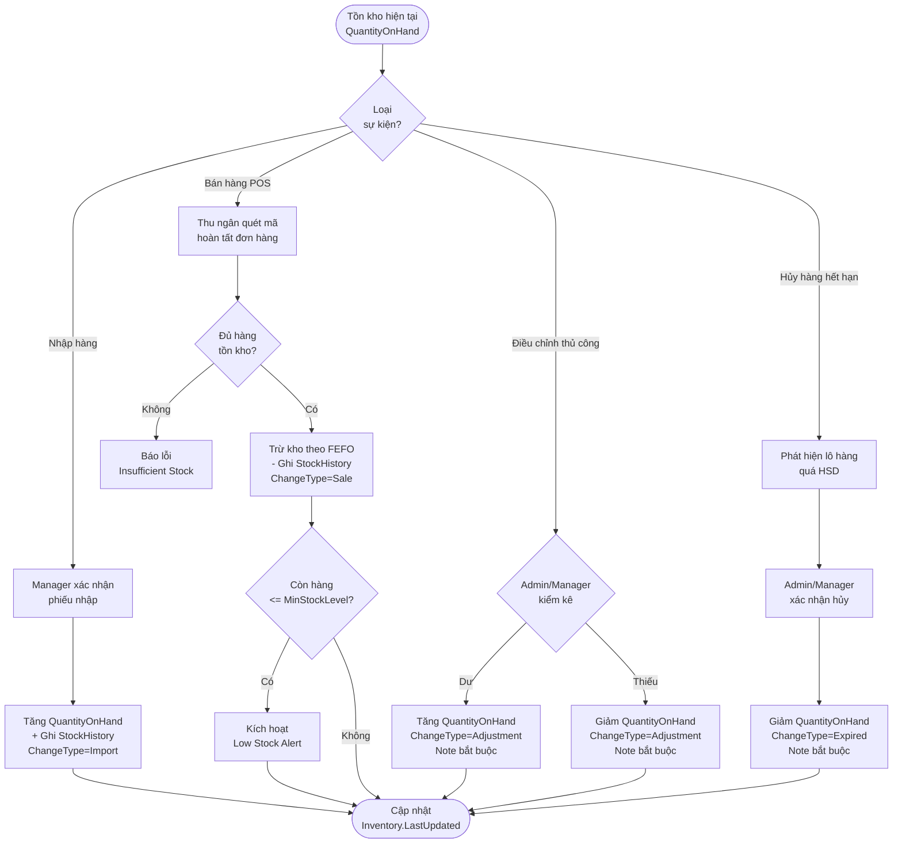

# LUỒNG BIẾN ĐỘNG TỒN KHO (STOCK FLOW SPECIFICATION)

---

## MỤC LỤC
1. [Giới thiệu](#1-giới-thiệu)
2. [Nội dung chính](#2-nội-dung-chính)
   - 2.1. [Tổng quan các loại biến động tồn kho](#21-tổng-quan-các-loại-biến-động-tồn-kho)
   - 2.2. [Chi tiết từng loại ChangeType](#22-chi-tiết-từng-loại-changetype)
   - 2.3. [Bảng tổng hợp ghi StockHistory theo từng sự kiện](#23-bảng-tổng-hợp-ghi-stockhistory-theo-từng-sự-kiện)
   - 2.4. [Flow Diagram tổng thể biến động tồn kho](#24-flow-diagram-tổng-thể-biến-động-tồn-kho)
3. [Open Questions](#3-open-questions)
4. [Ghi chú](#4-ghi-chú)
5. [Kết luận](#5-kết-luận)

---

## 1. GIỚI THIỆU

Tài liệu **StockFlow.md** mô tả toàn bộ các trường hợp gây biến động số lượng tồn kho (`QuantityOnHand`) trong hệ thống Smart SuperMarket: khi nào tồn kho tăng, khi nào giảm, ai thực hiện, hệ thống ghi nhận ra sao vào bảng `StockHistory`.

---

## 2. NỘI DUNG CHÍNH

### 2.1. Tổng quan các loại biến động tồn kho

| Loại biến động | ChangeType | Tồn kho | Tác nhân | Trigger |
| :--- | :---: | :---: | :--- | :--- |
| **Nhập hàng** | `Import (1)` | ➕ Tăng | Manager/Admin xác nhận phiếu nhập | Confirm ImportReceipt |
| **Bán hàng POS** | `Sale (2)` | ➖ Giảm | Hệ thống tự động khi hoàn tất đơn | Complete Order tại POS |
| **Điều chỉnh tăng** | `Adjustment (3)` | ➕ Tăng | Admin/Manager kiểm kê thực tế | Thao tác thủ công WinForms |
| **Điều chỉnh giảm** | `Adjustment (3)` | ➖ Giảm | Admin/Manager kiểm kê thực tế | Thao tác thủ công WinForms |
| **Hủy hàng hết hạn** | `Expired (4)` | ➖ Giảm | Admin/Manager xác nhận hủy | Cảnh báo HSD + xác nhận |

---

### 2.2. Chi tiết từng loại ChangeType

#### 2.2.1. Import (ChangeType = 1) — Nhập hàng

**Trigger:** Manager/Admin xác nhận phiếu nhập (`POST /api/import-receipts/{id}/confirm`)

**Logic:**
- Mỗi dòng `ImportDetail` tạo ra **1 bản ghi `StockHistory`** với `ChangeType = Import`.
- `QuantityChange` = số lượng nhập (luôn **dương**).
- `ExpiryDate` = HSD của lô hàng trong `ImportDetail.ExpiryDate`.
- `ReferenceId` = `ImportReceiptId`.

**Ví dụ:** Nhập 100 chai Pepsi HSD 31/12/2026 theo phiếu IMP-20260911-0015:
```
StockHistory: ProductId=5, ChangeType=1, QuantityChange=+100,
              QuantityBefore=4, QuantityAfter=104,
              ExpiryDate=2026-12-31, ReferenceId=15
```

---

#### 2.2.2. Sale (ChangeType = 2) — Bán hàng POS

**Trigger:** Đơn hàng hoàn tất tại POS (`Order.Status = Completed`)

**Logic:**
- Hệ thống tự động trừ tồn kho theo thuật toán **FEFO** (xem `FEFO.md`).
- Mỗi lô hàng xuất (có thể từ nhiều lô khác nhau) tạo **1 bản ghi `StockHistory`** riêng.
- `QuantityChange` = số lượng bán (luôn **âm**).
- `ExpiryDate` = HSD của lô hàng được xuất theo FEFO.
- `ReferenceId` = `OrderId`.

**Ví dụ:** Bán 60 chai Pepsi (Lô A: 50 chai HSD 18/09, Lô B: 10 chai HSD 31/12):
```
StockHistory[1]: ChangeType=2, QuantityChange=-50, ExpiryDate=2026-09-18, ReferenceId=OrderId
StockHistory[2]: ChangeType=2, QuantityChange=-10, ExpiryDate=2026-12-31, ReferenceId=OrderId
```

---

#### 2.2.3. Adjustment (ChangeType = 3) — Điều chỉnh thủ công

**Trigger:** Admin/Manager nhập liệu điều chỉnh tồn kho (`PUT /api/inventory/{productId}/adjust`)

**Logic:**
- `QuantityChange` có thể **dương** (kiểm kê dư) hoặc **âm** (kiểm kê thiếu).
- Trường `Note` **bắt buộc** — phải ghi lý do điều chỉnh.
- `ReferenceId = NULL` (không tham chiếu phiếu nào).
- `ExpiryDate = NULL` (điều chỉnh không gắn với lô cụ thể).

**Ví dụ:** Kiểm kê phát hiện thiếu 3 chai Pepsi (vỡ khi vận chuyển):
```
StockHistory: ChangeType=3, QuantityChange=-3,
              QuantityBefore=7, QuantityAfter=4,
              Note="Kiểm kê thực tế thiếu 3 chai, vỡ khi vận chuyển"
```

---

#### 2.2.4. Expired (ChangeType = 4) — Hủy hàng hết hạn

**Trigger:** Admin/Manager xác nhận hủy hàng đã hết hoặc sắp hết hạn

**Logic:**
- Hệ thống không tự động hủy — phải có xác nhận từ người có thẩm quyền.
- `QuantityChange` = số lượng hàng hủy (luôn **âm**).
- `ExpiryDate` = HSD của lô hàng bị hủy.
- `Note` **bắt buộc** — ghi rõ lý do hủy và thông tin kiểm tra.

**Ví dụ:** Hủy 4 chai Pepsi đã hết hạn 18/09/2026:
```
StockHistory: ChangeType=4, QuantityChange=-4,
              QuantityBefore=4, QuantityAfter=0,
              ExpiryDate=2026-09-18,
              Note="Hủy 4 chai Pepsi hết hạn ngày 18/09/2026 — xác nhận bởi Manager"
```

---

### 2.3. Bảng tổng hợp ghi StockHistory theo từng sự kiện

| Sự kiện | ChangeType | QuantityChange | ExpiryDate | ReferenceId | Note bắt buộc? |
| :--- | :---: | :---: | :---: | :---: | :---: |
| Confirm phiếu nhập | 1 | + (tăng) | HSD lô nhập | ImportReceiptId | ❌ |
| Hoàn tất đơn hàng POS | 2 | - (giảm) | HSD lô xuất (FEFO) | OrderId | ❌ |
| Điều chỉnh tăng (kiểm kê dư) | 3 | + (tăng) | NULL | NULL | ✅ |
| Điều chỉnh giảm (kiểm kê thiếu) | 3 | - (giảm) | NULL | NULL | ✅ |
| Hủy hàng hết hạn | 4 | - (giảm) | HSD lô hủy | NULL | ✅ |

---

### 2.4. Flow Diagram tổng thể biến động tồn kho



---

## 3. OPEN QUESTIONS

| STT | Vấn đề chưa quyết định | Tác động | Hướng xử lý đề xuất |
| :---: | :--- | :--- | :--- |
| 1 | Khi đơn hàng bị hủy sau khi đã trừ tồn kho, hệ thống có tự động hoàn kho không? | Ảnh hưởng luồng Order + Inventory. | Đề xuất: Có — khi `Order.Status = Cancelled` (từ `Completed`), tạo bản ghi `StockHistory` với `ChangeType = Import` để hoàn lại tồn kho, `ReferenceId = OrderId`, `Note = "Hoàn kho do hủy đơn"`. |

---

## 4. GHI CHÚ
- `StockHistory` là bảng **append-only** — không bao giờ UPDATE hoặc DELETE bất kỳ bản ghi nào.
- Cột `QuantityBefore` và `QuantityAfter` phải được tính và ghi ngay trong cùng Transaction với thao tác cập nhật `Inventory` để đảm bảo tính nhất quán.
- Dùng Enum `StockChangeType` (xem `InventoryEntity.md` mục 2.6) — không hardcode giá trị số trong code.

---

## 5. KẾT LUẬN

Tài liệu `StockFlow.md` đã mô tả toàn diện 4 loại biến động tồn kho trong hệ thống Smart SuperMarket. Việc nắm rõ tất cả các luồng tăng/giảm tồn kho, cách ghi `StockHistory` và điều kiện kích hoạt từng loại `ChangeType` là nền tảng để Backend Developer implement Service layer chính xác và nhất quán.
