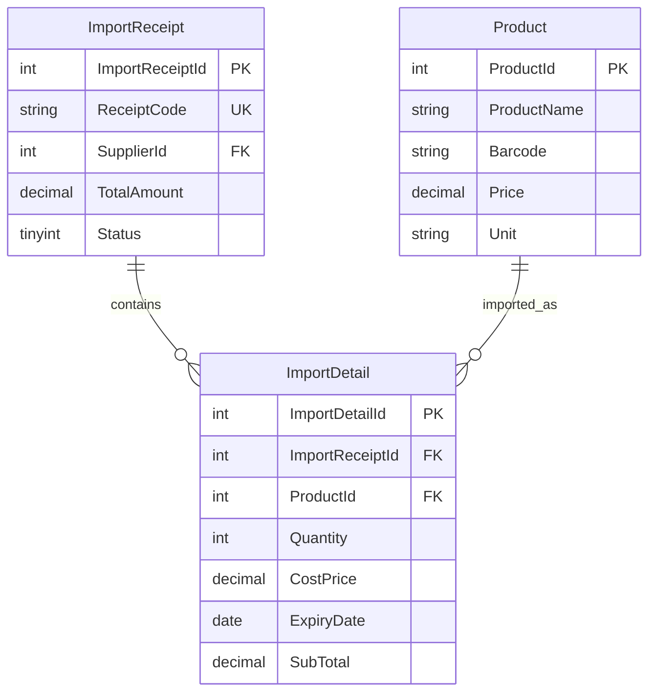

# MÔ TẢ CẤU TRÚC THỰC THỂ CHI TIẾT PHIẾU NHẬP (IMPORT DETAIL ENTITY SPECIFICATION)

---

## MỤC LỤC
1. [Giới thiệu](#1-giới-thiệu)
2. [Nội dung chính](#2-nội-dung-chính)
   - 2.1. [Chi tiết Bảng ImportDetail](#21-chi-tiết-bảng-importdetail)
   - 2.2. [Tại sao ExpiryDate lưu ở cấp ImportDetail](#22-tại-sao-expirydate-lưu-ở-cấp-importdetail)
   - 2.3. [Tính toán SubTotal](#23-tính-toán-subtotal)
   - 2.4. [Sơ đồ Quan hệ với ImportReceipt và Product](#24-sơ-đồ-quan-hệ-với-importreceipt-và-product)
   - 2.5. [Định nghĩa Entity Class trong C# (.NET 8 EF Core)](#25-định-nghĩa-entity-class-trong-c-net-8-ef-core)
3. [Open Questions](#3-open-questions)
4. [Ghi chú](#4-ghi-chú)
5. [Kết luận](#5-kết-luận)

---

## 1. GIỚI THIỆU

Tài liệu **ImportDetail.md** chi tiết hóa thiết kế cơ sở dữ liệu cho thực thể `ImportDetail` — bảng con của `ImportReceipt`, lưu trữ từng dòng sản phẩm trong một phiếu nhập hàng. Mỗi `ImportDetail` đại diện cho một **lô hàng** cụ thể: sản phẩm, số lượng nhập, giá vốn và đặc biệt là **hạn sử dụng** — dữ liệu nguồn cho toàn bộ cơ chế FEFO của hệ thống.

---

## 2. NỘI DUNG CHÍNH

### 2.1. Chi tiết Bảng ImportDetail

Tên bảng SQL: `ImportDetail`

| Tên Cột | Kiểu Dữ Liệu | Khóa | Ràng Buộc | Ghi Chú / Mô Tả |
| :--- | :--- | :---: | :--- | :--- |
| **`ImportDetailId`** | `INT IDENTITY(1,1)` | **PK** | `NOT NULL` | Mã chi tiết phiếu nhập |
| **`ImportReceiptId`** | `INT` | **FK** | `NOT NULL` | Trỏ tới `ImportReceipt(ImportReceiptId)` — phiếu nhập cha |
| **`ProductId`** | `INT` | **FK** | `NOT NULL` | Trỏ tới `Product(ProductId)` — sản phẩm nhập |
| **`Quantity`** | `INT` | | `NOT NULL, CHECK (> 0)` | Số lượng nhập của lô này |
| **`CostPrice`** | `DECIMAL(18,2)` | | `NOT NULL, CHECK (> 0)` | Giá vốn nhập (giá mua từ nhà cung cấp) |
| **`ExpiryDate`** | `DATE` | | `NULL` | Hạn sử dụng của lô hàng — `NULL` nếu sản phẩm không có HSD |
| **`SubTotal`** | `DECIMAL(18,2)` | | `NOT NULL, CHECK (>= 0)` | Thành tiền = `Quantity × CostPrice` |

---

### 2.2. Tại sao ExpiryDate lưu ở cấp ImportDetail

Đây là thiết kế quan trọng nhất của module nhập hàng — lý do lưu `ExpiryDate` ở `ImportDetail` thay vì ở `Product`:

**Ví dụ thực tế:**

Ngày 25/08/2026, siêu thị nhập 2 lô Pepsi 330ml từ cùng nhà cung cấp:
```
ImportReceipt #15 (IMP-20260825-0015):
  ImportDetail #1: Pepsi 330ml × 50 lon, Giá 8,000đ/lon, HSD: 20/09/2026
  ImportDetail #2: Pepsi 330ml × 80 lon, Giá 7,500đ/lon, HSD: 31/12/2026
```

**Tại sao không lưu HSD ở bảng `Product`?**
- Bảng `Product` chỉ có 1 bản ghi cho Pepsi 330ml.
- Nếu lưu `ExpiryDate` ở `Product`, chỉ lưu được 1 HSD — không thể quản lý nhiều lô với HSD khác nhau.
- Thực tế kho siêu thị luôn có nhiều lô hàng cùng sản phẩm với HSD khác nhau.

**Thiết kế đúng — lưu HSD ở `ImportDetail`:**
- Mỗi lô nhập có `ExpiryDate` riêng → Hệ thống biết chính xác lô nào hết hạn trước.
- Khi bán hàng, `InventoryService` query `ImportDetail` với `ExpiryDate` để thực hiện FEFO.
- Khi tồn kho của lô A hết → Tự động chuyển sang lô B.

---

### 2.3. Tính toán SubTotal

`SubTotal = Quantity × CostPrice`

**Quy tắc tính toán:**
- `SubTotal` được tính và lưu vào DB (không phải computed column) để đảm bảo tính nhất quán khi giá vốn thay đổi trong tương lai.
- Tầng Service tính `SubTotal` trước khi INSERT `ImportDetail`.
- `ImportReceipt.TotalAmount` = Tổng tất cả `ImportDetail.SubTotal` của phiếu.

**Ví dụ:**
```
ImportDetail #1: Pepsi 50 lon × 8,000đ = SubTotal: 400,000đ
ImportDetail #2: Pepsi 80 lon × 7,500đ = SubTotal: 600,000đ
ImportReceipt.TotalAmount = 400,000 + 600,000 = 1,000,000đ
```

---

### 2.4. Sơ đồ Quan hệ với ImportReceipt và Product



---

### 2.5. Định nghĩa Entity Class trong C# (.NET 8 EF Core)

#### File `Domain/Entities/ImportDetail.cs`:
```csharp
namespace SmartSupermarket.Backend.Domain.Entities;

public class ImportDetail
{
    public int ImportDetailId { get; set; }
    public int ImportReceiptId { get; set; }
    public int ProductId { get; set; }
    public int Quantity { get; set; }
    public decimal CostPrice { get; set; }
    public DateOnly? ExpiryDate { get; set; }
    public decimal SubTotal { get; set; }

    // Navigation properties
    public ImportReceipt ImportReceipt { get; set; } = null!;
    public Product Product { get; set; } = null!;
}
```

**Lưu ý:** Dùng `DateOnly?` (C# 10+) thay vì `DateTime?` cho `ExpiryDate` vì hạn sử dụng không cần giờ phút giây.

---

## 3. OPEN QUESTIONS

| STT | Vấn đề chưa quyết định | Tác động | Hướng xử lý đề xuất |
| :---: | :--- | :--- | :--- |
| 1 | Một phiếu nhập có thể có 2 dòng cùng sản phẩm nhưng HSD khác nhau không? (Như ví dụ Pepsi 2 lô) | Ảnh hưởng logic tính TotalAmount và validate. | Đề xuất: Cho phép — đây là nghiệp vụ thực tế. 2 dòng cùng `ProductId` nhưng `ExpiryDate` khác nhau là hợp lệ. |
| 2 | `SubTotal` có nên là computed column trong SQL Server không? | Ảnh hưởng hiệu năng và tính linh hoạt. | Đề xuất: Không dùng computed column SQL — tính tại Service và lưu vào DB để kiểm soát tốt hơn và tránh phụ thuộc DB. |

---

## 4. GHI CHÚ
- Khi cấu hình EF Core, quan hệ `ImportDetail → ImportReceipt` cần `OnDelete(DeleteBehavior.Cascade)` — xóa phiếu nhập (Draft) sẽ tự xóa các dòng chi tiết.
- Quan hệ `ImportDetail → Product` dùng `OnDelete(DeleteBehavior.Restrict)` — không cho phép xóa sản phẩm nếu đã có phiếu nhập tham chiếu.
- Sau khi phiếu nhập `Confirmed`, `ImportDetail` là dữ liệu không thể xóa — kể cả khi xóa Product (phải soft delete).

---

## 5. KẾT LUẬN

Tài liệu `ImportDetail.md` đã làm rõ thiết kế và lý do lưu `ExpiryDate` ở cấp `ImportDetail` thay vì bảng `Product`. Đây là quyết định thiết kế cốt lõi cho phép hệ thống Smart SuperMarket quản lý tồn kho nhiều lô hàng với HSD khác nhau và thực thi thuật toán FEFO chính xác, đảm bảo an toàn thực phẩm và tối ưu hóa hàng hóa.
