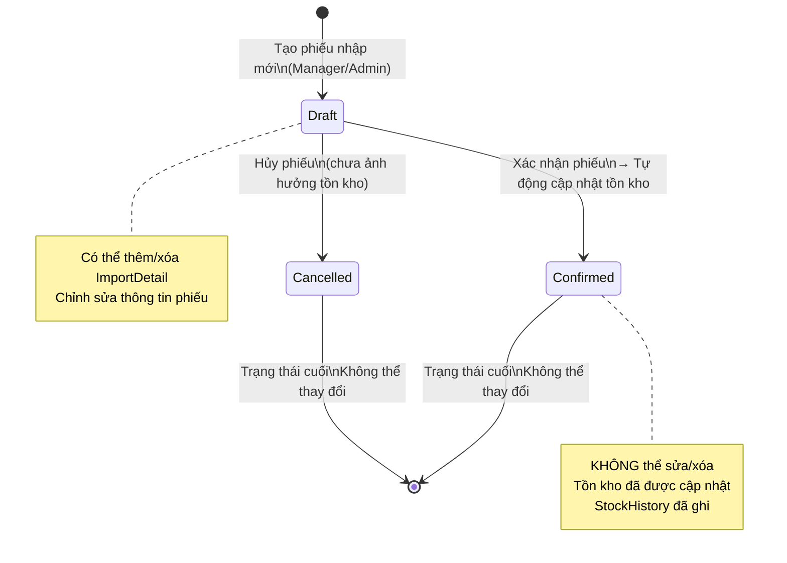
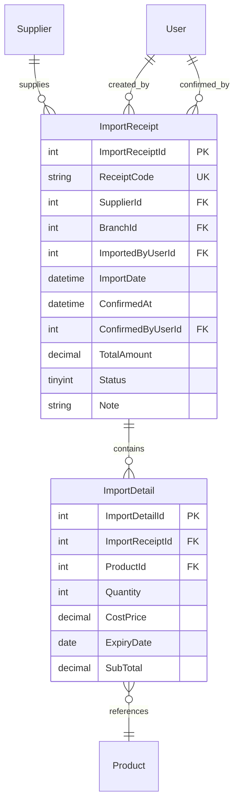

# MÔ TẢ CẤU TRÚC THỰC THỂ PHIẾU NHẬP HÀNG (IMPORT RECEIPT ENTITY SPECIFICATION)

---

## MỤC LỤC
1. [Giới thiệu](#1-giới-thiệu)
2. [Nội dung chính](#2-nội-dung-chính)
   - 2.1. [Chi tiết Bảng ImportReceipt](#21-chi-tiết-bảng-importreceipt)
   - 2.2. [Vòng đời trạng thái phiếu nhập (ImportStatus Lifecycle)](#22-vòng-đời-trạng-thái-phiếu-nhập-importstatus-lifecycle)
   - 2.3. [Quy tắc tự sinh mã phiếu ReceiptCode](#23-quy-tắc-tự-sinh-mã-phiếu-receiptcode)
   - 2.4. [Sơ đồ Quan hệ Thực thể (ERD Diagram)](#24-sơ-đồ-quan-hệ-thực-thể-erd-diagram)
   - 2.5. [Định nghĩa Entity Class trong C# (.NET 8 EF Core)](#25-định-nghĩa-entity-class-trong-c-net-8-ef-core)
   - 2.6. [Định nghĩa Enum ImportStatus](#26-định-nghĩa-enum-importstatus)
3. [Open Questions](#3-open-questions)
4. [Ghi chú](#4-ghi-chú)
5. [Kết luận](#5-kết-luận)

---

## 1. GIỚI THIỆU

Tài liệu **ImportReceipt.md** chi tiết hóa thiết kế cơ sở dữ liệu cho thực thể `ImportReceipt` — phiếu nhập hàng trong hệ thống **Smart SuperMarket**. Một phiếu nhập ghi nhận toàn bộ thông tin về lô hàng nhập từ nhà cung cấp vào chi nhánh: ngày nhập, tổng giá trị, trạng thái xử lý và danh sách sản phẩm (thông qua `ImportDetail`).

---

## 2. NỘI DUNG CHÍNH

### 2.1. Chi tiết Bảng ImportReceipt

Tên bảng SQL: `ImportReceipt`

| Tên Cột | Kiểu Dữ Liệu | Khóa | Ràng Buộc | Ghi Chú / Mô Tả |
| :--- | :--- | :---: | :--- | :--- |
| **`ImportReceiptId`** | `INT IDENTITY(1,1)` | **PK** | `NOT NULL` | Mã phiếu nhập tự tăng |
| **`ReceiptCode`** | `NVARCHAR(20)` | | `UNIQUE, NOT NULL` | Mã phiếu tự sinh: `IMP-YYYYMMDD-XXXX` |
| **`SupplierId`** | `INT` | **FK** | `NOT NULL` | Trỏ tới `Supplier(SupplierId)` |
| **`BranchId`** | `INT` | **FK** | `NOT NULL` | Chi nhánh nhận hàng |
| **`ImportedByUserId`** | `INT` | **FK** | `NOT NULL` | Trỏ tới `[User](UserId)` — người tạo phiếu |
| **`ImportDate`** | `DATETIME` | | `DEFAULT GETDATE()` | Ngày giờ tạo phiếu nhập |
| **`ConfirmedAt`** | `DATETIME` | | `NULL` | Thời điểm xác nhận phiếu (NULL nếu chưa Confirm) |
| **`ConfirmedByUserId`** | `INT` | **FK** | `NULL` | Người xác nhận phiếu (NULL nếu chưa Confirm) |
| **`TotalAmount`** | `DECIMAL(18,2)` | | `NOT NULL, CHECK (>= 0)` | Tổng giá trị phiếu nhập (tổng SubTotal các ImportDetail) |
| **`Status`** | `TINYINT` | | `DEFAULT 1, CHECK (1..3)` | `1=Draft`, `2=Confirmed`, `3=Cancelled` |
| **`Note`** | `NVARCHAR(500)` | | `NULL` | Ghi chú thêm cho phiếu nhập |

---

### 2.2. Vòng đời trạng thái phiếu nhập (ImportStatus Lifecycle)



**Giải thích:**
- **Draft (1)**: Phiếu mới tạo — chỉnh sửa tự do, chưa ảnh hưởng đến tồn kho.
- **Confirmed (2)**: Phiếu đã xác nhận — hệ thống cập nhật `Inventory.QuantityOnHand` và ghi `StockHistory`. **LOCK VĨNH VIỄN**.
- **Cancelled (3)**: Phiếu đã hủy từ `Draft` — không ảnh hưởng tồn kho. **LOCK VĨNH VIỄN**.

---

### 2.3. Quy tắc tự sinh mã phiếu ReceiptCode

Mã phiếu nhập được tự sinh theo định dạng: **`IMP-YYYYMMDD-XXXX`**

| Thành phần | Mô tả | Ví dụ |
| :--- | :--- | :--- |
| `IMP` | Prefix cố định | `IMP` |
| `YYYYMMDD` | Ngày tạo phiếu | `20260911` |
| `XXXX` | Số thứ tự phiếu trong ngày, 4 chữ số | `0001`, `0015` |

**Ví dụ:** Phiếu nhập thứ 3 trong ngày 11/09/2026 → `IMP-20260911-0003`

**Cách sinh mã trong Service:**
```csharp
// Đếm số phiếu đã tạo trong ngày hôm nay
var today = DateTime.Today;
var countToday = await _context.ImportReceipts
    .CountAsync(r => r.ImportDate.Date == today);

var receiptCode = $"IMP-{today:yyyyMMdd}-{(countToday + 1):D4}";
```

---

### 2.4. Sơ đồ Quan hệ Thực thể (ERD Diagram)



---

### 2.5. Định nghĩa Entity Class trong C# (.NET 8 EF Core)

#### File `Domain/Entities/ImportReceipt.cs`:
```csharp
using SmartSupermarket.Backend.Domain.Enums;

namespace SmartSupermarket.Backend.Domain.Entities;

public class ImportReceipt
{
    public int ImportReceiptId { get; set; }
    public string ReceiptCode { get; set; } = string.Empty;
    public int SupplierId { get; set; }
    public int BranchId { get; set; }
    public int ImportedByUserId { get; set; }
    public DateTime ImportDate { get; set; } = DateTime.UtcNow;
    public DateTime? ConfirmedAt { get; set; }
    public int? ConfirmedByUserId { get; set; }
    public decimal TotalAmount { get; set; }
    public ImportStatus Status { get; set; } = ImportStatus.Draft;
    public string? Note { get; set; }

    // Navigation properties
    public Supplier Supplier { get; set; } = null!;
    public User ImportedByUser { get; set; } = null!;
    public User? ConfirmedByUser { get; set; }
    public ICollection<ImportDetail> ImportDetails { get; set; } = new List<ImportDetail>();
}
```

---

### 2.6. Định nghĩa Enum ImportStatus

#### File `Domain/Enums/ImportStatus.cs`:
```csharp
namespace SmartSupermarket.Backend.Domain.Enums;

public enum ImportStatus
{
    Draft = 1,      // Phiếu đang soạn thảo
    Confirmed = 2,  // Phiếu đã xác nhận — tồn kho đã được cập nhật
    Cancelled = 3   // Phiếu đã hủy từ Draft
}
```

---

## 3. OPEN QUESTIONS

| STT | Vấn đề chưa quyết định | Tác động | Hướng xử lý đề xuất |
| :---: | :--- | :--- | :--- |
| 1 | `TotalAmount` được tính tự động từ các `ImportDetail.SubTotal` hay nhập thủ công? | Ảnh hưởng logic backend và tính toàn vẹn dữ liệu. | Đề xuất: Tính tự động tại Service khi thêm/xóa ImportDetail và khi Confirm. Không cho nhập thủ công. |
| 2 | Có cần lưu `InvoiceNumber` (số hóa đơn từ nhà cung cấp) không? | Ảnh hưởng schema bảng. | Đề xuất: Bổ sung cột `SupplierInvoiceNumber NVARCHAR(50) NULL` — tùy chọn điền khi nhập kho. |

---

## 4. GHI CHÚ
- Cột `ReceiptCode` cần Index `UNIQUE` và không nên tự sinh bằng GUID — dùng định dạng `IMP-YYYYMMDD-XXXX` để dễ tra cứu và đọc hiểu.
- Quan hệ `ConfirmedByUserId` có thể cùng người với `ImportedByUserId` (1 người tạo và tự xác nhận) — đây là hợp lệ với vai trò Manager.
- Khi cấu hình EF Core, cần khai báo 2 relationship riêng biệt từ `ImportReceipt` tới `User` (1 cho `ImportedByUserId`, 1 cho `ConfirmedByUserId`) với `HasForeignKey` tường minh.

---

## 5. KẾT LUẬN

Tài liệu `ImportReceipt.md` đã mô tả đầy đủ cấu trúc bảng `ImportReceipt`, vòng đời trạng thái `Draft → Confirmed/Cancelled`, quy tắc sinh mã phiếu và C# Entity class. Đây là nền tảng để Backend Developer triển khai Service nhập hàng và kết nối với module `05_Inventory` để tự động cập nhật tồn kho trong hệ thống Smart SuperMarket.
