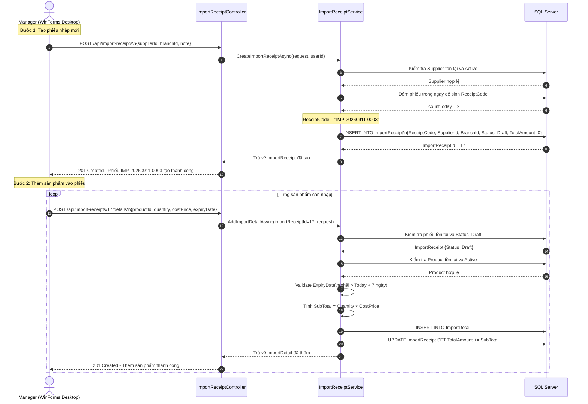
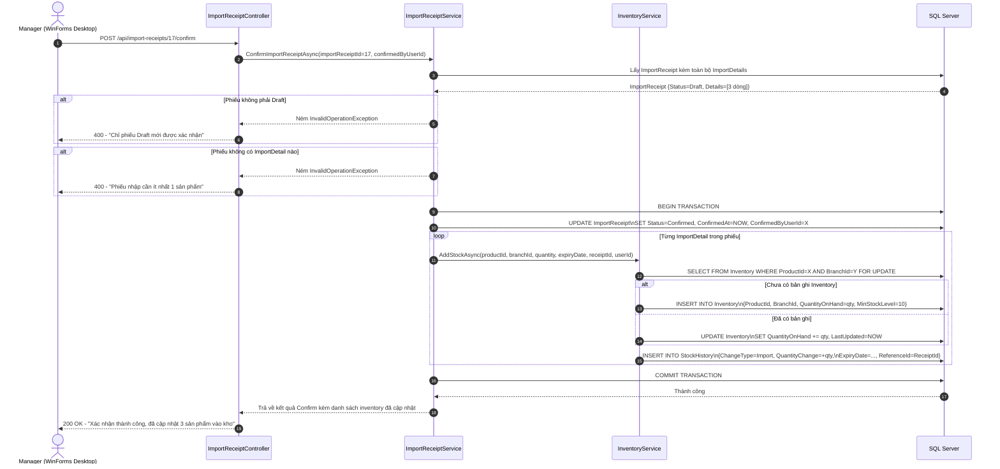
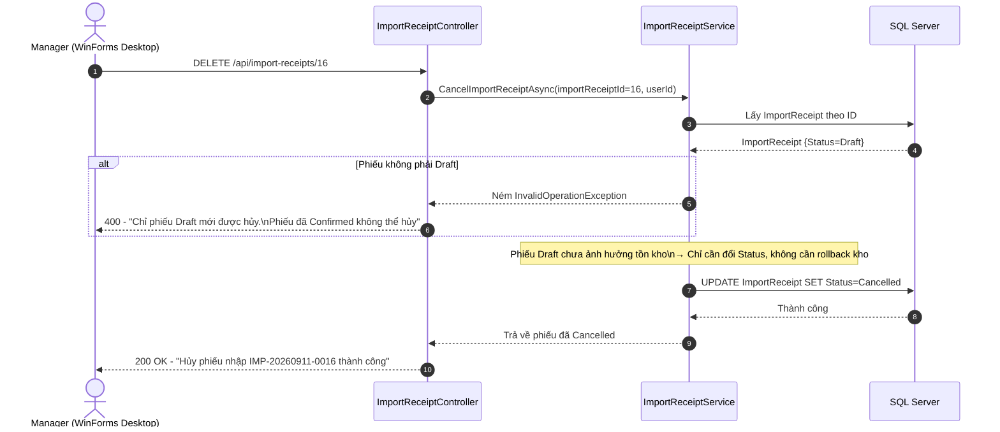
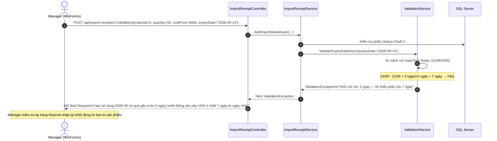

# SƠ ĐỒ TUẦN TỰ QUẢN LÝ NHẬP HÀNG (IMPORT SEQUENCE DIAGRAM SPECIFICATION)

---

## MỤC LỤC
1. [Giới thiệu](#1-giới-thiệu)
2. [Nội dung chính](#2-nội-dung-chính)
   - 2.1. [Luồng: Tạo phiếu nhập & Thêm chi tiết sản phẩm (Draft)](#21-luồng-tạo-phiếu-nhập--thêm-chi-tiết-sản-phẩm-draft)
   - 2.2. [Luồng: Xác nhận phiếu nhập → Cập nhật tồn kho](#22-luồng-xác-nhận-phiếu-nhập--cập-nhật-tồn-kho)
   - 2.3. [Luồng: Hủy phiếu nhập (Cancel Draft)](#23-luồng-hủy-phiếu-nhập-cancel-draft)
   - 2.4. [Luồng: Validate HSD khi thêm ImportDetail](#24-luồng-validate-hsd-khi-thêm-importdetail)
3. [Open Questions](#3-open-questions)
4. [Ghi chú](#4-ghi-chú)
5. [Kết luận](#5-kết-luận)

---

## 1. GIỚI THIỆU

Tài liệu **SequenceDiagram.md** mô tả bằng sơ đồ tuần tự (Sequence Diagram) các tương tác theo thời gian giữa Manager, WinForms Desktop, Backend API, Services và SQL Server cho các luồng nghiệp vụ chính của phân hệ `06_Import`.

---

## 2. NỘI DUNG CHÍNH

### 2.1. Luồng: Tạo phiếu nhập & Thêm chi tiết sản phẩm (Draft)

---

### 2.2. Luồng: Xác nhận phiếu nhập → Cập nhật tồn kho

---

### 2.3. Luồng: Hủy phiếu nhập (Cancel Draft)

---

### 2.4. Luồng: Validate HSD khi thêm ImportDetail

---

## 3. OPEN QUESTIONS

| STT | Vấn đề chưa quyết định | Tác động | Hướng xử lý đề xuất |
| :---: | :--- | :--- | :--- |
| 1 | Luồng Confirm (2.2) nếu xảy ra lỗi giữa chừng (ví dụ mạng mất kết nối sau khi đã Confirm 2/3 sản phẩm), rollback toàn bộ hay giữ lại những gì đã Confirm? | Ảnh hưởng tính toàn vẹn dữ liệu. | Đề xuất: Rollback toàn bộ — Transaction đảm bảo hoặc tất cả hoặc không có gì. Dùng `BeginTransactionAsync()` và `RollbackAsync()` trong catch block. |

---

## 4. GHI CHÚ
- Tất cả luồng trong `2.2` (Confirm) phải thực hiện trong 1 Transaction bao gồm cả phần gọi `InvSvc.AddStockAsync()`.
- Sơ đồ `2.4` (Validate HSD) là validation quan trọng nhất — nếu bỏ qua, sẽ nhập vào kho hàng sắp hết hạn và gây thiệt hại ngay.
- Khi implement, validate HSD nên đặt trong `ImportReceiptService` (không phải Controller) để tái sử dụng.

---

## 5. KẾT LUẬN

Tài liệu `SequenceDiagram.md` đã mô tả 4 luồng tuần tự chính của phân hệ `06_Import`. Luồng quan trọng nhất là luồng `2.2 (Confirm → Cập nhật tồn kho)` — đây là điểm kết nối trực tiếp giữa module nhập hàng và module tồn kho. Việc thực thi đúng Transaction và validate đầy đủ đảm bảo tính toàn vẹn dữ liệu trong hệ thống Smart SuperMarket.
