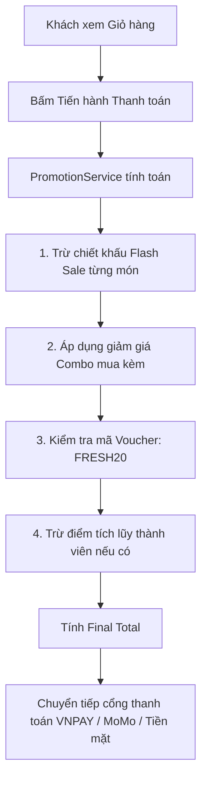

# WORKFLOW: QUY TRÌNH THANH TOÁN & ÁP MÃ ƯU ĐÃI (CHECKOUT WORKFLOW)

```mermaid
flowchart TD
    Cart[Khách xem Giỏ hàng] --> CheckOut[Bấm Tiến hành Thanh toán]
    CheckOut --> PromoEngine[PromotionService tính toán]
    
    PromoEngine --> Step1[1. Trừ chiết khấu Flash Sale từng món]
    Step1 --> Step2[2. Áp dụng giảm giá Combo mua kèm]
    Step2 --> Step3[3. Kiểm tra mã Voucher: FRESH20]
    Step3 --> Step4[4. Trừ điểm tích lũy thành viên nếu có]
    
    Step4 --> TotalCalc[Tính Final Total]
    TotalCalc --> PaymentGateway[Chuyển tiếp cổng thanh toán VNPAY / MoMo / Tiền mặt]
```
