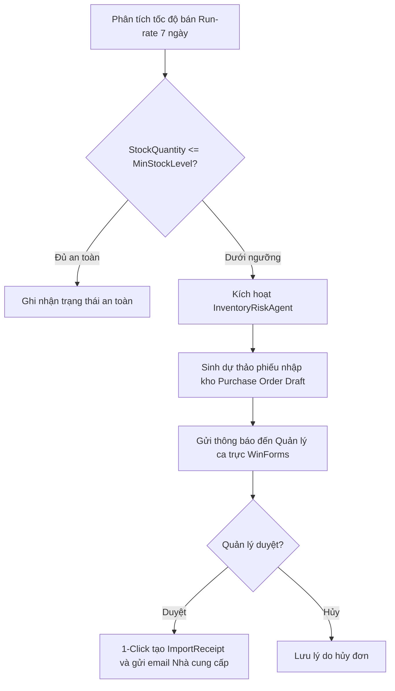

# WORKFLOW: QUY TRÌNH KIỂM SOÁT TỒN KHO & ĐỀ XUẤT NHẬP HÀNG (INVENTORY WORKFLOW)

```mermaid
flowchart TD
    RunRateJob[Phân tích tốc độ bán Run-rate 7 ngày] --> CheckStockLevel{StockQuantity <= MinStockLevel?}
    
    CheckStockLevel -- Đủ an toàn --> LogOk[Ghi nhận trạng thái an toàn]
    CheckStockLevel -- Dưới ngưỡng --> TriggerRisk[Kích hoạt InventoryRiskAgent]
    
    TriggerRisk --> GenPO[Sinh dự thảo phiếu nhập kho Purchase Order Draft]
    GenPO --> NotifyMgr[Gửi thông báo đến Quản lý ca trực WinForms]
    NotifyMgr --> Approve{Quản lý duyệt?}
    
    Approve -- Duyệt --> CommitPO[1-Click tạo ImportReceipt và gửi email Nhà cung cấp]
    Approve -- Hủy --> LogCancel[Lưu lý do hủy đơn]
```
