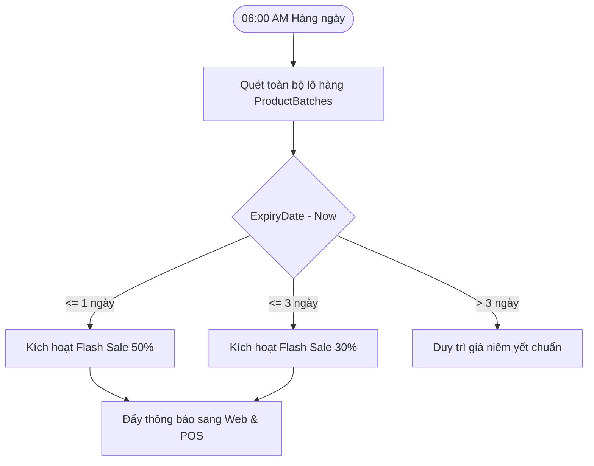

# WORKFLOW: QUY TRÌNH KHUYẾN MÃI & QUÉT FLASH SALE (PROMOTION WORKFLOW)

```mermaid
flowchart TD
    DailyTimer([06:00 AM Hàng ngày]) --> ScanJob[Quét toàn bộ lô hàng ProductBatches]
    ScanJob --> FilterRisk{ExpiryDate - Now}
    
    FilterRisk -->|<= 1 ngày| Apply50[Kích hoạt Flash Sale 50%]
    FilterRisk -->|<= 3 ngày| Apply30[Kích hoạt Flash Sale 30%]
    FilterRisk -->|> 3 ngày| KeepNormal[Duy trì giá niêm yết chuẩn]
    
    Apply50 --> PushApp[Đẩy thông báo sang Web & POS]
    Apply30 --> PushApp
```
