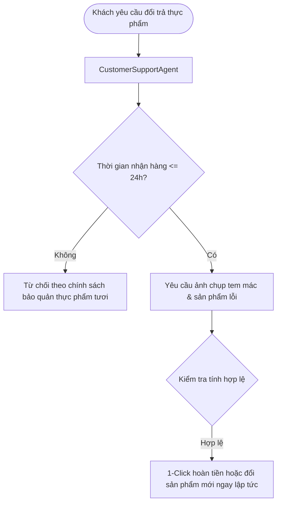

# WORKFLOW: QUY TRÌNH HỖ TRỢ ĐỔI TRẢ & HOÀN TIỀN (REFUND WORKFLOW)

```mermaid
flowchart TD
    Customer([Khách yêu cầu đổi trả thực phẩm]) --> Agent[CustomerSupportAgent]
    Agent --> CheckTime{Thời gian nhận hàng <= 24h?}
    
    CheckTime -- Không --> Reject[Từ chối theo chính sách bảo quản thực phẩm tươi]
    CheckTime -- Có --> UploadImg[Yêu cầu ảnh chụp tem mác & sản phẩm lỗi]
    
    UploadImg --> ManagerReview{Kiểm tra tính hợp lệ}
    ManagerReview -- Hợp lệ --> RefundAction[1-Click hoàn tiền hoặc đổi sản phẩm mới ngay lập tức]
```
